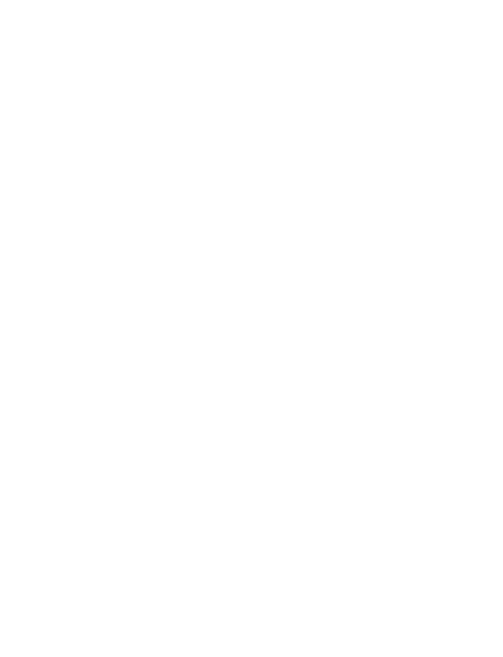

<h1 class="skip">안녕하세요, 김용균입니다.</h1>

저는 소프트웨어 엔지니어로 웹서비스와 유용한 도구를 만드는 일을 합니다. 작은 것을 만드는 일, 사진 찍는 일, 그리고 맛있는 커피를 좋아합니다.

현재는 CS 학생으로 열심히 배우고 있습니다. 만나서 반갑고 잘 부탁드립니다 :)

:::div{.no-indent}
:span[[저는 이런 사람입니다](/ko/about/)]{.button} :span[[트위터에서도 만나요](https://twitter.com/haruair)]{.button}
:::

---

- [글 모음](/ko/post/): 개발 관련 경험과 번역글 비정기 포스트 (얇고 길게 가고 싶습니다)
- [노트](/ko/notes/): 아무거나 정리용 페이지
- [조각글 모음](/ko/micro/): 일상적인 이야기와 스크랩용 페이지
