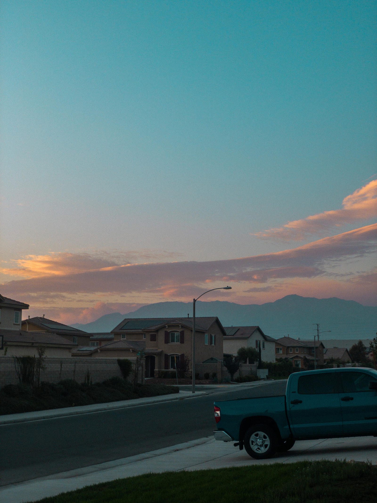

평소에 작은 글이라도 작성하는 습관을 만들고 싶어서 공간을 만들었다. 글을 써야 한다는 강박 비슷한 것이 매년 더 커지고 있는데 짧은 일기라도 쓰면 그 답답한 마음이 좀 정돈되지 않을까. 그런 막연한 기대감으로.

---

팬더믹이 시작되고 나서는 알 수 없는 불안감이 좀 더 커졌다. 물론 마스크를 쓰고 손을 잘 씻는 것으로도 충분하다고 생각하지만 아무래도 함께 사는 사람들을 염두에 두면 그마저도 최소로 줄여야 했다. 나도 학교를 온라인으로 다니고 있으니 사실 바깥에 나갈 일이 전혀 없게 되었다. 꽉 막힌 도로 위에서 보내는 시간이 줄어든 만큼 하늘 올려보는 시간도 없어졌다. 그래선지 요즘 나 자신을 돌아보면 사소한 부분에 더 민감하게 반응하는 것 같다.

여유는 내가 직접 찾지 않는 이상 어디서 갑자기 나타나는 법이 없다.