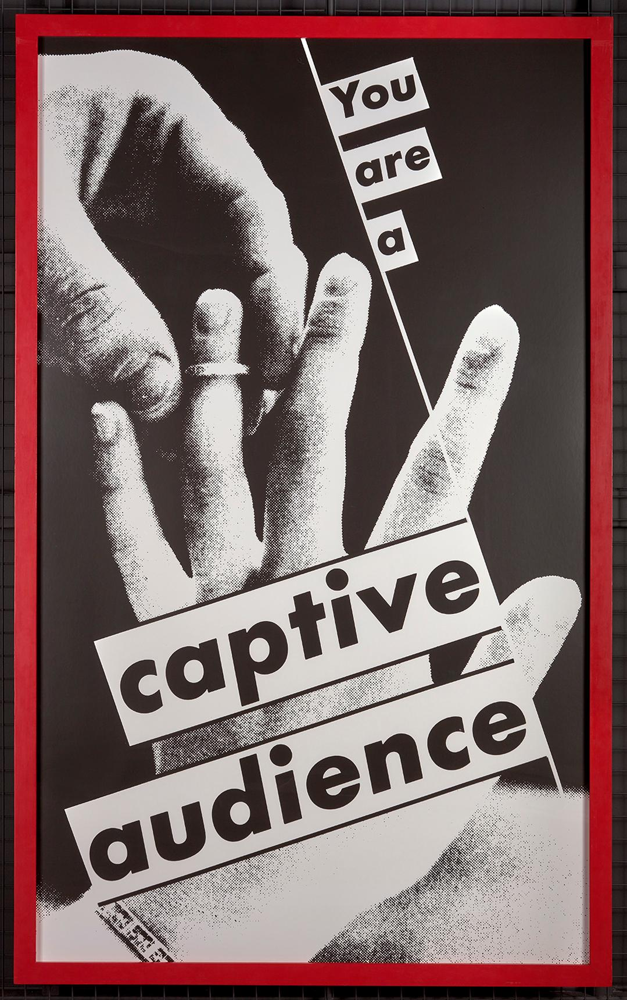

<figure>

<figcaption>Typed on applied printed label on frame verso: Barbara Kruger / Untitled (You are a captive audience) 82 1/2 by 50 (inches)

Photograph 1992 MBG#6659 Mary Boone Gallery, 417 West Broadway / New York, New York 431-1818</figcaption>

</figure>

- [Barbara Kruger](http://www.barbarakruger.com/)
- [Eastman Museum](https://collections.eastman.org/objects/80430/untitled-you-are-a-captive-audience;jsessionid=19B737E15B44DC719F4937064721A638?ctx=af4199c9-abed-4bdc-9aba-1ba9fc0d5360&idx=0)
