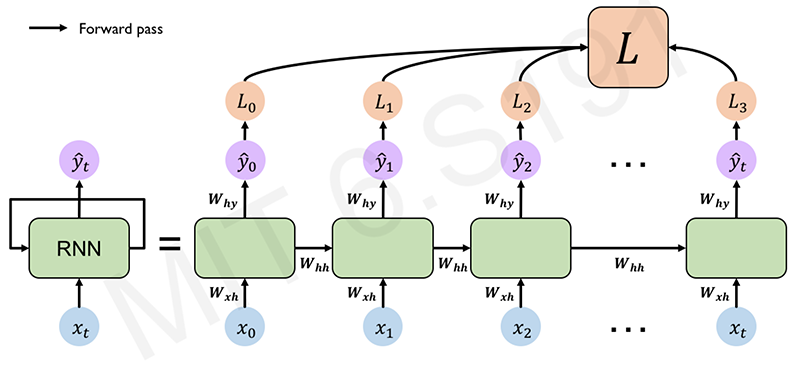
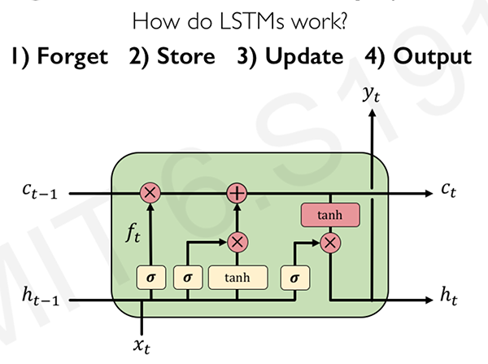

# Course and lecture info

- [Course Website](http://introtodeeplearning.com/2020/index.html)
- [Video](https://www.youtube.com/watch?v=SEnXr6v2ifU&list=PLtBw6njQRU-rwp5__7C0oIVt26ZgjG9NI&index=2&ab_channel=AlexanderAmini)
- [Slide](http://introtodeeplearning.com/2020/slides/6S191_MIT_DeepLearning_L2.pdf)

# Deep Sequence Modeling

- Feed-forward models in the previous lectures
- Sequential processing of data

Predict the movement using previous data which is sequencial. e.g. stock prices, EEG signals

# A Sequence Modeling Problem: Predict the Next Word

"This morning I took my cat for a \[predict\]."

- **Problem**: Feed-forward network can only take a fixed length input. The model needs to handle variable length inputs.
- **Solution**: Uses a fixed window. Use only certain length of the words. e.g. last 2 words.

One-hot feature encoding: tells us what each word is.

```
[10000 01000]   ->    [            ]
  for    a              prediction
```

## Problem 1: Can't Model long term dependencies

"France is where I grew up, but I now live in Boston. I speak fluent \[   \]."

We need information from the distance past to accurately predict the correct word. Not only past few words.

## Idea 2: Use Entire Sequence as Set of Counts

Use a bag of words.

```
"This morning I took my cat for a" -> [0100100...00110001] -> prediction
```

**Problem!** Counts Don't Preserve Order

These two sentences are exact same representations but the semantic meanings are opposite.

- The food was good, not bad at all.
- The food was bad, not good at all.

## Idea 3: Use a Really Big Fixed Window

```
[10000 00001 00100 01000 00010 ...] -> prediction
 this morning took  the  cat
```

**Problem!** Each of these inputs has a separate parameter. The meaning is same but the parameter can be separated. This we learn about the sequence won't transfer if the appear elsewhere in the sequence.

```
[10000 00001 00100 01000 00010 ...]
 this morning took  the  cat
[00100 01000 00010 10000 00001 ...]
 took  the  cat   this morning
```

## Design Criteria

To model sequences, we need to:

- Handle **variable-length** sequences
- Track **long-term** dependencies
- Maintain information about **order**
- **Share parameters** across the sequence

Use Recurrent Neural Networks (RNNs) as an approach to sequence modeling problems in this lecture.

# Recurrent Neural Networks (RNNs)

Comparsion RNN with Standard Feed-Forward Neural Network

```
One to One    -- "Vanilla" neural network
Many to One   -- Sentiment Classification
Many to Many  -- Music Generation

# and many others
```

```
# RNN
                     +-------------+
                     |             |
           +---------+----------+  |
x_t  +---->+  RNN               |  |
           |  Recurrent cell    +------> \hat{y}_t
           +---------+----------+  |
                     ^             |
                     +-------------+ h_t
```

Apply a **recurrence relation** at every time step to process a sequence:

$$
\begin{aligned}
h_t &= f_w(h_{t-1}, x_t) \\
h_t&: \text{cell state} \\
f_w&: \text{function parameterized by W} \\
h_{t-1}&: \text{old state} \\
x_t&: \text{input vector at time step t} \\
\end{aligned}
$$

Note: the same function and set of parameters are used at every time step.

## RNN Intuition

```python
my_rnn = RNN()
hidden_state = [0, 0, 0, 0]

sentence = ["I", "love", "recurrrent", "neural"]

for word in sentence:
  prediction, hidden_state = my_rnn(word, hidden_state)

next_word_prediction = prediction
# >>> "networks!"
```

## RNN State Update and Output

$$
\begin{aligned}
\text{Input Vector: }& x_t \\
\text{Update Hidden State: }& h_t = \tanh(W_{hh}^Th_{t-1} + W_{xh}^Tx_{t}) \\
\text{Output Vector: }& \hat{y}_t = W_{hy}^th_t \\
\end{aligned}
$$

Application of a weighted matrix and non-linearity. Two params of the previous result and produce the output.

## Computational Graph Across Time

Re-use the same weight matrices at every time step. Forward pass to the final result over time. Compute a loss at each time step and this computation of the loss will then complete forward propagation through the network.



(Li/Johnson/Yeung C231n.)

Total loss is a sum the losses of individual contributions over time. (time component involved.)

```python
class MyRNNCell(tf.keras.layers.Layer):
  def __init__(self, rnn_units, input_dim, output_dim):
    super(MyRNNCell, self).__init__()

    # Initialize weight matrices
    self.W_xh = self.add_weight([rnn_units, input_dim])
    self.W_hh = self.add_weight([rnn_units, rnn_units])
    self.W_hy = self.add_weight([output_dim, rnn_units])

    # Initialize hidden state to zeros
    self.h = tf.zeros([rnn_units, 1])
  
  def call(self, x):
    # Update the hidden state
    self.h = tf.math.tanh(self.W_hh * self.h * self.W_xh * x)

    # Compute the output
    output = self.W_hy * self.h

    # Return the current output and hidden state
    return output, self.h

# tf.keras.layers.SimpleRNN(rnn_units)
```

# Backpropagation Through Time (BPTT)

## Backpropagation

1. Take the derivative (gradient) of the loss with respect to each parameter
1. Shift parameters in order to minimize loss

Backpropagation in RNN,

1. Errors are back propagated at each individual time step
1. Finally across all time steps (Backpropagation through time)

## Standard RNN Gradient Flow

Computing the gradient wrt $h_0$ involves many factors for $W_{hh} + \text{repeated gradient computation}$.

1. $\text{Many values} > 1$: exploding gradients. <br />=> Sln: Gradient clipping to scale big gradients.
1. $\text{Many values} < 1$: Vanishing gardients. <br />=> Sln:
    1. Activation function
    1. Weight initialization
    1. Network architecture

## The problem of long-term dependencies

**Vanishing gradients**, why matter?

1. Multiply many **small numbers** together.
1. Errors due to further back time steps have smaller and smaller gradients.
1. Bias parameters to capture short-term dependencies.

When more context requires, RNN cannot connect the dot between the context because of vanishing gradients problem.

## Trick 1: Activation Functions

Using ReLU prevent $f'$ from shirinking the gradient when $x > 0$. By choosing more contrast activation function, the network can prevent vanishing gradient problem. (Compare ReLU derivative, tanh, and sigmoid.)

## Trick 2: Parameter Initialization

Initialize **weights** to identity matrix. Initialize **biases** to zero. This helps prevent the weigths from shirinking to zero.

$$
I_n = \begin{pmatrix}
   1 & 0 & 0 & \dots & 0 \\
   0 & 1 & 0 & \dots & 0 \\
   0 & 0 & 1 & \dots & 0 \\
   \vdots & \vdots & \vdots & \ddots & \vdots \\
   0 & 0 & 0 & \dots & 1
\end{pmatrix}
$$

## Solution 3: Gated Cells

Idea: use a more **complex recurrent unit with gates** to control what information is passed through. e.g. LSTM, GRU, etc.

**Long Short Term Memory (LSTMs)** networks rely on a gated cell to track information throughtout many time steps. Well-suited for learning long-term dependencies to overcome this vanishing $\nabla$ problem.

# Long Short Term Memory (LSTM) Networks

- In a standard RNN, repeating modules contain a **simple computation node**.
- LSTM modules contain **computational blocks** that **control information flow**. LSTM cells are able to track information throughout many timesteps.

```python
tf.keras.layers.LSTM(num_units)
```



(Hochreiter & Schmidhuber, Neural Computation 1997.)

Information is **added** or **removed** through structures called **gates** $\sigma$. Gats optionally let information through, for example via a sigmoid neural  net layer and pointwise multiplication.

"How much of the information through the gate should  be retained?" => Selectively update their internal state, generate an output => gating/regulating the flow of information effectively

Ref: Olah, "Understanding LSTMs."

1. Forget: LSTM's forget irrelevant parts of the previous state $f_t$
1. Store: LSTMs store relevant new information into the cells state $i_t$
1. Update: LSTMs selectively update cell state values $c_{t-1} \xrightarrow{f_t, i_t} c_{t}$
1. Output: The output gate controls what information is sent to the next time step. $o_t$

## LSTM Gradient Flow

Internal cell state $C$ allows for the interrupted flow to find the gradients through time. "a highway of cell states" and also alleviate and mitigate the vanishing gradient problem.

While training, identify what are those bits of prior history that carry more meaning that are important to predict the next word and discard what is not relevant to.

## Key Concepts

1. Maintain a separate cell state from what is outputted
2. Use gates to control the flow of information
    - Forget gate gets rid of irrelevant information
    - Store relevant information from current input
    - Selectively update cell state
    - Output gate returns a filtered version of the cell state
3. Backpropagation through time with uninterrupted gradient flow

# RNN Applications

## Example Task: Music Generation

- Input: sheet music
- Output: next character in sheet music

## Example Task: Sentiment Classification

- Input: sequence of words
- Output: probability of having positive sentiment

```python
loss = tf.nn.softmax_cross_entropy_with_logits(y, predicted)
```

## Example Task: Machine Translation

Encode original language sentence into a state vector and decoder takes encoded language. **Encoding bottleneck**: need to be a single vector.

Sln: **Attention Mechanisms** is neural networks provide **learnable memory access** from the original sentence. (Extends the scope of state so that decorder also can access the encoder state in all time.)

When the network learns this waiting, its placing its attention in the original sentences so that effectively capture the memory of the important information.

## Examples

- Trajectory Prediction: Self-Driving Cars: encounters a cyclist cuts the lane so that slow down.
- Environmental Modeling: predict the future behavior of weather

# Summary

1. RNNs are well suited for sequence modeling tasks
1. Model sequences via a recurrence relation
1. Training RNNs with backpropagation through time
1. Gated cells like LSTMs let us model long-term dependencies
1. Models for music generation, classification, machine translation, and more

---

Check the [lab session 1](https://github.com/aamini/introtodeeplearning/).
