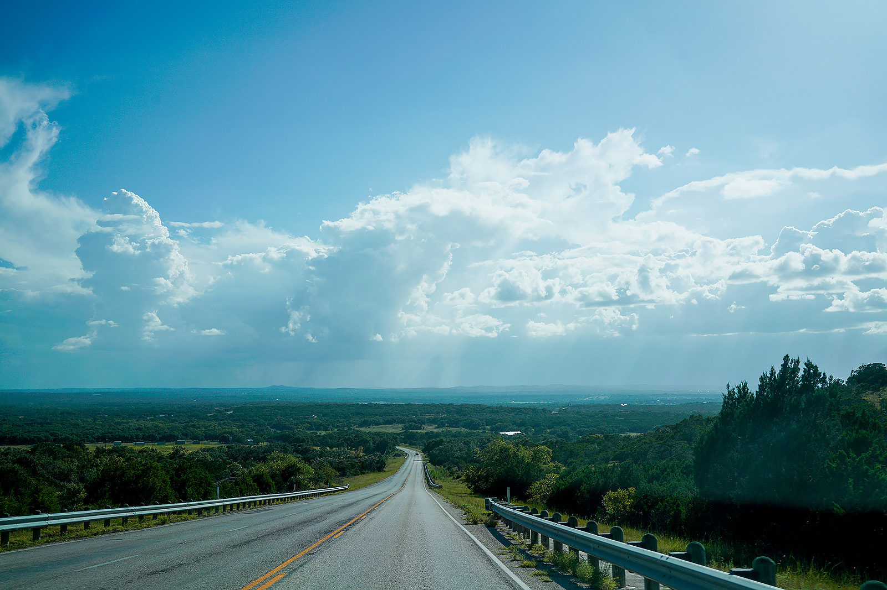

<figure>

</figure>

어쩌다보니 8월 말에 글 제목만 적었는데.

- 학기가 시작했다. 여기서 마지막 학기인데 원래는 18주였던 학기가 일부 과목 빼고 14주로 단축되었다. 다른 학기와 마찬가지로 걱정이 앞서지만 시간을 많이 써서 성과 내는 것 말고 할 수 있는게 크게 없으니까. 무거운 엉덩이로 결과를 만들자.
- 조건부 영주권에서 일반 영주권으로 전환되었다. RFE를 요청하는 바람에 놀라서 이것저것 급하게 서류를 모아 보냈다. 내가 어딘가 살아야 할 이유를 남에게 증명하기 위해서 서류를 모으고 정리하는 일이란 정말 피곤하고 힘이 빠지는 일이다. 앞으로 더이상 서류와의 싸움을 하지 않아도 된다는 게 행복하다.
- 텍사스에 다녀왔다. 매우 짧은 방문이었지만 이번엔 그 틈에 UT Austin을 갔는데 학교도 생각보다 크고 시설도 좋아보였다. 일단 오스틴 자체가 매력이 넘치는 도시인데 과연 여기서 학교를 다니면 어떨까 생각하면서 캠퍼스를 걸으니 기분이 이상했다. 또 다른 도전에 대한 설렘보다는 이사 걱정이나 재정에 대한 고민에 너무 막연한 목표인가 싶어지기도 했고. 일단 하자, 해보자 하는 태도로 임할 수 있었으면 좋겠다.
- 트럼펫은 계속 연습하고 있다. 시간을 많이 쓰면 지치기만 하고 여기서도 긴장 낮추고 여유 갖는 것이 중요하다고 해서 노력하고 있다.
- 여름학기 후에 푹 쉬었다. 지나고 나면 정말 얼마 안되는 나머지 여름이었지만 그냥 별 생각 안하고 티비보고 아무거나 하면서 지냈다. 크고 작은 일이 있긴 했지만 올해 남은 시간 해야 할 일을 생각하면 별로 중요하지도 않고. 좋은 결과 낼 수 있음 좋겠다.

성장은 끝이 없다는 것 매일 재확인한다. 결국 노력이 답이다. 가을 문턱이라고 시원한 날은 또 엄청 시원한 바람이 불어온다.
