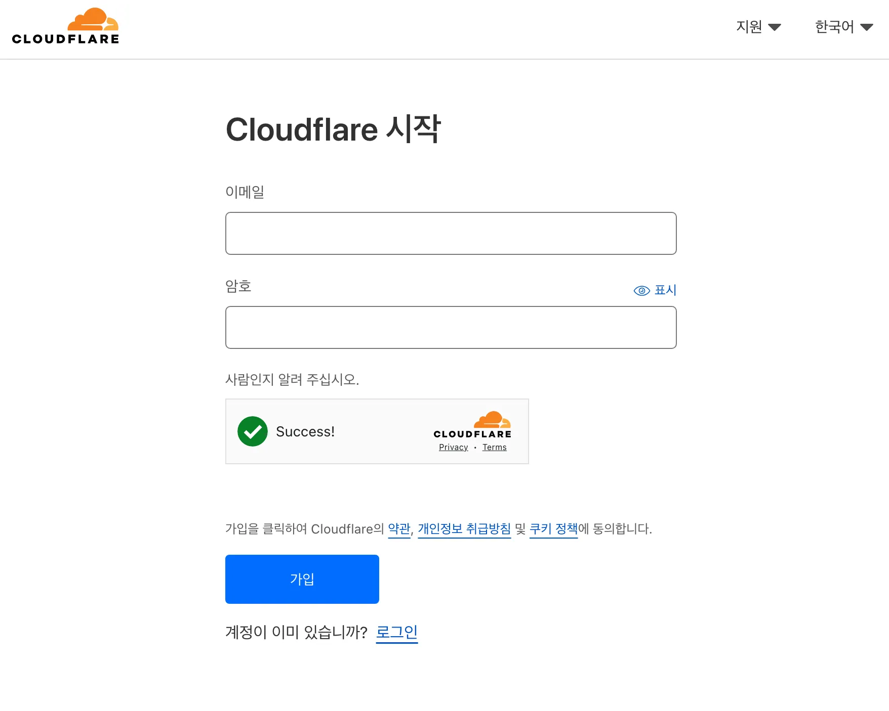

천 리 길도 한 걸음부터. 개인 브랜드, 작품 포트폴리오, 컨설팅 서비스, 비지니스,
클럽과 모임, 어떤 아이디어든 작은 웹사이트를 만드는 일부터 출발할 수 있습니다.
웹사이트는 목표를 구체화하고 다른 사람과 공유하는데 최고의 도구거든요. 시작부터
거창하고 복잡할 필요는 없으니까요, 이 문서에서는 정말 정말 간단한 웹페이지를
작성하고 누구든 볼 수 있는 공간에 올리는 방법을 배워봅니다.

## 1. 초간단 웹사이트 만들기

컴퓨터에서 문서 편집기 프로그램을 실행합니다. Windows를 사용한다면 **메모장**,
macOS를 사용하면 **텍스트 편집기**, linux를 사용한다면 **gedit** 같은 프로그램을
활용할 수 있습니다.

문서 편집기 아이콘

먼저 폴더를 만듭니다. 저는 `tiny-website`라는 이름의 폴더를 만들었습니다.

새 문서에 다음 내용을 입력합니다.

```html
<h1>초간단 웹사이트 만들기 프로젝트</h1>
<p>누구든 손쉽게 웹사이트를 만들 수 있어요!</p>
```

작성한 파일을 `index.html` 이란 이름으로 저장합니다. 앞서 만든 폴더에 저장하는
것을 잊지 마세요. 저장한 후에 파일을 열어보세요. 방금 웹사이트를 만든 겁니다!

## 2. 웹사이트 출시하기

이제 이 웹사이트를 누구든 볼 수 있도록 출시하려고 합니다. 일반적으로 이렇게 만든
웹페이지는 웹호스팅 서비스를 통해 게시할 수 있습니다. 여기서는 간단하게
**Cloudflare**에 게시하는 방법을 배워봅니다.



[Cloudflare](https://www.cloudflare.com/ko-kr/)에서 가입합니다. 이메일과
비밀번호만 입력하면 쉽게 가입할 수 있습니다. 가입한 후에 이메일로 온 인증 링크를
클릭하면 준비가 끝납니다.


왼쪽 사이드바 메뉴에서 **Workers 및 Pages**를 클릭합니다. 그리고 "Workers 및
Pages 시작" 페이지에서 **Pages** 탭을 클릭합니다.


하단에 있는 **자산 업로드를 사용하여 생성**에 **자산 업로드** 버튼을 클릭합니다.


프로젝트 이름을 입력한 후 프로젝트 생성 버튼을 누릅니다. 여기에서 입력하는
프로젝트 이름으로 웹사이트가 생성됩니다. 다시 말하면 `<프로젝트
이름>.pages.dev`으로 방금 만든 웹사이트를 접속할 수 있게 됩니다.


`tiny-website` 폴더를 끌어서 놓거나 폴더 업로드 버튼을 사용해서 전송합니다. 그런
다음에 **사이트 배포** 버튼을 클릭해 절차를 마무리합니다.


다음과 같은 성공 페이지가 나오면 모두 끝났습니다. 이제 주소를 눌러 게시된
웹사이트를 확인해보세요. 이제 어디서든 같은 주소로 웹사이트를 열어볼 수
있습니다.


---

**축하드립니다! 🥳** 직접 만든 웹사이트를 공식 출시했습니다!! 아주 단순하더라도
직접 한땀 한땀 정성으로 만든 경험은 무엇보다도 값진 일입니다. 다른 사람에게도
주소를 보내서 접속할 수 있는지 확인해보세요.

이제 다음 단계는 무엇일까요? 더 여러 페이지를 추가할 수도 있고 새로운 주소를
연결하는 것도 가능합니다.

- 도메인 주소 구입하기: 지금 사용하는 `*.pages.dev` 주소는 Cloudflare에서
  기본으로 제공하는 주소입니다. 자신에게 더 맞는 주소로 변경하고 싶다면 "도메인
  등록 업체"에서 주소를 구입한 후에 대시보드 내의 사용자 설정 도메인 탭을 눌러
  웹사이트와 도메인 주소를 연결하면 됩니다.
- 웹사이트 꾸미기: 위에서 작성한 `<h1>...</h1>`과 같은 코드를 html 태그라고
  합니다. MDN에서 제공하는 [HTML 기초][0] 페이지에서 더 세부적인 내용을 배배울
  수 있습니다. [CSS 기초][1] 페이지에서는 스타일을 적용하는 방법도 확인할 수
  있습니다.
- 페이지 추가하기: `index.html` 외에도 `hello.html`, `about.html` 등 새로운
  페이지를 더 작성해서 저장해보세요. `<a href="hello.html">인사 페이지로 이동</a>`
  식으로 작성하면 웹페이지끼리 링크를 추가할 수 있습니다.

[0]: https://developer.mozilla.org/ko/docs/Learn/Getting_started_with_the_web/CSS_basics
[1]: https://developer.mozilla.org/ko/docs/Learn/Getting_started_with_the_web/HTML_basics

