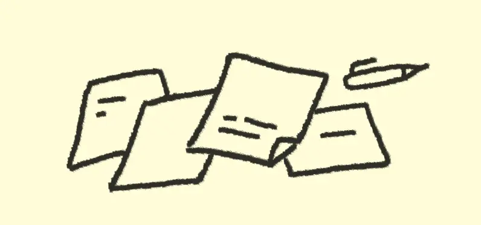

:::div{.narrow.headpiece}

:::

<h2 class="subtitle">링크정원</h2>

브라우저에 탭 늘려가는 대신 여기에 링크를 심어두기로 결심했어요.

  - [즐겨찾기](/ko/bookmarks/)
  - [클립보드](/ko/clipboard/)

<h2 class="subtitle">작은 페이지</h2>

- [샌디에고 커피](/ko/sd/coffee/)
- [지침서](/ko/guidance/)
- [마음 받은 글](/ko/liked/)

<h2 class="subtitle">공방</h2>

- [미니 붐박스](/ko/mini-boombox)

<h2 class="subtitle">작은 튜토리얼</h2>

- [작은 웹사이트 뚝딱 만들기](/ko/how-to/tiny-website/)
- [아주 조그마한 컴파일러 만들기](/ko/post/the-super-tiny-compiler/) (번역)

<h2 class="subtitle">작은 웹앱</h2>

- [즉석사진](/ko/photobooth/)
- [신디사이저](/ko/synth/) 급하게 연주가 고플 때
