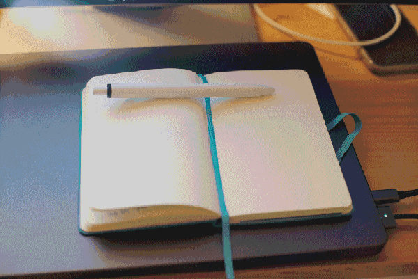

- [샌디에고 커피](/ko/sd/coffee/)
- [지침서](/ko/guidance/)
- [마음 받은 글](/ko/liked/)
- [즐겨찾기](/ko/bookmarks/)
- [미니 붐박스](/ko/mini-boombox)
- [namul34](/ko/keyboard/namul34) 30% 키보드
- [작은 웹사이트 뚝딱 만들기](/ko/how-to/tiny-website/)
- [아주 조그마한 컴파일러 만들기](/ko/post/the-super-tiny-compiler/) (번역)
- [즉석사진](/ko/photobooth/)
- [신디사이저](/ko/synth/) 급하게 연주가 고플 때
- [이미지 디더링](/ko/dithering/) 90년대 웹 감성의 이미지 만들기

