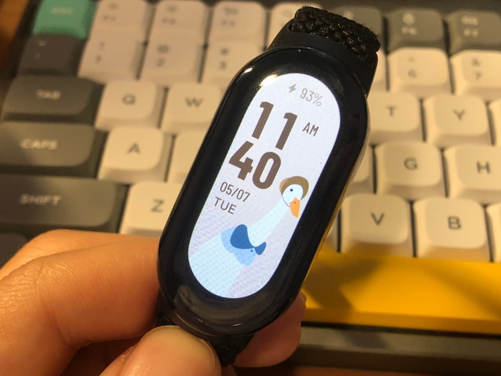

애플워치를 한동안 사용했지만 도무지 매일 충전하는 일이 익숙해지지 않았다. 온갖
알림 덕분에 모든 것을 놓치지 않고 살게 하지만 눈 앞에 있는 일에 좀 소홀해지는
기분도 들어서, 결국엔 시계 기능만 잘하는 카시오 시계를 한동안 차고 다녔다.
그러다 미밴드에 대해 우연히 듣고는 이 시계는 좀 괜찮지 않을까 싶어서 구입했다.

- 가격이 애플워치에 비하면 정말 저렴한 편이다. 케이스랑 시계줄을 서드파티로
  구입했는데 악세서리 가겨이 시계 가격이랑 같았다.
- 가볍다. 애플워치는 항상 찰 때마다 거추장스러운 느낌이 있었는데 그냥 고무밴드
  끼고 있는 기분이다.
- 배터리가 오래 간다. 대부분의 기능을 켜고 끌 수 있어서 중요하지 않은 기능을
  끄면 정말 오래 사용할 수 있다. 게다가 충전도 꽤 빠른 편이라서 샤워하고 오는
  사이에 완전 충전이 가능하다. 일주일에 한 번 정도 충전하는 걸로 충분하다.
- 워치페이스가 다양하다. 안드로이드를 사용하면 직접 워치페이스를 만들어서 넣는
  것도 가능하다는데 그러지 않아도 충분히 이것저것 많다.
- 측정 정확도는 엄청 정확하진 않다는데 의료장비가 아니니까 그런 기대는 크게
  안하고. 그래도 대략적으로 얼마나 잤나, 얼마나 걸었나는 정도는 적절하게
  측정한다.
  - 애플 건강앱에 데이터도 잘 연동된다.
- 알람은 진동으로 동작한다. 진동 크기는 밴드를 얼마나 꽉 끼냐에 따라서 편차가 꽤
  큰 것 같다.

알림 메시지가 가끔 잘 안온다는 얘기가 있던데 문자든 전화든 아무 알림도 안오게
설정하고 사용하고 있어서 그건 확인을 못해봤다. 조용한 웨어러블 기기로 쓴다면 전혀
부족하지 않아 만족스럽다.

