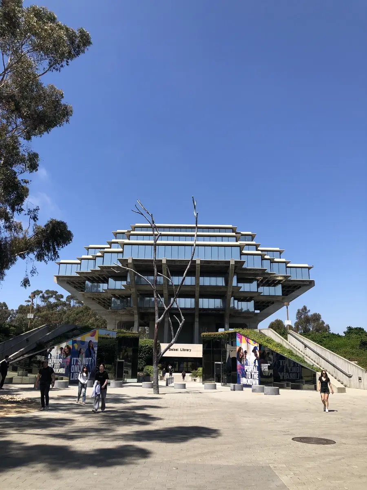

2025년 3월 봄학기를 마지막으로 졸업했다.

## 기대했던 부분들

전공 공부를 하면 오랫동안 느껴온 한계를 조금이라도 넘을 수 있을 거란 기대가
있었다. 매년 반복되는 '비전공 vs 전공' 얘기에서, 굳이 전공이 아니어도 실무는
충분하다는 말도 자주 봤다. 꼭 학교를 가지 않아도 배울 수 있기도 하고 필요할
때마다 그때그때 공부하면 된다는 얘기도 많이 들었다. 실제로도 멋진 결과를 내는
비전공 분들도 많이 봐왔지만, 그럼에도 해보고싶단 생각은 좀처럼 사라지지 않았다.
못해본 경험에 대한 궁금증은 어쩌면 당연한 일이었다. 새로운 기술이 나왔다는
소식을 접할 때마다 이건 언제 배우지, 싶을 정도로 새로운 때가 많았다. 하지만
과거의 무언가를 재해석한 것이거나 유명한 이론의 확장인 경우도 있었다. 그런
경험이 몇 차례 반복되면서, 언제가 되었든 전공을 꼭 해보겠다는 욕심이 생겼다.
때로는 그런 경험이 전공하지 않으면 넘을 수 없는 그런 벽처럼 느껴저서 좌절감을
느꼈던 시절도 있었다. 분야에 대해 폭넓게 알고 있으면 정말 수백 수천 걸음 앞서서
걸을 수 있구나, 그런 넓은 관점과 이해도를 갖고 문제에 접근할 수 있다면 어떻게든
빨리 공부를 시작하는 것이 필요하다 싶었다.

거기에 더해 오래 학업을 이어온 분들의 이야기를 접할 때마다 늘 흥미롭게 들렸다.
자연스럽게 연구자/학자로의 삶에도 궁금증이 생겼다. 연구 주제를 정하고 깊이
공부한다는 것이 어떤 의미인지, 어떻게 공부하고 연구한다는 것인지 배워보고
싶었다. 실제로 겪어본 적이 없다보니 그런 직업이 막연하게 느껴졌고, 그래서
가능하다면 짧게라도 직접 경험해보고 싶었다. 연구한다는 것은 구체적으로 무슨 일을
한다는 것일까? 단순히 글이나 이야기로 듣는 것이 아니라 가까이서 보고 체감해보고
싶었다. 학부 과정에서 그런 경험을 할 수 있는 기회를 얻기는 쉽지 않겠지만
어떻게든 맛보기라도 할 수 있기를 바라는 마음이 컸다.

<figure>

<figcaption>CSE 건물 곰돌이, 괜히 기분 좋아지는.</figcaption>

</figure>

<figure>

<figcaption>CSE 건물 지하던전, 늘 공기가 별로였다</figcaption>

</figure>

그리고 학교 다니기 전부터 궁금했던 분야를 배울 수 있을 것이란 기대감이 있었다.
시작하기 전에는 단순히 CS에 대한 지식을 배운다는 생각에 기대했는데 실제로는 훨씬
넓고 깊이 있는, 다양한 주제가 유기적으로 연결된 학문이었고, 그 안에서 내가 알고
있던 것은 정말 극히 일부에 불과했다는 것에 주눅이 들 정도였다. 특히 막연하게
배우고 싶었던 분야는 자연어 처리(NLP)와 컴파일러였다. 지금 보면 언어로 하는 것은
무엇이든 깊이 있게 배우고 싶었던 것 같다. NLP는 호주에 가기 전부터 관심이 있었던
부분이고 컴파일러는 프로그래밍 언어에 대한 관심에 자연스럽게 궁금증이 생긴
주제였다. 원하는 타이밍에 그 주제의 수업이 열리지 않아 비슷한 수업만 겨우 들을
수 있었는데 아쉽긴 했지만 비슷했던 수업에서 각 주제가 어떤 식으로 다뤄지는지
작게나마 통찰을 얻을 수 있었다.

호기심에서 비롯되긴 했던 공부지만 궁극적으로는 모호한 내 진로에 좀 더 분명한
방향이나 단서를 찾을 수 있기를 기대했다. 그동안 오래 웹개발을 해오긴 했어도
시스템 통합과 같이 비지니스에 더 가까운 일을 많이 해왔다. 그래서 내 스스로도
개발자라고는 하지만 코어가 되는 어떤 것을 만드는 일보다는 조금은 주변적이고
때로는 일이 되게 하기 위해서 하는 일들에 내적 혼란을 겪을 때도 있었다. 어떤
분야에서 무슨 일을 할지, 이런 생각은 하게되면 정말 끝이 없는 것 같다. 언젠가는
내가 정말 원하는 어떤 일을 찾게 되고 즐겁게 할 수 있게 되지 않을까, 정말 내가
지금의 일을 계속 할 수 있을까, 이런 고민은 마치 그림자 같이 없어지질 않는다. 이
나이가 되어서도 이런 고민을 계속 하게 될 줄 몰랐지만 학교에서 어떻게든 힌트가 될
만한 실마리라도 찾을 수 있기를 바랐다.

<figure>

<figcaption>기괴한 Geisel 도서관, 조용한 1층 구석에서 보냈다</figcaption>

</figure>

<figure>

<figcaption>조용해서 늘 좋아했던 Sally T. WongAvery 도서관</figcaption>

</figure>

그렇게 오랜 궁금증과 기대를 안고 학교 생활을 시작했다. 내가 그토록 알고 싶었던
것들, 이해하고 싶었던 주제들을 정말 끝까지 따라가며 머릿속에 차곡차곡 담아
무사히 졸업까지 마칠 수 있었을까.. 🥲

## 얻고 배운 부분들

먼저 공부하는 방법을 많이 배웠다. 학교 생활 하기 전에도 수업 내용을 보고
배우려고 실라버스를 뒤적인 적이 꽤 있지만 지금 생각해보면 정말 피상적인 수준에
그쳤던 것 같다. 이 수업이 어떤 의미이고 어떤 분량과 진도로 배워야 하는 주제인지,
시간을 얼마나 할애해야 하며 이 수업에서 학습은 어느 정도 깊이를 가지는지 등
실제 수업에 맞춰 따라가다보니 실라버스가 어떤 의미의 문서인지 확실하게 배웠다.
실라버스는 사전적이기도 하고 수업의 목차 역할도 하며 때론 광고지, 때로는
계약서의 역할도 했다. 학교 다니면서 모든 공부가 실라버스에서 시작되고 끝난다는
얘기가 더 와닿게 되었다. 물론 모든 실라버스가 같은 수준으로 작성되진 않지만 잘
작성된 실라버스와 체계적인 수업 틀을 몇 차례 경험할 수 있던 덕분에 그동안
중구난방 공부했던 경험들을 많이 개선할 수 있게 되었다. 단순히 보고 외우는 것이
전부가 아니었다. 내가 특정 주제에 대해 얼마나 시간을 써서 공부해야 하는지에
대한 감각을 만들어줬다. 거기에 더해 여러 수업과 다양한 교수법을 접하면서
"학습하는 나"를 더 잘 관찰할 수 있었고 어떻게 학습하면 내게 더 오래 남고 도움이
되는지, 어떤 방식으로 접근해야 하는지 자연스럽게 체득할 수 있었다. 학습을
체계적으로 계획하고 구체화한 경험은 앞으로도 큰 도움이 될 것 같다.

CS에서 다루는 다양한 주제를 많이 배울 수 있었다. 그동안 매일 업무에서 코드를
작성하고 있지만 컴퓨터라는 넓은 스펙트럼에서 얼마나 한정적인 영역에서 개발하고
있었는지 다시금 느꼈다. 개발과 연구가 진행되는 수많은 크고 작은 주제는 매우
신선했고 때로는 충격적이기도 했다. 세상은 정말 넓었다. 전통적인 주제는 전통인
이유가 있었다. 전혀 다른 문제처럼 보여도 관점을 바꾸면 전통적인 문제와 동일한
접근법으로 유려하게 해결해낼 수 있었다. 새로운 것도 앞서 접근 방법에 대한 깊은
이해도가 필요했다. 학부 과정에서 가장 놀라웠던 부분은 간단하게 배우고 지나간다고
해서 절대 간단한 부분이 아닌 경우가 많다는 점이다. 사소하게 보여도 모든 항목에
레퍼런스가 있고 현재에도 깊이 연구하는 사람들이 어딘가에 존재한다는 것이
너무나도 신기하고 놀라웠다.

어떤 부분이든 흥미가 있다면 더 들여다 볼 부분이 있다니 생각만으로도 즐거운
일이다. 더욱이 학교가 학부에서도 리서치 경험을 쌓을 수 있도록 다양한 프로그램과
연구 수업을 운영하고 있는 덕분에 깊이 있게 들여다보는 과정이 어떤지도 배울 수
있었다. VR의 UI/UX 수업을 들은 계기로 디자인랩에서 확장현실(XR) 관련 리서치에도
참여했고 fine-grained 복잡도에 관한 알고리즘 연구 수업에서 이론 연구 과정도
간접적으로 경험할 수 있었다.

학부 과정에서의 아쉬움도 분명 있었다. 대부분 수업이 "여기까지가 학부의 세계고 더
재미있는 것은 석박사에 와야 배울 수 있다"는 말로 마무리 되었다. 학부에서도
많이 배우기도 했지만 깊이 있게 안다기 보다는 여전히 겉만 더 잘 알게 된 느낌인데.
오랜 기간 학습에 대한 갈증이 있던 탓인지 더 배우고 싶다는 여운이 많이 남았다.

<figure>

<figcaption>COGS 10 가장 흥미로웠던 인지과학/기술 교양</figcaption>

</figure>

<figure>

<figcaption>CSE 167 가장 재밌게 들은 그래픽스 수업</figcaption>

</figure>

## 끝나고서 아쉬운 부분들

학자금 대출과 더불어 생각하지 못한 장학금을 꽤 받은 덕분에 비용적으로 엄청 힘든
것은 아니었지만 그래도 학업 대부분의 시간을 회사일과 병행했다. 리모트로 근무하는
회사기도 했고 스케줄을 꽤 유연하게 해준 덕분에 금전적으로는 큰 걱정 없이 학교
마무리까지 할 수 있었다. 다만 회사일과 학업을 같이 하면서 가장 부족한건
시간이었다. 퇴근하면 수업과 과제 따라가는 것만 해도 빠듯해서 학교 내에서 그다지
네트워크를 꾸리지 못했다. 특히나 주중에 배운 내용을 금요일까지 과제해서 내야
하는 수업은 일하면서 듣기엔 정말 비인륜적인 것이었다. 네트워크고 뭐고 밥 먹을
시간도 없었던 그때는 어떻게 버텼는지. 엄청 재미있어 보이는 클럽도 많았는데
당연히 클럽 활동도 전혀 들여다보지 못했고 여름에도 여름학기 수업과 함께 회사일을
병행해서 인턴십 같은 것도 전혀 해보질 못한 것은 아쉽다. 금전적으로 안정을 추구한
대신에 대학 생활에서 가장 얻어볼 만한 부분을 챙기지 못한 것 같다.

그렇게 시간에 쫒기다보니 학습한 내용을 체계적으로 정리하는 작업이 부족했다. 수업
듣고 과제 끝내기에 바빴고 과제가 끝나면 또 과제가 시작되었다. 쿼터제로 운영되는
학교라서 엄청 빠르게 시간이 흐르는 기분인데 얼마나 빠르냐면 첫 주부터 과제가
밀리는 기분이 들 정도다. 다 끝난 이제서야 그나마 저장해뒀던 실라버스와 슬라이드
보면서 키워드라도 [목록으로 작성](/ko/ucsd)했다. 목록을 적다보니 더 공부해보고
싶은 토픽이 많이 보인다.

<figure>

<figcaption>가까이 바다가 있어 좋았다. 학교에서도 바다 내음이 날 정도.</figcaption>

</figure>

<figure>

<figcaption>밤에도 산책하기 좋았던 HDH 하우징</figcaption>

</figure>

어쩌면 아쉬운게 다 시간과 관련된 것 같은데 가장 아쉬운건 역시 체력적인
부분이었다. 그룹 프로젝트 같은 게 있으면 애들은 몬스터 같은 드링크 달고서 밤새
공부하고 코딩하던데, 나는 한 줌 체력 가지고 일하며 쫒아가려니 쉽지 않았다.
체력이 없으니 집중도 안되고 더 많은 시간을 써야만 토픽이 이해되는 상황이 되니까,
악순환이었다. 커피 의지해서 겨우 수업 듣고 적으며 따라가고 있으면 눈 반짝이면서
정말 감탄이 나오는 질문을 하는 친구들도 있었는데 부럽고 멋지더라. 여러모로 체력을
좀 더 챙겼더라면 더 즐겁지 않았을까 하는 아쉬움이 있다.

---

학교가 끝나고 나서도 많은 물음표가 있다. 당장 있는 것에만 집중하다보니 학교가
끝나고 나서의 무언가를 크게 계획하지 않았던 탓에 무엇을 어떻게 해야하나 하는
실존적 고민이 쏟아졌다. 30대의 많은 시간을 할애했다는 점에서도 자꾸 텁텁한
기분이 들지만... 그래도 더 늦기 전에 했으니 얼마나 다행인가! 더 이상 학사 언제하나
고민하지 않아도 된다는 것만으로도 만족한다. 뭐든 정말 감사한 일이다.
지금 학업을 더 하고 싶다는 생각도 들지만 현재 일과 공부한 것 사이 괴리 때문에 더 고민이
된다. 학부 이후 학습이 단순히 내 지적인 욕심을 채우는 것에 시간과 비용을 사용하는 것인지,
아니면 내가 다른 진로, 다른 개발 분야에서 일할 것을 가정하고서 공부를 하려는 것인지도
고민이다.

<figure>

<figcaption>SD 맛있는 카페는 거의 다 가본 것 같다. 카페인 연료 삼아.</figcaption>

</figure>

<figure>

<figcaption>바다 보고 힘내고 과제하고 반복 반복</figcaption>

</figure>

이제 갚아 나가야 할 학자금 대출하며, 취업 문제, 그 외에 현실적인 문제들이
쏟아지기 시작했지만 그래도 긴 과정을 잘 끝냈다는 것에 얼마나 감사한지, 만감이
섞인다. 졸업만 하면 모두 해피엔딩이라고만 생각했는데 끝나고 나서도 이토록
양가적인 감정이 들 일인가. 집 이사도 있고 이런저런 신경 써야 할 일이 많아서 이
글도 얼마나 오래 걸려 썼는지 모른다. 그래도 무엇보다도 후련하다.
학업과 회사일 사이에서 늘 시간과 싸움했고 그 외에도 많은 우여곡절이 있었지만
이 긴 과정을 끝냈다는 것 자체만으로도 얼마나 감사한지 모르겠다. 이 모든 과정에 늘
곁에서 항상 위로 주고 힘이 되어 준 민경 씨에게 너무나도 고맙다. 부지런히 일상을
다시 챙기고 공허한 기분 털어내고 방향을 잘 잡고 걸어갈 일만 남았다. 앞으로 계획하고
도전한 일들에 더 기대가 된다.
