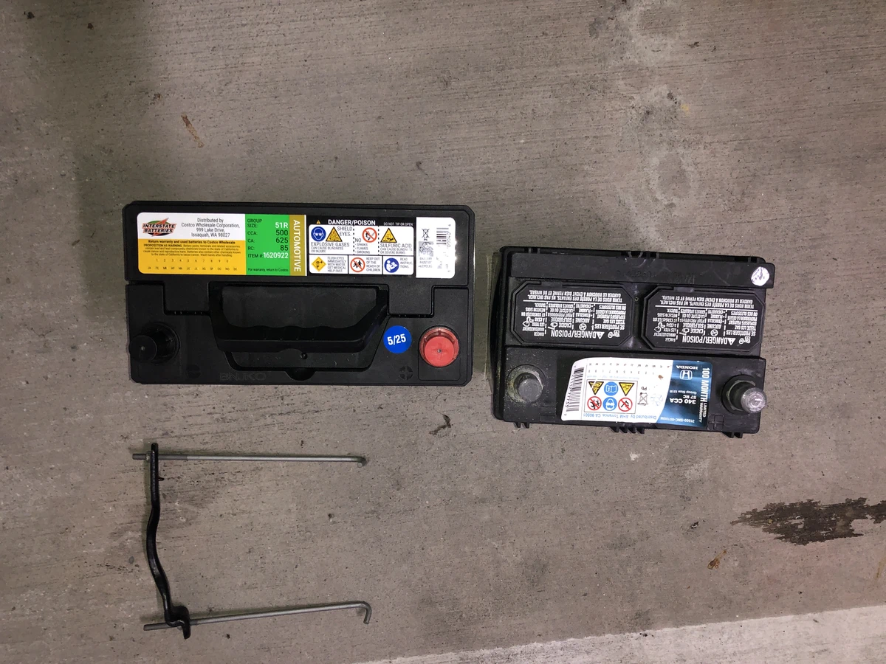
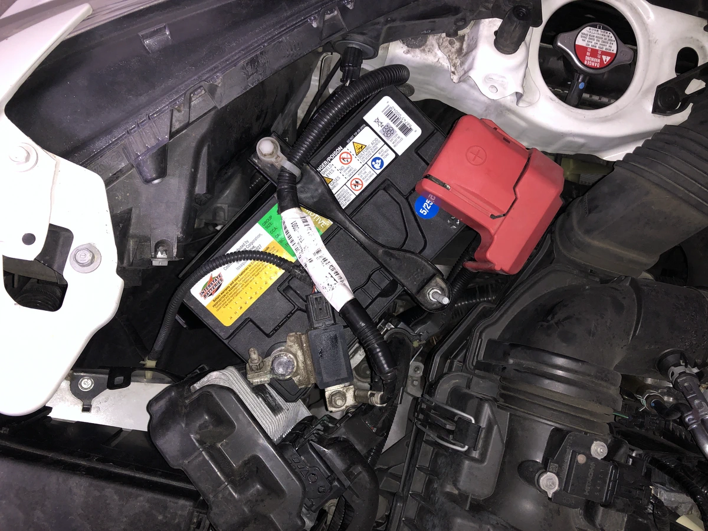

2019년에 구입한 2015년식 Honda Fit은 자동차 왕국인 미국에서의 생존에 큰 도움이
되고 있다. 호주에서 지낼 때부터 Honda Jazz가 막연히 갖고 싶은 차라고 생각했는데
어쩌다 정말 이렇게 타고 다니게 될 줄은 몰랐다. 연비든 뭐든 다 만족스러운데 2주만
운행하지 않아도 쉽게 배터리 방전이 발생하는 문제가 있었다. 중고로 구입해서
그런가보다 하고 새 배터리로 교체했고 한동안은 또 괜찮다가 또 금방 방전되기
일쑤였다. 덕분에 휴대용 점프 배터리를 항상 들고 다녀야 했다.

뒤늦게 인터넷 검색해보니 배터리 규격이 작아서 생기는, 의외로 흔한 문제였다. 추운
동네에서는 더 심하다니 그나마 캘리포니아여서 오히려 나은 사정이었던 건데, 게다가
작은 규격이 흔하지도 않아서 취급하는 곳도 많지 않았고 그 탓에 가격도 더 비쌌다.
더 큰 배터리로 교체하면 된다는데 새 배터리로 교체한지 얼마 되지 않았던 터라 좀만
더 참고 기다리기로 했다. 학교에 종종 몰고 갈 때마다 점프 배터리 챙기는 일이
일상이 되었었다. 번거로워도 시간없다는 핑계로 대충 타고 다녔는데 이제 졸업도
했겠다 탈 일이 더 많을 것 같아 얼른 교체했다.

- 51R 배터리
- 51R 배터리 트레이 (파트번호: 31521-T5A-000)
- 배터리 절연 그리스 (dielectric grease)
- 10mm 렌치
- 장갑

원래는 151R 규격 배터리인데 51R 배터리로 교체하면 된단다. 단순하게 큰 배터리로
늘리면 된다니 싶었는데 놀랍게도 미주 차량에만 작은 배터리고 다른 지역엔 다 51R
배터리가 기본으로 탑재되어 있다고. 배터리 트레이는 기존 있는 걸 잘라도 되고 큰
규격에 맞는 트레이를 사도 되는데 기왕 하는 김에 아마존에서 15불 정도에 구입했다.
배터리는 코스트코에서 구입했다. 코스트코에서 구입하려고 하면 차종을 물어보는데
그냥 시빅 얘기하던지 지금51R 설치 되어있다고 하면 된단다. 나는 별 말 없이 구입할
수 있었다.

<figure>

<figcaption>151R과51R 비교. 아예 체급이 달랐다.</figcaption>

</figure>

<figure>

<figcaption>교체 후 모습</figcaption>

</figure>

[교체 영상][1]이 이미 많아서 쉽게 따라했고 20분 정도면 충분했다.

1. 마이너스 단자(검정) 분리
2. 플러스 단자(빨강) 분리
3. 배터리 고정 브라켓 분리
4. 배터리, 측면 커버, 트레이 제거
5. 새 트레이와 배터리 설치
6. 배터리 측면 커버 부착
7. 브라켓 조립
8. 배터리 연결부와 단자에 절연 그리스 도포
9. 플러스 단자(빨강)을 연결
10. 마이너스 단자(검정)을 연결

차량 악세사리 같은건 교환해본 적이 있지만 배터리를 교체해본 것은 처음이라서
신기했다. 배터리 바꾸고 나서도 쌩쌩 잘 돌아가는 차에 기분이 좋았다. IKEA 가구
직접 조립해서 애정이 더 가는 것이랑 비슷한 기분이다. 별 고장 없이 오래 탈 수
있음 좋겠다.

[1]: https://youtu.be/nW_rz2aVaUc

