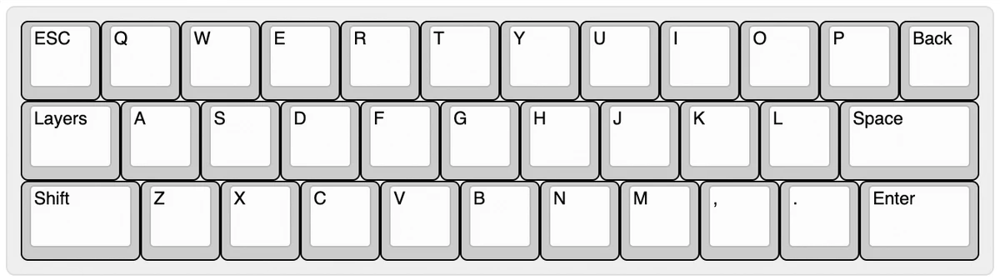
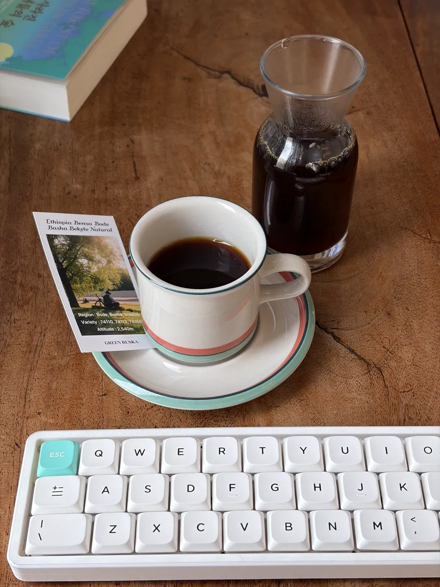

<figure class="wide">

</figure>

나는 나갈 일이 있을 때마다 뭐든 바리바리 싸 들고 나가는 보부상이다. 어쨌든 죄다
넣어서 나가긴 하지만 가장 고민하게 되는 부분은 키보드다. 가방에 이미 모든 걸
넣고 있다가도 키보드 하나 때문에 가방을 바꿔야 하는 일이 생기기 때문이다. 그래서
늘 작은 키보드를 갖고 싶었다. 그냥 필통이나 수첩처럼 가방에 고민 없이 넣어둘 수
있는 정도 크기의 키보드는 없을까? 몇 년을 고민하다가 생각보다 간단하게 만들 수
있다는 얘기를 보고 직접 만들게 되었다.

namul34는 34키로 구성된 작은 블루투스 키보드로 계단식 배열(staggered)을 채택하고
있으며 [ZMK 펌웨어][1]를 기반으로 하고 있다. 기왕 작게 만드는 것 일반적이지 않은
배열로 만들고 싶어서 3행으로 구성했고 스페이스 등 4행에 있을 법한 키 위치를 다
옆이나 레이어 속에 옮겨 두었다. 개인화가 가능한 펌웨어를 사용하고 있어서 여러
레이어를 오가며 정해진 키보다 더 많은 입력이 가능한 것이 큰 장점이다.

키보드를 만드는 과정은 유튜브에서 많이 찾을 수 있어서 막히는 부분이 크게 없이도
최종 제품을 만들 수 있었다. 특히 PCB를 디자인하고 주문하는 과정도 매우 간단했고
소량 생산에도 생각보다 저렴한 편이라 놀라웠다. 최대한 작은 크기로 만들고 싶어서
낮은 프로파일의 스위치와 키캡을 쓰고 싶었는데 오래 사용해 와서 익숙한 nuphy의
키캡과 스위치를 활용했다. 다만 크기에 맞춰서 키캡을 끼운 터라 각인이 실제
레이아웃과 정확하게 일치하지 않아도 깔끔하니까 좋다.

개발에 관한 세부적인 사항은 [개발 노트에서 확인](/ko/keyboard/namul34) 할 수
있다.

<figure>

<figcaption>스페이스/엔터 위치가 기묘하게 보이지만 생각보다 금방 익숙해진다</figcaption>

</figure>

<figure>

<figcaption>첫 프로토타입</figcaption>

</figure>

<figure>

<figcaption>무료로 사용할 수 있는 지역 도서관 메이커스랩에서 출력에 도움을 받았다</figcaption>

</figure>

<figure>

<figcaption>깔—끔</figcaption>

</figure>

<figure>

<figcaption>작은 크기는 여행에서도 빛을 발했다</figcaption>

</figure>

언제든 휴대하기 좋게 만들겠다는 생각과 글쓰기에만 쓰겠다는 제약 덕분에 이런
크기의 키보드를 만들어 낼 수 있었다. 다음에는 조금 더 크게 만들더라도 개발
작업에 무리 없이 쓸 수 있을 레이아웃으로 만들어보고 싶다.

[1]: https://zmk.studio/
