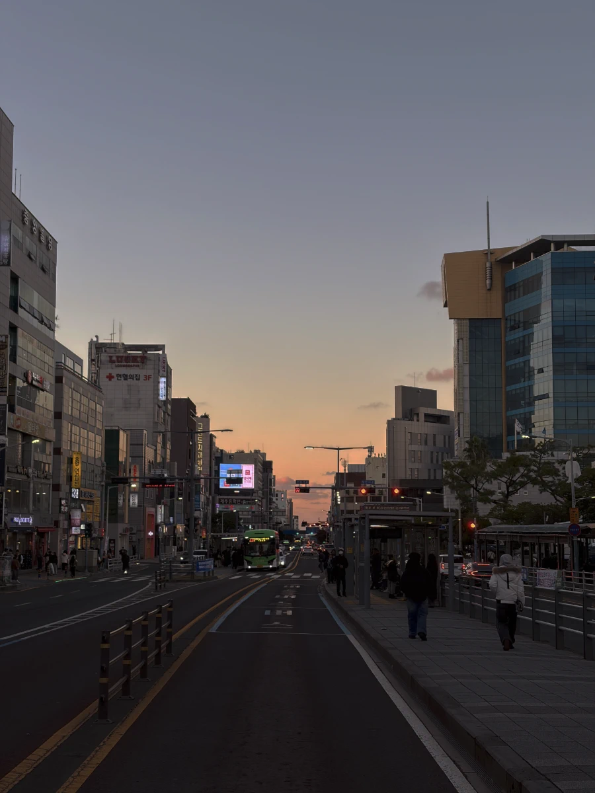
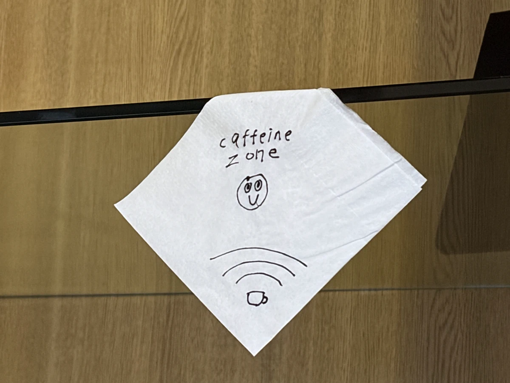

새해가 왔다고 말하기엔 벌써 1월도 거의 다 지났다. 늘 신정까지 새해의 시작을
유보하면서 알쏭달쏭한 위안을 얻는다. 일상에서는 흙 한 톨도 만지지 않으면서
산천초목이라도 된 것처럼 말이다.

작년 말에는 꽤 오랜만에 한국을, 그것도 꽤 긴 일정으로 다녀왔는데 그런 여행을
목전에 두고 집을 서둘러 이사하는 일이 있었다. 신년 초에 이사하지 않을지
헐렁하게만 생각했었는데 그동안 잔뜩 늘어버린 짐이 골치였다. 장모님 집을
정리하게 되면서 보내지 못했던 짐들을 어쩔 수 없이 다 들고 왔다. 다만 그냥 그
상태 그대로 방이며 거실이며 어떻게 처리하지 못한 상태로 있었다. 이사 가면 좀
정리가 되겠지, 생각만 하고 있었다. 그러던 중에 차라리 한국에 가기 전에 이사를
해버리면 한국에서 돌아와서 좀 편하게 쉬지 않을까, 그런 생각을 덜컥 하고 나서는
집을 재빨리 찾아 속전속결로 이사를 해냈다. 덕분에 조금은 마음 편히 한국행
비행기를 탔다.

<figure>

<figcaption>제주 올 때마다 오게 되는 산굼부리</figcaption>
</figure>

<figure>

<figcaption>도민 모먼트: 네비 없이도 잘 다닌다</figcaption>
</figure>

일정은 길었지만 그렇다고 해서 그렇게 편하게만 지내고 온 것은 아니었다. 이번
방문은 우리만 간 것이 아니라 처제와 사돈 식구까지 전부 간 것이기도 해서
생각보다도 신경 쓸 부분이 있었다. 바쁘게 보내고 바쁘게 쉬나 싶더니 벌써 돌아오는
비행기에 앉아 있었다. 언제면 한국에 갈 때 좀 여유로운 기분으로 사람도 만나고
쉬며 올 수 있을까. 늘 급급하게만 보내다가 돌아오게 된다. 늘 돌아오는 비행기에서
이제 집에 가면 좀 쉬겠군, 생각하는데 이사 온 지 한 달여도 되지 않은 곳이라 좀
헛웃음이 났다.

이번에 가면서 잔뜩 싸 들고 갈 것들이 많았던 덕분에 돌아올 때는 가방에 책을 잔뜩
담아서 왔다. 오랜만에 간 서점에서 책장 가득 꽂혀있는 한글을 보고는 부지런히
훑어가며 골랐다. 평소에는 조만간 이사를 할 수 있다는 이유에서 많이 고민하고 사는
편인데 그동안 누르고 있던 모든 것이 터진 것처럼 책을 집어 들었다. 그렇게 한가득
구매하고 왔는데도 집었다가 내려놨던 책들을 다 들고 와야 했나, 그런 생각만
들었다.

<figure>

<figcaption>이번 여행에서 가장 좋았던 카페 우리는</figcaption>
</figure>

멀리 떨어져서 살다 보면, 내가 앞으로 나이가 몇이고, 앞으로 한국을 다녀오는 일이
몇 차례나 될지 별로 크지 않은 숫자를 짐작할 수 있다. 회사를 그만두거나 하지 않는
이상 갈 수 있는 길이가 정해져 있으니 그 방문 횟수와 곱해보면 내 남은 생애 동안
대략 며칠이나 가족과 함께 시간을 보내게 되는지도 알 수 있다. 이젠 가족과의
시간이 내가 평생 양치질하며 쓰는 시간보다도 적다는 점에서, 여기 생활이 이렇게나
큰 대가가 있었구나, 그동안 외면하던 것을 갑작스럽게 마주했다. 오랜만에 가족과
함께 좋은 시간을 보내면서도 서글픈 마음이 여행 내내 따라다녔다.

그렇게 시간을 보내고서 미국에 돌아와 연말을 맞이했다. 폭풍같이 많은 일이
지나가고 나서는 우리는 평안을 되찾았을까, 흑백요리사2도 보고 윤남노포도 보고
그 외에는 밀린 것들 부지런히 보면서 신년을 맞이했다.

안 그래도 요즘 AI 탓에 내가 일하는 분야가 없어진다, 안없어진다, 어쩐다, 저쩐다,
말이 많다. 그런 탓에 굳이 이런 미디어나 플랫폼에 잦은 노출 해서 심란한 기분을
계속 이어가는 것은 정신 건강에 확실히 해로운 일이다. 연말연시에 그나마 위로가
되는 시간은 사 온 책을 뒤적이는 시간이었는데 덕분에 이제 좀 안정을 찾아가는 것
같다. 책을 고르면서 뭘 하라 마라 이래라저래라 정언명령 같은 제목이 많아서 이런
책은 사기도 싫다고 했는데 집에 와서 보니 또 그런 제목의 책도 몇 골라 왔더라.
막상 읽으면 즐겁게 읽을 거면서, 그리고 즐거웠다.

난 늘 글쓰기에 관한 책을 재미있게 읽는 편인데 『쓰고 싶다 쓰고 싶지 않다』도
재밌었다. 각자 글쓰기에 대한 태도나 작법이 이토록 다를 수가 있다고 하면서도 다
모아보니 어째서 다 나는 공감을 하고 있나 싶을 정도로 이입해서 읽었다. 『최선을
다하면 죽는다』는 톡토로라서 꼭 읽어야 할 것 같은 기분이 들어 구매했는데 읽는
내내 킬킬거리다가 울컥 하다가... 일하면서 듣는 라디오처럼 즐거웠다.

항상 신년 계획이라고 이것저것 적어보지만 내 MBTI는 원래 계획대로 실천을 잘
못하고 계획을 세세하게 세우는 것 자체가 잘 맞지 않는 유형이라는 걸 최근에야
알았다. 이런 면죄부가 주어진 나는 어쩌면 이번 신년 유보가 더욱 달콤하게
느껴진다. (웃긴 건 내 유형은 MBTI에 또 과몰입하는 유형 중 하나란다. 나 참
하나만 하면 좋겠구먼) 올해도 건강해야 할 때 건강하고, 즐거운 일에는 충분히
즐거워하고, 괴로운 일에는 위로를 잘 챙겨 시간을 잘 보낼 수 있으면 좋겠다.
