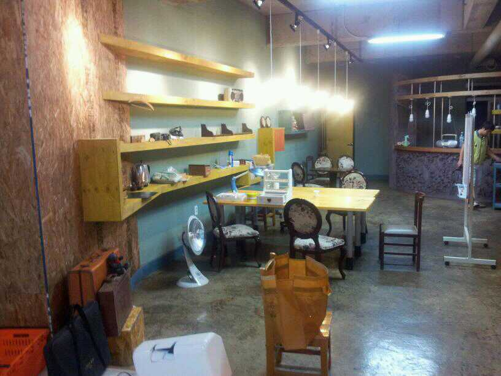

사무실 이사를 했다.

좁은 사무실 내에 인원이 많아지다보니 무질서한 커뮤니케이션 또한 잦아져 온전히 업무에 집중하기 어렵다는 판단 하에 사무실을 분리하기로 결정했다.

비도 오고 그래서 이사하기에 좋은 날씨는 아니었지만 짐을 내릴 땐 날씨가 괜찮아 다행이었다. 원래 카페를 운영하고자 했던 장소라서 인테리어가 이미 되어 있어 마치 카페와 같은 분위기의 사무실이 되었다. 단점은 지하라는 점.[^2]

이전 사무실에서 대표님의 개발 정책은 거의 애자일에 가까웠다. 매일 아침 회의와 함께 누구든지 의견을 개진할 수 있도록 유도하는 분위기, 그 흐름이 끊기지 않도록 오픈된 공간, 그 연장선에서 개발자와 클라이언트가 직접 대면해 당일 모든 수정을 끝내는 유지보수 정책은 고객들에게 강한 인상으로 남게 되었고 그 방식 자체가 회사의 마케팅 방식 중 하나로 자리를 잡았다.

물론 이 정책은 프로그래머, 디자이너, 플래셔, 퍼블리셔가 각각 한 명일 때 유효한 방식이었고 인원수가 늘어감에 따라 (또는 직책의 수가 늘어남에 따라) 여러가지 문제가 나타났다. 예로, 해당 유지보수 내용이 하위 직책의 인원에 떠넘기기 식으로 넘어오기도 하고, 퇴직자의 공백을 모든 직원이 책임 회피를 하는 등의 문제[^3]도 발생하기도 했다. 중간 관리자의 부재의 문제도 있었지만 규모가 커지면 큰 규모에 맞는 프로세스를 구축하거나 부분별로 나눠 소규모를 지속적으로 유지하는 등의 방법으로 해소하는게 바람직하지 않았나 생각이 든다.

개발자에게 어떤 공간이, 어떤 인원이 가장 효율 높고 불편함이 없을까. 환경적인 요소, 제도적인 요소 등 다각적으로 고민해봐야 한다.

[^2]:    
    지하에 사무실을 구해서는 안된다는 사실을 알게 되었다.

[^3]:    
    어쩌면 당연한 문제.
