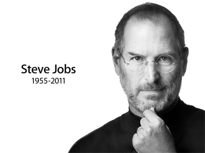

미국시간으로 2011년 10월 5일 저녁, 애플社의 전 CEO 스티브 잡스가 세상을 떠났습니다. 가히 지구적 규모라고 볼 수 있을 정도로 전역에서 추모가 있었습니다. 시대의 아이콘이라는 표현이 농담이 아닌 실존하는 존재였으며 사익을 추구하는 기업의 수장임에도 모두에게 존경과 애도 속에 세상을 떠나간 것은 정말로 멋진 일이란 생각이 들었습니다.

부를 사회에 환원하기 위해 끊임없이 노력하는 공룡 기업도 많지만 그들이 깨끗하다는 인상은 전혀 심어주지 못하는 반면 애플이 외적으로 보여주는 부분은 단지 그들의 프로덕트 외에는 없음에도 세상을 변화시키는 기업으로의 긍정적인 포지션으로 인식된다는 것은 대단합니다. 그의 긍정성과 진정성은 앞으로도 수많은 사람들의 귀감으로 남을 것입니다.

수고하셨어요. 잘가세요, 스티브 잡스!

> I&#8217;m convinced that the only thing that kept me going was that I loved what I did. You&#8217;ve got to find what you love. And that is as true for your work as it is for your lovers.
> 
> &#8211; Steve Jobs
> 
> &nbsp;
> 
> 내가 계속할 수 있었던 유일한 이유는 내가 하는 일을 사랑했기 때문이라 확신합니다. 여러분도 사랑하는 일을 찾으셔야 합니다. 당신이 사랑하는 사람을 찾아야 하듯 일 또한 마찬가지입니다.
> 
> &#8211; 스티브잡스
