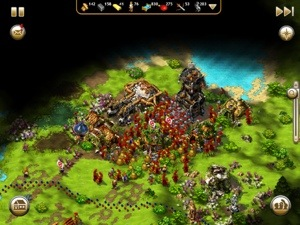

이전 PC판은 리뷰와 친구의 얘기로 들은 적이 있었는데 아이패드 버전이 보이길래 구매해봤다. 아쉽게도 레티나 디스플레이에 최적화 되진 않아 다소 거친 느낌이다.

제목에서 보듯 레밍즈의 전략시뮬 버전이라 할 수 있다. 실제로 전투하거나 특수 유닛들은 컨트롤 (이라 해봤자 위치이동) 을 해줘야 하지만 나머지는 건물과 자원에 따라 대부분 알아서 진행이 된다.

처음에는 자원이 너무 복잡하다고 생각했는데 단순하게 목록에 모든 건물을 지으니 잘 돌아간다. 좀 답답하다고 느끼는 부분은 건물을 아무 곳에나 다 지을 수 있는 것이 아니라 해당 건물을 지을 수 있는 위치가 모종의 방식에 따라 제한적으로 제공된다. 전략시뮬의 묘미는 심시티라고 생각하는데 생각처럼 건물을 마구마구 늘리는 것도 쉽지 않다. 모든 생산 요소도 대부분 자동으로 흘러가는데에 의존하고 있어서 리얼타임 전략시뮬과는 다르게 약간은 관조적인 입장을 제공한다.

물론 독특한 요소지만 결국 많이 짓고 많이 생산하면 이기는 구조. AI도 최적화 때문인지 무한정 유닛을 늘리는 것이 아니라서 잘 막고 많이 생산해서 밀어버리면 되는, 다양한 전략의 구사는 딱히 필요 없어 보인다. 주어지는 유닛들의 종류는 상당히 다양한 편이고 독특한 마나 시스템이라든가 사제 유닛이 다양한 마법을 구사한다든가 하는 부분은 독특한데 자원의 흐름을 직접적으로 제어할 수 없어서 유닛의 조합을 생각해서 진행하기엔 귀찮은 구석이 적잖다. 게다가 계속 생산하게 하는 버튼이 있어 사실 조합의 개념보다는 뚜껑 덮어놓고 생산하는 식. 더욱이 빨리 진행하는 버튼이 있어서&#8230;

게임에서 가장 문제라고 생각되는 부분은 타워나 캐슬같은 군사시설을 기준으로 공격을 해야 땅을 빼앗을 수 있다는 것으로 유닛을 반복적으로 이동하게 하는 요인이 되었다. 특히 길찾기를 잘 못한다. 게다가 군사시설은 sword man 으로만 공격이 가능하다는 점이 상당히 번거로운 부분이었다. 특히 점령을 하게 되면 해당 sword man은 해당 타워를 해체하기 전까지는 터렛(?)처럼 되버리는게 sword man이 비율적으로 많이 필요하다. 그러니 무한 질럿, 무한 저글링 식의 전략을 쓸 수 밖에 없다.

그리고 앞서 얘기한 것처럼 군사시설이 기준이라 AI는 무조건 타워를 먼저 공격한다. 그러므로 병력을 국경에 배치하는 것보다 타워 주변에 모아 두는게 낫다. 처음엔 국경 따라 펼쳐두었는데 뚫고 본진 중앙에 있는 타워까지 밀고 들어와 타워를 부셔버리더라. 게다가 타워를 촘촘하게 안지어두면 한번에 상대방 진영으로 변경되며 마을이 폭풍 반토막이 될 가능성이 농후. 그러므로 촘촘하게 짓거나 반대로 아예 안짓고 모든 병력을 거기에 모아두어 전투를 한다던가. 물론 인원이 일정 이상 되면 쳐들어오지도 않는다.

너무 많은 기대를 해서 그런지 아쉽지만 그래도 요소요소 귀여운 부분들, 예를 들자면 판세가 완전히 기울었을 때 주민들이 반전 딱지를 들고 서있기도 하고, 정복한 타워는 하얀 깃발이 내걸리거나 하는 세세한 부분까지 신경을 썼다는 사실이 돋보였다.

지출이 살짝 아쉽긴 하지만 과거 한 시대의 명작이기도 하고 얘기로만 들어온 궁금증이 해소되어 아깝진 않다.<figure style="width: 300px" class="wp-caption aligncenter">

요즘 오가며 게임만 하고 있어서 어째 게임 리뷰 블로그가 되가는 기분;
