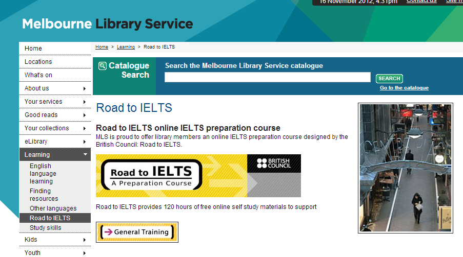

Road to IELTS는 IELTS를 운영하는 British Council에서 만든 온라인 스터디라는데 사실 자세한 내용은 모르겠다. 대충 검색으로는 유료로 가입해야 하는 프로그램인 듯 한데 멜번 시티 라이브러리에 가입하면 무료로 사용할 수 있다고.

멜번 시티 라이브러리에 가입하고자 하면 신분증 들고 가까운 시티 라이브러리에 방문하면 된다. 주소지 증명이 필요하다고 하는데 내 경우는 백팩에 지낼 때 가입해서 백팩에 지낸다고 하니까 나중에 주소 확정되면 갱신하라는 식으로 가입해주었다.

내용이 상당히 좋다고 추천을 받았는데 열심히 봐야겠다.
