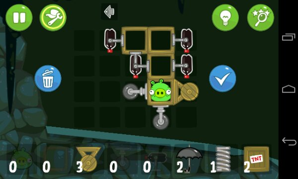
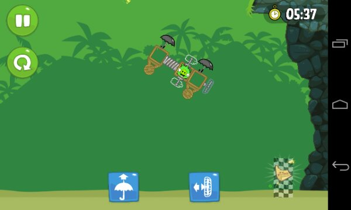

쓰고 싶은 포스트가 많은데도 쉬이 적어나가지 못했던 이유가 바로 이 게임 때문이었다. 이 게임의 프로모 영상을 워낙에 관심있게 봤었는데 안드로이드마켓에 올라와있길래 받은 것이 화근. 며칠동안 출근, 퇴근, 식사때, 화장실에 가서도 부지런히 하게 되더라.

앵그리버드에서 악당으로 나오는 돼지가 주인공으로 나온다. 무차별로 학살 당하던 돼지들이 생존을 위해 새들을 공격하는 시나리오였다면 솔직히 별 관심 없었을텐데 그런 과격한 요소 없이 돼지들이 나온다는게 좋았다.

새들처럼 날아갈 수 없으니 여러 장비를 이용해서 맵 상에 있는 지도를 먹는 것이 목표. 각 스테이지마다 별상자를 먹거나 특정 시간 안에 미션을 완료하거나 특정 아이템을 사용하지 않고 완수하거나 하면 더 높은 달성 점수를 획득할 수 있다. 기존 앵그리버드에서는 스테이지마다 새로운 새를 넣어 레벨링을 한 것과 같이 여기서는 사용할 수 있는 장비를 늘림으로 난이도를 조절했다. 몇개의 스테이지를 진행하면 동굴에 떨어뜨린 모자를 찾는 스테이지가 열린다.

스테이지 목표가 별을 모은다는 컨셉은 아무래도 앵그리버드를 했던 사람들을 위한 배려가 아닌가 생각된다. 개인적으론 음식같은 걸로 대체했으면 어떨까 하고 생각했지만, 차후 버전엔 그렇게 나올지도.

또한 샌드박스 스테이지가 별도로 제공되고 스테이지 진행마다 획득한 파트를 가지고 시나리오 진행때보다 더 자유로운 조립과 플레이가 가능하다. 이런 게임을 하는 사람의 성향을 잘 판단하고 만들어준 부분.

게임을 진행하면서 요절복통기계의 모습을 하고 있으면서도 그 단조로움을 탈피하고 있다. 요절복통기계는 설치가 완료된 후 조작 없이 관조적인 입장에서 기계의 진행을 바라보기만 하는 입장이라면 이 게임에서는 콜라병이나 엔진을 조작하는 등 적극적인 개입을 요구한다. 조작 자체가 크게 복잡하진 않지만 앵그리버드와 같이 당겨서 쏜다 &#8211; 새의 특수기를 사용한다 같이 단순한 조작과는 확실히 대조가 되는 부분이다. 물론 게임의 앞부분에서는 조립해서 출발이지만 진행할수록 조립 자체보다는 조립 이후 컨트롤에 더 많은 영향을 받는다는 점이 확실히 다르다. 

앵그리버드의 흥행은 새를 쏘고 상황을 지켜보는 단순성으로 흥행했다고 생각하는데 긍정적으로 보면 Bad Piggies는 앵그리버드와 다른 복잡성을 가지고 그 앵그리버드가 수용하지 못했던 대상까지 품을 수 있는 게임이다.

