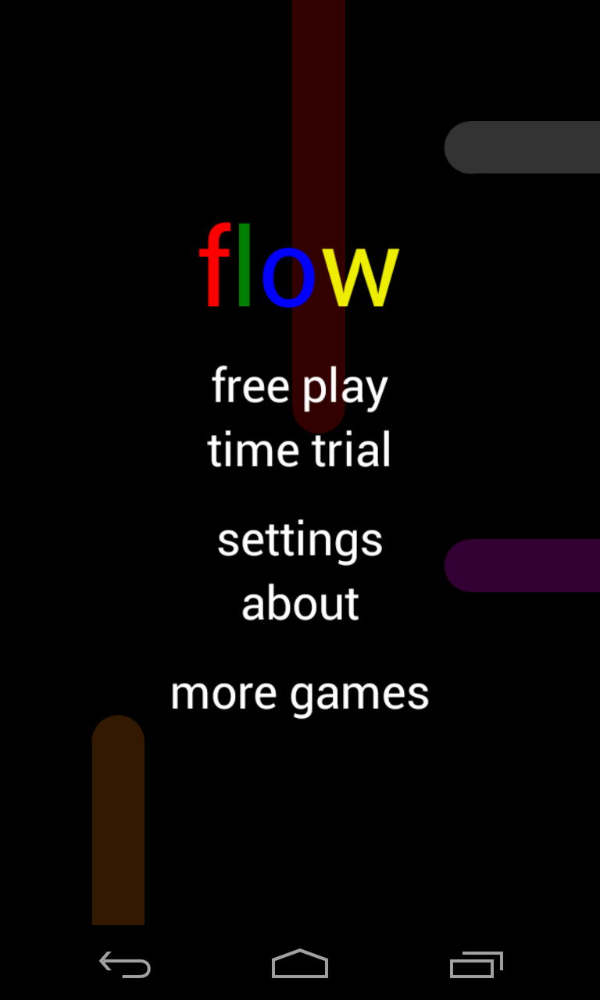
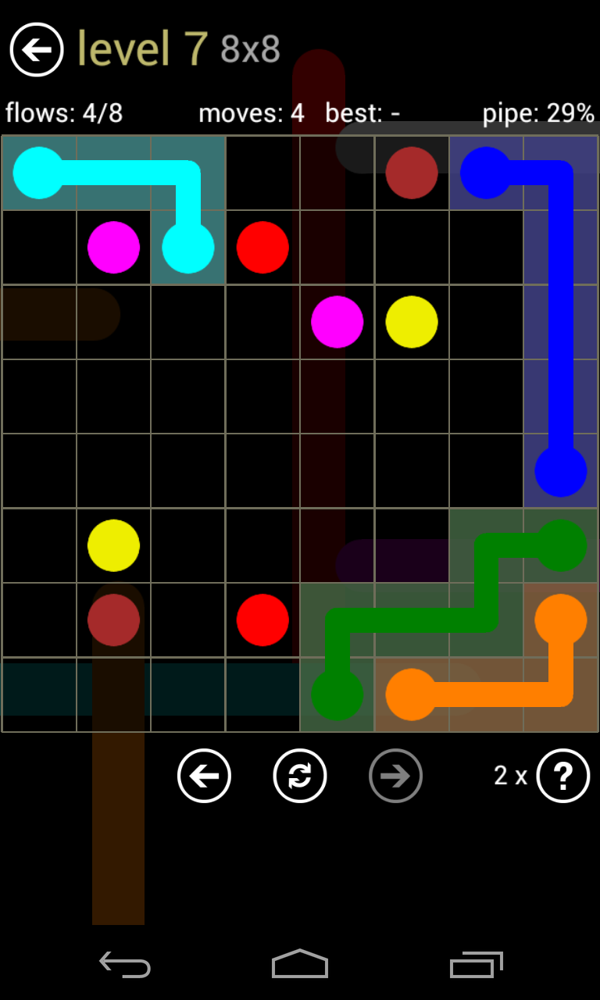

Flow는 잠금해제패턴을 하는 듯한 길찾기 퍼즐게임이다. 규칙은 같은 색의 패턴을 연결하기만 하면 되는데 점의 수, 판의 크기 등으로 난이도를 조절한 것이 특징. 단순히 연결하는 것이 아니라 모든 공간을 채워야 하는데 선을 모두 잇고 나서도 채워지지 않은 공간 때문에 게임이 끝나지 않는 경우가 있다.

단순한 규칙에 조금만 익숙해진다면 금방금방 진행할 수 있다. 처음에 주는 기본 컨텐츠가 많은 편인데 추가로 컨텐츠를 구입할 수 있다.

규칙이 단순해서 그런지 난이도가 높아지더라도 크게 어렵다고 느껴지질 않는게 문제. 외각에 붙은 것들부터 이어가면 각 게임이 1분 이내로 가능하다. 시간제한 모드도 있어서 나름 경쟁하면서 할만한 부분도 있다.

그런데&#8230; 생각해보면 이런 게임 진작에 나왔을 것 같은데 이제야 이렇게 올라온 것 보면 좀 신기하다.