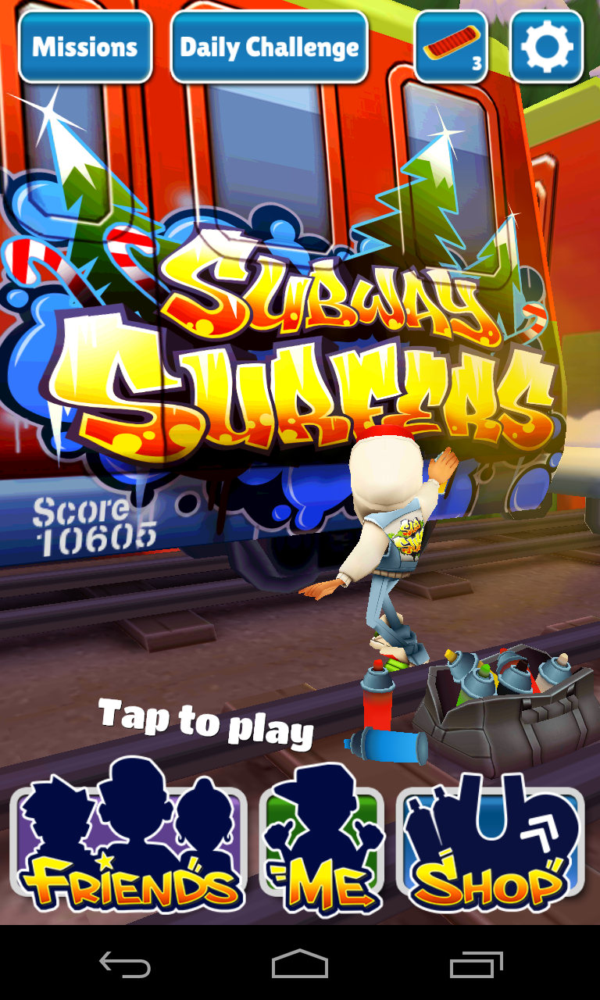
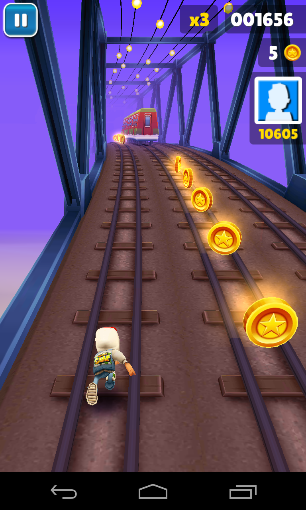
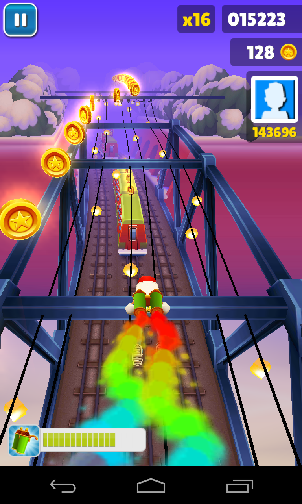
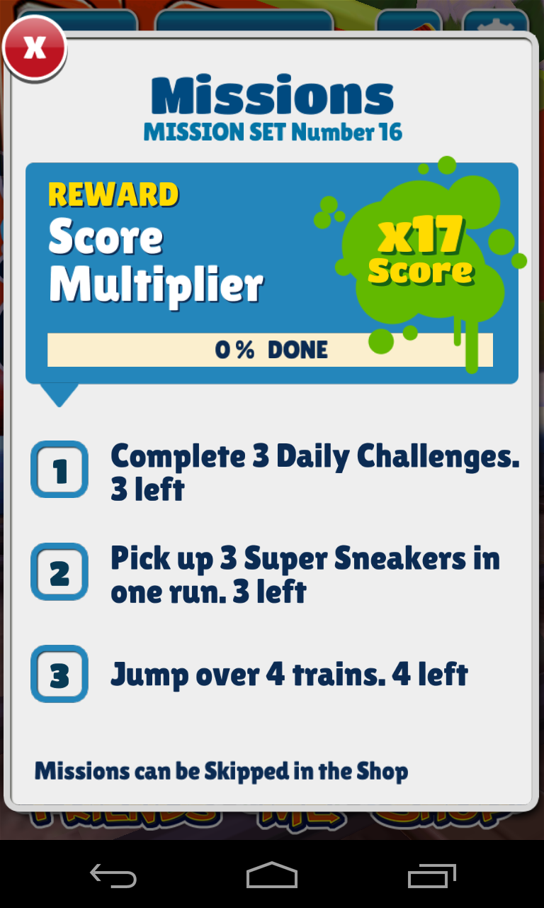

Subway surfers는 이전에 리뷰했던 jetpack과 상당히 유사한 룰을 가지고 있는 3D 플랫포머 게임으로 지하철에 그라비티 그리다 걸려서 도망가는 배경 이야기를 가지고 있다. 출시한지 상당히 오래된, 전통있는(?) 게임으로 알고 있다. 고전 게임에서도 우주선이 우주를 뛰어다니는 sky라는 게임이 있었는데 그와 상당히 유사하다.

회사 직원이 자기 딸이 완전 이거에 홀릭되어 있다며 아이폰으로 시켜줘서 한번 했었는데 아이폰만 있는 줄 알았더니 안드로이드도 있길래 바로 설치해봤다.

게임은 좌우이동, 점프와 구르기 네가지의 조작을 통해 기록을 내는 방식으로 진행된다. Jetpack joyride에서는 사실 다양한 조작이 없어 단조로운 면이 있었는데 이 게임은 다양한 조작과 적절한 장애물 배치로 난이도를 구성했다.

달리는 중에 코인과 특수 아이템과 비밀상자를 획득할 수 있으며 코인으로는 케릭터, 보드 등을 추가로 구입할 수 있다. 일부 케릭터는 미스터리 상자에서 획득하는 아이템을 통해 얻을 수 있는 형태. 보드는 게임중 더블탭으로 사용할 수 있는데 장애물에 부딫치면 장애물과 함께 폭파(?)하며 계속 달릴 수 있게 한다. 무한정 쓸 수 있는건 아니며 구입하거나 미스테리 상자를 통해 획득해야 한다.

특수 아이템은 코인 자석, 점수 더블, 슈퍼 점프, 젯팩 등으로 구성되어 있다. 각각의 아이템은 상점을 통해 업그레이드를 총 5단계까지 할 수 있는데 업그레이드 할수록 사용 시간이 증가한다.

일간 도전과 미션이 있는데 내 일간 도전은 뭐가 문제인지 진행이 안되는 상태. 그래서 미션을 진행할 때 데일리 챌린지에 대한 부분이 나오면 상점에서 미션 스킵하는 아이템을 구입한다.

미션은 각 미션마다 세가지씩 주어지는데 미션을 수행하면 달리기 점수를 더 높은 배수로 획득할 수 있게 해준다. 즉 일정 시간이 지나면 더이상 고득점을 하기 힘든 형식의 게임에서 미션 달성을 통해 자연스럽게 자신의 고득점을 지속적으로 갱신할 수 있게 만든 배려 아닌 배려로 끊임없는 플레이를 유도한다. (난 16배까지 와서야 고득점 갱신이 내 실력이 좋아져서 갱신하는 것이 아니라 배수가 높아져서란걸 깨달았다. 당했어&#8230;)

다른 게임들과 같이 페이스북이나 트위터, 유튜브 연동을 통해 추가 코인을 획득할 수 있다. 상점에 있는 연동 항목은 누르고 취소하면 코인은 들어온다. 페이스북을 연동하면 점수나 달성 내용을 포스트 할 수 있다. 친구랑 기록내기 하는 것도 나름 재미있..겠지만 설치 하게되면 2주 정도는 가뿐히 워프하므로 원망을 사지 않도록 주의할 것. ㅠㅠ