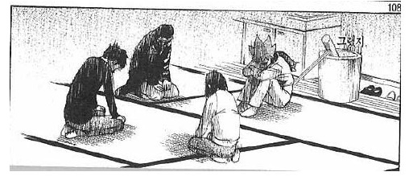
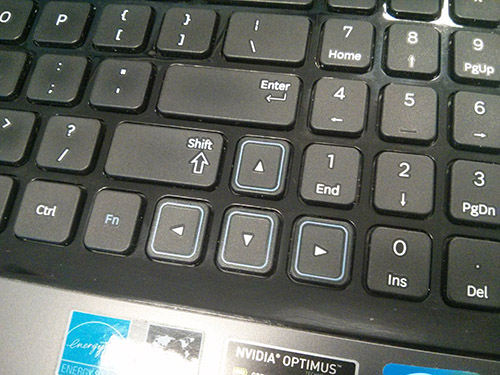
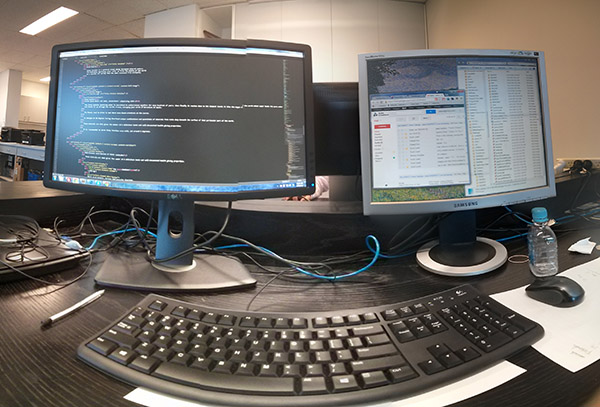

이전까지 다니던 회사에서는 데스크탑을 지원해줬는데 지금의 회사에서는 이동이 많은 관계로 데스크탑 대신 노트북을 지원해 줬었다. 입사 당시에는 회사에 있던 Acer 노트북을 사용하고 있었는데 잦은 멈춤 현상으로 작업본을 몇번 날려먹자 회사 앞 Officeworks에 가 사용할 노트북을 구입했다. 에이서 모델을 제외하고 나니 해당 매장에서 구입할 수 있던 기종이 삼성 아니면 아수스 모델이었는데 이상하게 가장 괜찮은 사양이 삼성 모델이었다. 별로 내키지는 않지만 일이 급했던 관계로 삼성 노트북을 구입했고&#8230; 그게 **재앙의 시작**이었다.

<figure>

<figcaption>불편하고 능률 하락하고 아프고 1타 3피</figcaption></figure>

삼성 노트북의 가장 큰 문제점은 바로 **키배치**였다. 좁은 공간에 편의를 위해 넘버패드를 넣는 것까지는 좋은데 방향키와 엔터키, 넘버패드 0키와 우측 컨트롤, 시프트 키의 동선이 기존 키보드와는 맞지 않아 엄청난 불편함을 초래했다. 좁은 공간을 활용하는 입장까지는 이해가 되지만 차라리 아래로 넓게 공간을 활용해 방향키를 뺐더라면 사용성을 더 살릴 수 있지 않았나 싶은데 이런 기형적인 키보드 구조[^p1569-1]로 인해 매 작업마다 위 나열한 키들이 멋대로 눌려 매번 스트레스를 야기했다. UX를 고려하지 않은 키보드 레이아웃이 작업에 얼마나 막대한 영향을 미치게 되는지 이번 기회를 통해 제대로 알게 되었다.

<figure>

<figcaption>문제의 키보드 레이아웃. 보면 모른다. 눌러봐야 안다.</figcaption></figure>

극단적인 불편함을 초래했던 키보드를 대체하기 위해 일반적인 레이아웃을 가진 키보드도 하나 구입해왔다. <a href="http://www.logitech.com/en-us/product/6692?crid=26" target="_blank">Logitech K120</a> 모델로 맴브레인 키보드인데 노트북의 기형 레이아웃을 벗어나 정상적인 규격의 키보드를 사용하니 천국이 따로 없다. 이전 한국서는 아이락스 팬터그래프 키보드를 사용했었는데 팬터그래프라 그런지 손가락 끝이 미끌리는 기분도 들고 정확히 눌린다는 느낌이 덜했었다. 오랜만에 사용하는 맴브레인이라 그런지 눌리는 느낌도 정확하지만 팬타그래프에 비해 조금 더 손가락에 압력이 강하게 느껴지는듯 싶다. 물론 노트북 키보드에 당한걸 생각하면 뭐든 안좋은게 없겠지만 말이다.

노트북을 오랫동안 사용하면 자연스레 <a href="http://ko.wikipedia.org/wiki/VDT_%EC%A6%9D%ED%9B%84%EA%B5%B0" target="_blank">VDT 증후군</a>에 노출되게 된다. 난 예외라고 생각했지만 당연히 예외일 수가 없었고 특히 12월부터는 어깨와 목, 손목 통증이 심해지기 시작했다. &#8220;프로젝트보다 내 몸이 먼저 상하겠구나&#8221; 생각이 들어 환경을 개선하고자 이리저리 알아봤다. 일단 모니터를 하나 더 구입해서 듀얼 모니터로 구성을 했다. 원래는 외장으로 쓰는 모니터가 하나 있었기 때문에 노트북 스탠드를 구입해보려 했으나 신기하게도 호주에서 판매하는 스탠드는 한결같이 금방이고 부서질 것 같은 녀석들만 엄청난 가격으로 판매하고 있었다. 기왕 사는 김에 고해상도 모니터를 구입해보자는 생각도 들어 <a href="http://accessories.us.dell.com/sna/productdetail.aspx?c=us&#038;cs=19&#038;l=en&#038;sku=320-2807" target="_blank">델에서 판매하는 U2312MH</a>를 구입하게 되었다. 원래는 집에서 사용하려고 구입했으나 그걸 못참고 사무실에서 개봉해 사무실에서 사용하고 있다.

<figure>

<figcaption>작업환경. 진작부터 이랬으면 좋았을걸.</figcaption></figure>

**&#8220;훌륭한 목수는 연장 탓하지 않는다&#8221;[^p1569-2]**를 조금 바꿔보면 **&#8220;훌륭한 목수가 연장 탓을 안하면 VDT 증후군에 걸린다.&#8221;** 가 되겠다. (뭐 내가 훌륭한 목수란건 아니지만.) 온전히 작업에만 집중할 수 있는 환경을 만드는 것이 얼마나 중요한지, 그리고 좋지 않은 개발 환경이 건강을 위협할 수 있다는 사실까지 되짚어 볼 수 있었다.

* * *

  

    1) 이런 기형적 키보드 레이아웃은 삼성 뿐만 아니라 요즘 대다수의 노트북에서 사용되고 있는 &#8220;트랜드&#8221;라고 한다. 뭔가 슬픈 유행이다.
  

  
  

    2) 사실 &#8220;훌륭한 목수는 연장 탓하지 않는다&#8221;의 본 뜻은 자신이 잘하고 못하는걸 연장의 잘못으로 돌리지 않는다는 말이지 좋은 연장을 쓰지 않는다는 의미가 아니다.
  

