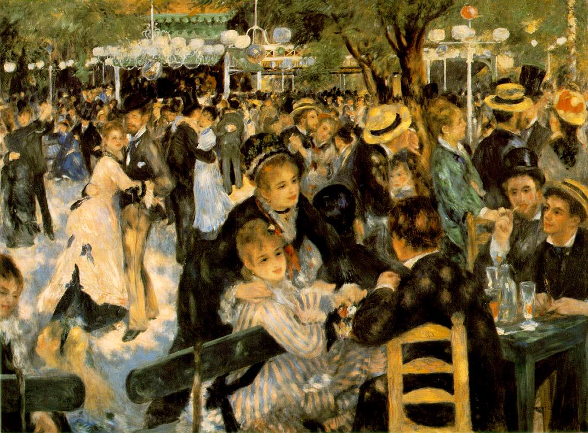
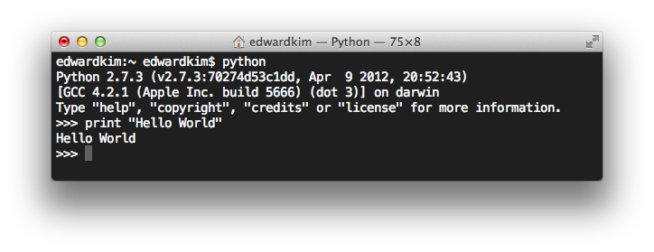

미술사에 대한 관심은 어려서부터 많았다. 외삼촌이 미술에 관심이 많았었는데 대학에 들어가며 수많은 미술 서적들을 우리집에 두고 갔다. 올 컬러 인쇄의 호화 양장본이었고 오랜 기간이 지난 책인데도 약간 퀘퀘한 냄새가 날 뿐이지 작가의 그림을 보기에, 그리고 뒤에 붙어있던 작가의 설명을 보기에 전혀 문제가 없었다. 그걸 유치원 때 재미있다고 읽고 보고 했었다. 시간이 지나면서도 가끔씩 들여다보던 책이었다.

본격적으로 미술사에 대해 책을 찾아보고 공부하게 된 것은 재미있게도 고등학교 때 소설 _<냉정과 열정 사이>_를 보고나서 였다. 소설 중 아가타 쥰세이의 직업은 미술작품을 복원하는 복원사였는데 흥미가 생겨서 소설을 읽고 난 후에 다카시나 슈지의 _<명화를 보는 눈>_ 등 여러 미술사 관련 책을 통해 좀더 체계적으로 배우려고 노력했었다.

**스탕달 신드롬**은 _명화와 같은 뛰어난 예술 작품을 보게 될 때 겪는 현상으로 심장이 두근거리거나, 의식이 혼미해지거나, 심하면 환상을 보는 등의 경험을 하는 것을 뜻_한다. 이전까지는 미술을 책으로만 접했던 나는 르누아르의 작품을 보다가 너무 놀랐는지 미술관 한복판에서 현기증에 주저 앉은 적이 있었다. 그게 진짜 스탕달 신드롬인지 그냥 다리 힘이 갑자기 풀린 것인지는 모르겠지만, 그런 경험 이후에는 좀 더 깊게 미술사를 살펴보게 된 건 어쩌면 당연한 일인지도 모르겠다. 근래에도 National Gallery of Victoria에서 인상파전을 하길래 다녀온 적이 있었는데 요번에 출근하며 가만 기억을 더듬다가 프로그래밍에도 스탕달 신드롬이 있지 않나 생각이 들었다.

<figure>

<figcaption>이 작품 앞에서 주저 앉았다. 르누아르의 Moulin de la Galette</figcaption></figure>

실무에 있다보면 새로운 것에 대한 자극이 점점 옅어져 권태에 접어들거나 좌절감에 빠져들기도 한단다. (난 경력도 얼마 안되는데도 나에게서 요즘 이런 모습이 보인다&#8230;) 그래도 개발일을 하면서 겪었던 경험들에 빗대어 생각하게 되었다. 한참을 고민하다 해결책을 찾았을 때라거나, 생각지도 못한 기발한 방법으로 작성한 코드를 보고 심장이 두근거리다 못해 현기증이 나고 마는 프로그래밍 스탕달 신드롬! 가끔 마주하는 그런 순간들이 프로그래밍의 깊이를 더하고 앞으로 더 나아가게 만드는 힘이 되지 않았던가 하고 말이다.

그래서 한참 생각하다 그 설렘이 가장 컸던 순간이 언제였을까? 되감아 생각해보니 무엇보다 가장 강렬했던 그 순간은 이런 저런 복잡한 일이 아닌 **Hello World를 화면에 가장 먼저 띄웠을 때**였다.

<figure>

<figcaption>Hello World를 처음 띄운 순간에 다들 그렇지 않나요? 나만 그랬나&#8230;</figcaption></figure>

처음 Hello World에서 보았던 미래를 다시 가슴에 품고, **프로그래밍 스탕달 신드롬**을 기대하며 부지런히 해야하지 않을까. 얼렁뚱땅 결론을 내는 기분이 나지만 ^^; 다시 그 스탕달 신드롬을 마주하는 순간을 기대하며 부지런히 나아가야겠다.