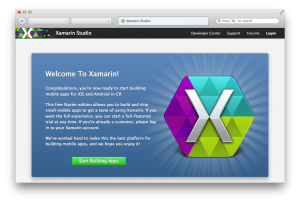
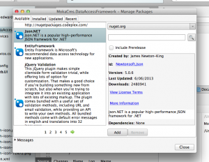

.Net 스터디를 대비해 개발 환경을 설치한 과정을 기록해둔 포스트. 이전 MonoDevelop에 비해 훨씬 뛰어난 모습의 Xamarin Studio와 각종 add-in package로 mac OSX에서의 .Net 개발 환경을 구축할 수 있었다. 스터디는 Visual Studio 기준이라서 아마 가상 환경을 구축하게 될 것 같지만 그러기엔 에어 용량이 많이 허덕여서 일단 급한대로 mono 환경을 다시 세팅했다.

## Mono란?

Mono는 개발자들이 쉽게 크로스 플랫폼 어플리케이션을 만들 수 있도록 고안된 소프트웨어 플랫폼이다. Xamarin사에서 지원하며, Mono는 Microsoft .NET 프레임워크를 구현한 오픈소스이며 ECMA 표준을 따르는 C#과 공용언어 런타임을 기반으로 하고 있다. Mono 환경과 Xamarin Studio와 함께 .Net 개발을 시작할 수 있다. [^1]현재 안드로이드, iOS 등 광범위한 영역의 크로스 플랫폼을 구현하고 있다.

## Mono와 Xamarin Studio 설치

  1. [Mono 웹사이트][1]에서 Mono SDK인 MDK를 받는다. JRE, JDK처럼 MRE, MDK가 있는데 MDK를 설치하면 된다.

  1. [Xamarin 웹사이트][3]에서 Xamarin Studio를 내려받는다.

둘다 받아 설치하면 일단 끝난다.

최신의 MSBuild를 사용하기 위해서는 `Xamarin Studio > Preferences...` 로 들어가서 `Project > Load/Save` 항목을 눌러 최신 버전의 MSBuild를 선택한다.

## NuGet을 Xamarin Studio에 설치하기

NuGet은 .Net을 포함한, Microsoft 개발 환경 플랫폼을 위한 패키지 매니저다. `PyPI`, `npm` 같이 편리하게 리포지터리에서 받아 사용할 수 있다.

Mac에서 사용하고자 하면 이전엔 CLI를 이용해 설치하는 방법이 있었지만 Xamarin Studio에서 바로 사용할 수 있도록 [add-in][4]으로 만들어뒀다. 덕분에 편리하게 설치하고 사용할 수 있다.

  1. `Xamarin Studio > Add-in Manager`로 들어간다.
  2. `Gallery` 탭에서 Repository를 선택해 `Manage Repositories`에 들어간다.
  3. Add를 누른 후 자신의 Xamarin Studio 버전에 맞는 `NuGet Add-in`을 [NuGet GitHub 페이지][4]에서 찾아 추가한다.
  4. Refresh 버튼을 눌러 갱신한 후 `Nuget Package Management`를 검색해 설치한다.
  5. 이제 각 Project에서 오른쪽 클릭하면 `Manage NuGet Packages`를 볼 수 있으며 눌러 설정할 수 있다.

## 기존의 project가 load failed 되는 경우

solution을 불러오면 몇 project에서 불러와지지 않는 문제가 나타나는데 해당 프로젝트의 `csproj`를 열어 `<ProjectTypeGuids>` 항목을 지워주면 정상적으로 불러온다.

* * *

기본적인 설치를 마치고 .Net 스터디에서 작성했던 코드를 받아 구동해봤는데 정상적으로 잘 동작한다. Xamarin Studio는 예전 MonoDevelop을 생각하면 엄청나게 좋아졌다는 것을 느낄 수 있다.

[^1]:    
    MS에서 제공하는 것에 비해 모자란 점이 있긴 하지만 꾸준히 성장하고 있다.

 [1]: http://www.mono-project.com/
 [3]: http://xamarin.com/
 [4]: https://github.com/mrward/monodevelop-nuget-addin
