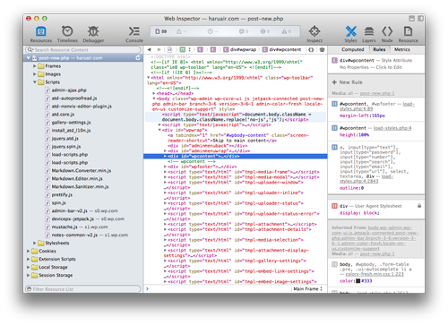

메인 브라우저로 Google Chrome을 상당히 오래 사용해왔다. OS와 상관 없이 일관적으로 제공하는 수많은 핫키들과 특히, 강력한 개발자도구로 편리하게 이용하고 있었다.

하지만 근래들어 불안하다 느껴질 정도로 메모리 사용량도 증가하고 멈추는 경우도 종종 있어서 브라우저를 Apple Safari로 사용해보려고 찾아봤다.

## 일반 단축키

  * 특정 순서 탭 바로 이동하기 : `Cmd + 1,2,3,4`&#8230; [확장 설치 필요][1]
  * 바로 전에 닫은 창 다시 열기 : `Cmd + Z` (크롬서는 `Cmd + Shift + T`)
  * 앞탭 뒷탭 이동하기 : `Ctrl + Tab`, `Ctrl + Shift + Tab` (모든 브라우저 동일)
  * 주소창 바로가기 : `Cmd + L` (모든 브라우저 동일)
  * Reader 화면 바로보기 : `Cmd + Shift + R`

## 개발자도구 단축키

개발자도구가 더욱 xcode스러워졌다. xcode에서 개발하기 익숙한 사람은 대다수의 UI를 유사하게 차용한 사파리의 개발자도구가 크롬의 도구보다 사용하기 편할 듯 싶다. 이처럼 일관적인 개발 경험을 제공하는 것도 좋은 전략으로 보인다. (이런 면에서 IE의 개발자도구는 개선의 여지가 많다.)

  * 개발자도구 열기 : `Alt + Cmd + I`
  * 개발자도구 콘솔 바로 열기 : `Alt + Cmd + C`
  * 인스펙팅 사용하기 : 개발자도구 연 상태에서 `Shift + Cmd + C`

## Pocket extesion 설치

스크랩을 위해 자주 사용하는 Pocket은 Safari를 위한 확장도 제공한다. [Pocket 웹사이트][3]에서 확장을 설치할 수 있다.

## Safari 확장 관련 사이트

  * [Back to the Mac 선정 &#8211; 추천 사파리 확장 프로그램(Extension) 30선][4]
  * [Apple Safari Extensions Gallery][5]

[1]: https://github.com/rs/SafariTabSwitching
[3]: http://getpocket.com/safari/
[4]: http://macnews.tistory.com/1663
[5]: http://extensions.apple.com