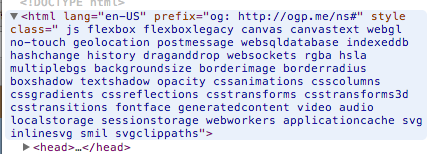

근래 아이폰, 아이패드, 맥북 프로 등 통칭 레티나로 일컬어지는, 고밀도 디스플레이 기기가 늘고 있다. 그에 따라서 웹페이지도 레티나 해상도에 대응을 하기 시작했는데, 각 이미지를 2배의 해상도로 저장한 후 css 또는 js를 이용해 치환하는 형태 또는 svg, canvas 등을 이용하는 방식으로 대응하고 있다. 여러 방법 중 svg를 활용하는 방법을 살펴보려고 한다.

svg는 xml로 작성된 벡터 이미지 포맷으로 [대다수의 최신 브라우저에서 지원][1]하고 있어 이와 같은 문제를 해결하는데 도움이 된다. svg를 이용하는 장점은 다음과 같다.

  * 이미지를 2번 이상 생성하지 않아도 된다. 하나의 이미지로 여러 해상도를 지원할 수 있으며 단일 파일로 모두 제어할 수 있으므로 유지보수에 용이하다.
  * `svg` 엘리먼트를 이용해 인라인으로 사용하면 stylesheet나 js를 이용해 동적으로 활용할 수 있다.

물론 svg를 사용할 때 단점도 분명 존재한다.

  * 확대/축소에 따라서 의도와 다른 형태로 렌더링 될 수 있다. 예를 들면 비트맵에서는 쉽게 가능한 1px 선을 벡터 방식에선 면으로 표현해야 하기 때문에 그리기 어렵다.
  * IE 8 이하, Android 내장 브라우저 (2.1, 2.2, 2.3)에서는 지원하지 않는다.[^1]

위에서 살펴본 장단점에 따라 svg를 사용할 수 있는지, 어떤 경우에 적용할 것인지 전략을 세워야 한다. 특히 렌더링에서 차이를 보이는 부분으로 인해 iOS에서 벡터 앱 아이콘을 사용할 수 있는 상황에도 애플앱들은 비트맵으로 작성한 아이콘을 쓰고 있는 예도 있다.[^2]

## svg 사용하기

svg를 웹에서 사용하는 방법은 `img` 엘리먼트와 `svg` 엘리먼트를 이용하거나 css를 통해 활용할 수 있다.

`img`를 이용해 일반 이미지처럼 사용할 수 있다.

    
    

그리고 `svg` 엘리먼트를 통해 직접 넣을 수 있다. 이렇게 작성하면 다소 지저분해지는 경향이 있지만 svg 내부의 엘리먼트도 css로 제어할 수 있다는 장점도 있다. 아래는 이상한 모임 로고의 글자 부분이다.

    <svg version="1.1" xmlns="http://www.w3.org/2000/svg" xmlns:xlink="http://www.w3.org/1999/xlink" x="0px" y="0px" width="500px"
     height="500px" viewBox="0 0 500 500" enable-background="new 0 0 500 500" xml:space="preserve">
        <g id="이상한모임">
            <g>
                <path fill="#000000" d="M180.647,389.499c-2.698,0-5.852-1.786-5.852-6.649v-9.042c0-3.951,2.584-6.991,6.991-6.991h3.381
                    c4.217,0,6.839,3.153,6.839,7.105v9.156c0,3.837-2.545,6.421-5.205,6.421H180.647z M184.447,385.586
                    c1.899,0,2.773-1.824,2.773-3.268v-8.055c0-1.634-1.254-3.078-2.773-3.078h-1.9c-1.52,0-2.925,1.444-2.925,3.078v8.055
                    c0,2.47,0.988,3.268,2.925,3.268H184.447z M200.291,364.309h-5.091v31.953h5.091V364.309z"/>
                <path fill="#000000" d="M216.556,365.639c0.342,4.521,4.597,11.702,7.485,15.273h-5.737c-1.52-1.823-3.153-5.015-4.407-7.94
                    c-1.292,2.583-2.28,5.167-4.445,7.94h-6.421c5.433-4.559,8.207-13.374,8.435-15.273H216.556z M226.283,384.712
                    c2.735,0,4.939,1.71,4.939,4.104v3.039c0,2.09-2.127,4.027-4.787,4.027h-12.918c-3.496,0-5.396-1.178-5.396-4.065v-2.887
                    c0-2.812,2.128-4.218,5.281-4.218H226.283z M214.922,388.663c-1.444,0-1.976,0.38-1.976,1.292v1.102
                    c0,1.103,1.064,1.103,2.052,1.103h9.727c0.912,0,2.052-0.381,2.052-1.103v-1.178c0-0.722-0.76-1.216-2.052-1.216H214.922z
                     M235.135,374.947h-4.255v7.979h-4.863v-18.655h4.863v6.231h4.255V374.947z"/>
                <path fill="#000000" d="M248.742,366.437h6.117v3.495h-2.735c0.874,0.912,1.405,2.166,1.405,3.496v3.951
                    c0,3.191-2.355,5.471-5.053,5.471h-4.711c-2.698,0-5.091-2.279-5.091-5.091v-4.331c0-1.33,0.532-2.584,1.406-3.496h-2.66v-3.495
                    h6.117v-2.166h5.205V366.437z M263.484,395.502h-22.721v-10.524h4.788v6.003h17.934V395.502z M249.122,376.847v-2.432
                    c0-1.216-0.912-2.127-2.166-2.127h-1.596c-1.216,0-2.318,0.911-2.318,2.127v2.432c0,1.254,0.722,2.166,1.938,2.166h2.127
                    C248.362,379.013,249.122,378.101,249.122,376.847z M262.42,372.819h4.483v4.56h-4.483v8.473h-4.901v-21.619h4.901V372.819z"/>
                <path fill="#000000" d="M298.063,392.767h-28.876v-4.445h11.893v-4.293h5.091v4.293h11.893V392.767z M272.493,367.12v15.616
                    h22.455V367.12H272.493z M290.236,378.557h-12.538v-7.295h12.538V378.557z"/>
                <path fill="#000000" d="M315.621,370.806v5.243c0,2.926-2.317,5.243-5.091,5.243h-4.901c-2.773,0-5.281-2.317-5.281-5.243v-5.243
                    c0-2.926,2.508-5.243,5.281-5.243h4.901C313.304,365.562,315.621,367.88,315.621,370.806z M326.031,384.598v11.664h-22.492
                    v-11.664H326.031z M311.176,371.87c0-1.292-0.987-2.242-2.241-2.242h-1.71c-1.254,0-2.355,0.95-2.355,2.242v3.115
                    c0,1.292,1.102,2.279,2.355,2.279h1.71c1.254,0,2.241-0.987,2.241-2.279V371.87z M322.422,388.587h-14.817v3.609h14.817V388.587z
                     M326.031,364.232h-4.407v18.124h4.407V364.232z"/>
            </g>
        </g>
    </svg>
    

어떻게 지저분한지 보여주기 위해 위 예를 넣었다. 다섯글자일 뿐인데 이렇게 지저분하다.

## modernizr와 css를 이용한 이미지 대체

위와 같이 직접 적용하면 svg를 지원하지 않는 브라우저에서는 이미지가 나타나지 않기 때문에 [modernizr][2]를 통해 svg 지원 여부를 확인하고 그에 따라 css로 이미지를 교체해주는 방법을 활용할 수 있다.

Modernizr를 웹페이지에 적용하면 해당 브라우저에서 어떤 기능을 지원하는지 `html`의 클래스로 선언해준다. `html`에 적용된 클래스를 플래그로 이용해 css 배경을 대체/적용하는 방식으로 svg 미지원 브라우저 문제를 해결할 수 있다.

    #logo { background: url("logo.svg"); }
    .no-svg #logo { background: url("logo.png"); }
    

## svg 적용 사례

  * [Apple][4] : apple 사이트의 메뉴 등에서 svg를 사용함. 벡터 이미지는 서체 표현에 용이함.
  * [Mailchimp][5] : 동보메일 서비스인 mailchimp도 이번 개편에서 svg를 곳곳에서 사용하고 있음. 특히 체크박스나 라디오 버튼을 svg로 대체하고 있는 점이 독특.
  * [FontAwesome][6] : 아이콘 폰트를 제공하는 서비스인데 svg로 된 포멧도 지원함.

이외에도 svg를 활용한 곳을 심심하지 않게 찾아볼 수 있다. svg도 이제 지원하는 브라우저가 많기도 하고 하위 호환을 고려하기도 큰 어려움이 없기 때문에 예전에 비해 많이 사용하는 추세다. 위의 예시에서 눈치챘을 수도 있지만 [이상한모임][7]의 로고도 svg를 사용했다.

## 읽어볼 만한 글

다음 두 포스트는 레티나 지원을 위한 다양한 방법에 대해 체계적으로 잘 정리된 글이다.

  * [레티나 웹(Retina Web)에 대응하는 우리들의 자세 1 &#8211; 래스터 이미지 편 &#8211; uxd.so][8]
  * [레티나 웹(Retina Web)에 대응하는 우리들의 자세 2 – 벡터 이미지 편 &#8211; uxd.so][9]

간단한 svg 적용 방법, 위에서 언급한 fontawesome를 이용하는 방법은 다음의 링크에서 확인해볼 수 있다.

  * [Get ready for Retina – using SVG images and web font icons for pixel perfection][10]

[^1]:    
    svg의 브라우저 지원 여부는 [caniuse.com의 svg 페이지][1]에서 확인해볼 수 있다.

[^2]:    
    iOS7으로 오면서 애플앱도 벡터 방식 아이콘을 쓰는 것 같더라. (잘 모름)

[1]: http://caniuse.com/svg
[2]: http://modernizr.com/
[4]: http://apple.com
[5]: http://mailchimp.com
[6]: http://fontawesome.io/
[7]: http://we.weirdmeetup.com/
[8]: http://uxd.so/h/retina-web-raster/
[9]: http://uxd.so/h/retina-web-vector/
[10]: http://astronautweb.co/2013/02/retina-svg-font-icons/