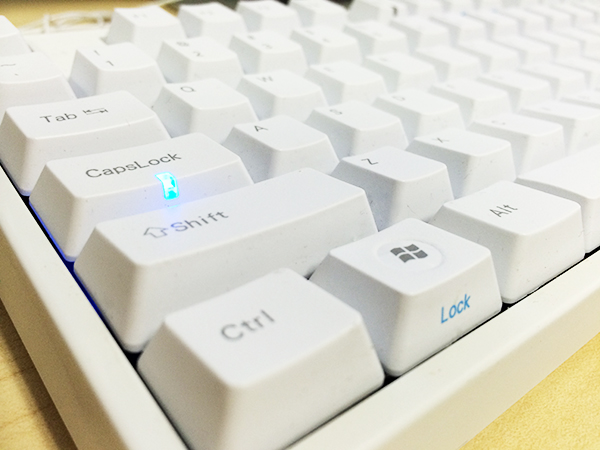
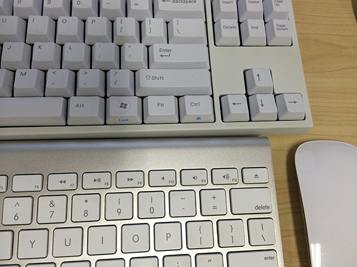

2013년 2월 한국 다녀올 당시 레오폴드 키보드를 구입해서 왔다. 당시 회사에서 사용했던 이상한 키배열의 삼성 노트북 이후 키보드에 관심이 생겨서 관련 글을 읽다보니 기계식 키보드에 대해 좋은 인상을 받아 구입했다.

구입할 때 직접 타건해보고 구입하지 못하는 상황이었다. 그래서 타건 영상을 보고 타이핑 소리를 가늠해야 했는데 다들 청축은 지나치게 시끄럽고 적축은 오타율이 높다는 얘기를 듣고 갈축을 선택했다. 다른 키보드 경험이 없어 딱히 비교하기 어려운데 간단하게 적어보자면 다음과 같다.

  * 소리가 좋다. 그래서 가끔 사무실이 조용하면 사용하기 민망하다.
  * 기계식 키보드라 그런지 키보드 자체가 무겁다. 덕분에 키보드가 밀리거나 하지 않는다.
  * 키배열이 윈도 배열이라 맥 단축키가 불편할 때가 있다. (바인딩으로 해결 안되는 부분)
  * 타이핑하는 양이 많아질 때 일반 키보드에 비해 손에 무리가 덜 간다.
  * 키는 여전히 하얗지만 본체는 약간 노란 빛이 감돌기 시작했다.

처음엔 집에서 사용했는데 이제 사무실에 가져다놓고 가상머신에서 윈도우 작업할 때 주로 사용하고 있다. 사무실에서 사용할 때 맥 키보드랑 혼용해서 사용하고 있다. 가장 큰 이유는 키보드 바인딩 문제인데 F1~12의 펑션키를 맥 키보드의 기능처럼 쓰게되면 해당 function키가 정상적으로 동작하지 않는다거나 생각처럼 깔끔하게 바인딩이 되질 않아 어쩔 수 없이 혼용하고 있다.

전반적으로 키보드는 만족스럽지만 키보드 사용량이 그렇게 많지 않다면 크게 유의미하진 않은 것 같다. 만약 내가 vim이나 emacs를 잘 사용할 줄 안다면 더 재미있게 사용할 수 있지 않았을까. 코드든 글이든 타이핑을 많이 하는 사람이라면 사용해보는 것도 나쁘지 않다.

아직 키를 분리해서 청소해보진 않았는데 조만간 날 잡아서 분리하고 청소를 해야겠다.