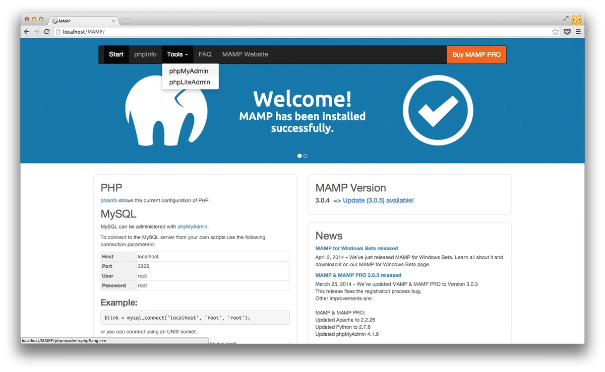
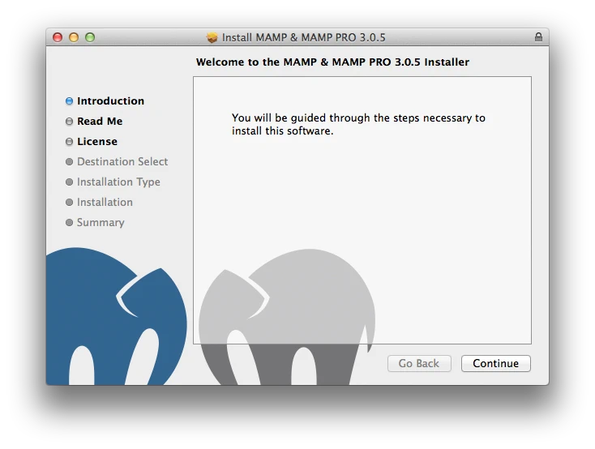
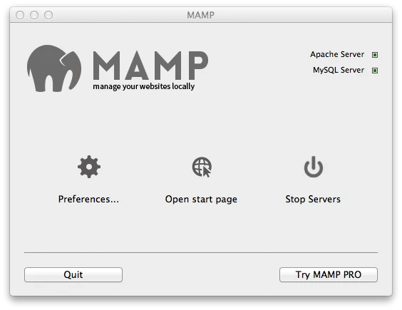
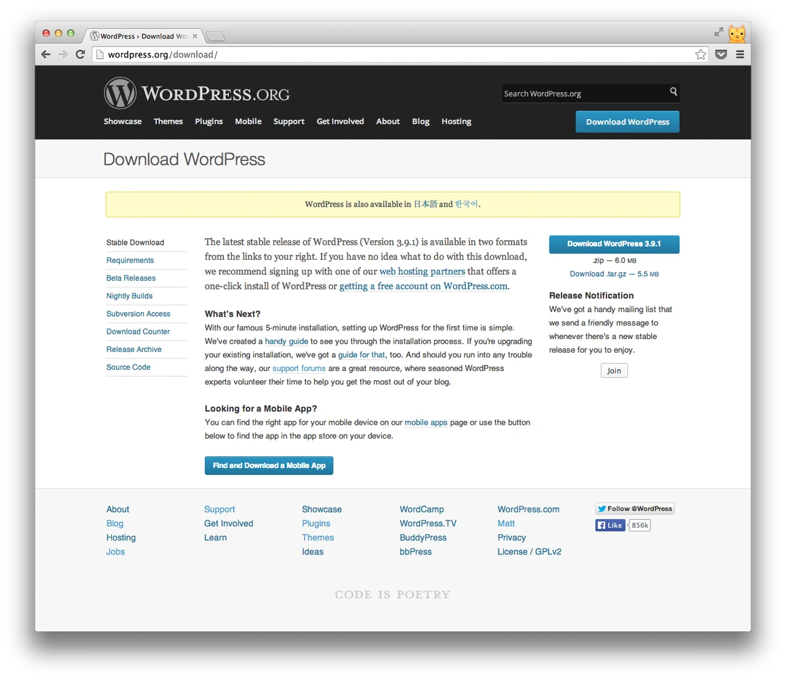
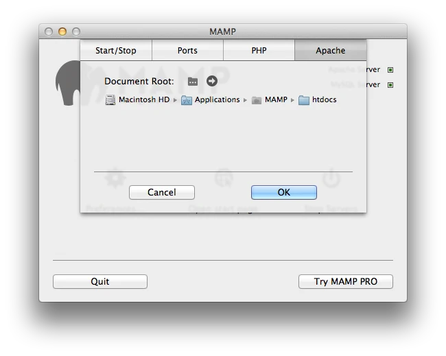
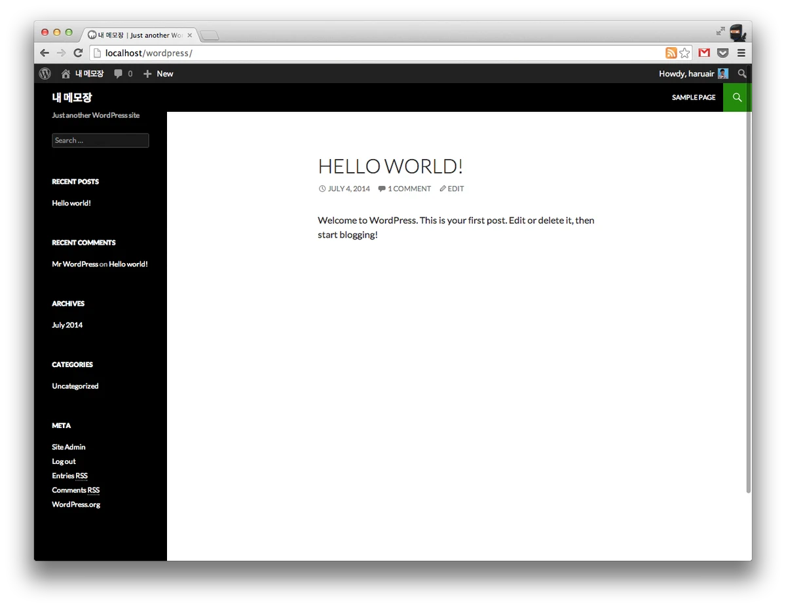

평소에 짧은 메모를 많이 적는 편이다. 맥에서 메모를 위해 사용할 수 있는 다양한 도구가 많이 있긴 하지만 완제품인 어플리케이션을 내 취향대로 수정해 사용할 수 없는 부분이 가장 불편하다. 손에 딱 맞는, 쉽게 사용할 수 있는 프로그램을 찾아야하는데 그게 말처럼 쉽지 않다. 그래서 내 경우에는 오래 전부터 로컬에 **나만 접근 가능한 워드프레스를 만들어 글쓰기 도구로** 활용하고 있다.

다양한 플러그인을 사용할 수 있고, 외부에 노출될 위험이 없으며, 추후 외부 공개로 전환하기에도 간편하다.<a href="#fn-2231-1" rel="footnote">1</a> 만약 마크다운으로 작성하고 싶다면 일반 워드프레스를 사용하는 것과 동일하게 플러그인을 설치하면 완료된다. 특히 워드프레스가 지속적으로 업데이트 되고 있는 것도 큰 장점인데 각각의 글 변경사항을 관리해주는 부분, Just write 기능 등 글을 관리하는데 있어 유용하다. 물론 태그나 카테고리, 기간별 아카이빙 등 기본적인 기능들도 큰 도움이 된다. 워드프레스를 설치할 수 있는 환경은 MAMP라는 앱을 사용하면 쉽고 간편하게 진행 할 수 있다.

## MAMP 설치하기

MAMP는 Mac을 위한 Apache, MySQL, PHP로 맥에서 웹서버를 구동해주는 앱이다. 일반적으로는 각각 설치하고 세팅해야 하는 번거로움이 있는데 MAMP는 단지 버튼 하나만 누르면 끄고 켤 수 있도록 돕는다.

MAMP를 [공식 사이트][1]에서 내려받는다.

내려받은 MAMP를 설치한다. 설치에는 980MB 정도를 요구한다. 내려받은 파일을 실행해 설치한다. <a href="#fn-2231-2" rel="footnote">2</a>

설치가 완료되면 MAMP를 실행한다. 실행하면 MAMP PRO를 실행할 것인가 물어보는데 Check for MAMP PRO when starting MAMP 체크를 해제하고 Launch MAMP 클릭한다. MAMP PRO는 서버 관리에 있어 더 편리한 도구를 많이 제공하는데 지금은 MAMP면 충분하다.

이제 MAMP 관리 페널인데 버튼이 3개 있다. 우측에 Start Servers 버튼을 누르면 서버가 실행되고 서버 관리 웹페이지가 뜬다.

## 데이터베이스 생성하기

워드프레스를 설치하기에 앞서 워드프레스의 데이터가 저장될 공간인 데이터베이스를 추가해야 한다. 위에서 본 서버 관리 웹페이지에 상단 메뉴에서 Tools > phpMyAdmin을 클릭한다.

상단에 Databases 탭을 클릭, Create database 밑에 Database name에 wordpress를 입력하고 오른쪽 Create 버튼을 클릭한다. (다른 데이터베이스명을 사용해도 상관없다)

## 워드프레스 설치하기

워드프레스 웹사이트에서 워드프레스를 내려받는다. [영어][9] 또는 [한국어][10] 등 자신이 선호하는 버전을 설치하면 된다.

내려받은 파일을 MAMP 안에 htdocs 폴더에 넣고 압축을 푼다. htdocs 폴더 경로는 /Application/MAMP/htdocs 인데 MAMP 관리 패널에서 Preferences… > Apache 탭으로 들어가 화살표 버튼을 누르면 MAMP 폴더가 나타난다. 거기 htdocs 폴더를 열어 거기에 받은 파일을 넣자.

`wp-config-example.php`를 `wp-config.php`로 복사한다. `wp-config.php`는 앞에서 추가한 데이터베이스와 워드프레스를 연결하기 위한 정보가 들어있는 파일이다. MAMP의 기본 아이디와 비밀번호, 앞서 데이터베이스명을 미리 입력해둔 파일이라 해당 위치에 잘 넣기만 하면 된다. (만약 위에서 생성한 데이터베이스 이름이 `wordpress`가 아니라면 이 파일을 열어 수정해야 한다.)

여기까지 모두 완료되면 <http://localhost:8888/wordpress> 를 인터넷 주소창에 입력해 접속한다. 사이트명, 아이디, 비밀번호 등을 등록하는 절차를 걸쳐 워드프레스를 사용할 수 있게 된다.

아이디를 생성하고 로그인하면 이제 워드프레스를 로컬 환경에서 사용할 수 있게 된다.

<li id="fn-2231-1">
  MAMP에서 아파치 설정을 해주면 동일한 네트워크 내에서 접속 가능한 형태로도 사용 가능하다.&#160;<a href="#fnref-2231-1" rev="footnote">&#8617;</a>
</li>
<li id="fn-2231-2">
  중간에 관리자 권한을 위해 비밀번호를 입력하게 된다.&#160;<a href="#fnref-2231-2" rev="footnote">&#8617;</a> </fn></footnotes>

 [1]: http://www.mamp.info
 [9]: http://wordpress.org/download/
 [10]: http://ko.wordpress.org/
