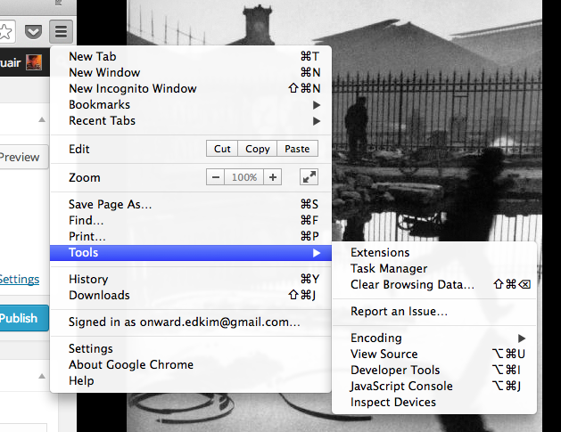
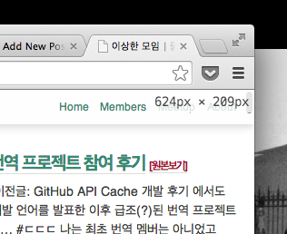
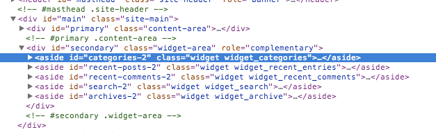
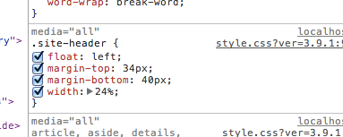
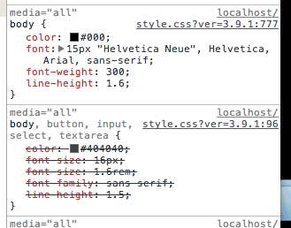
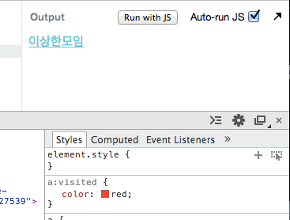
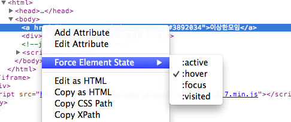

다른 브라우저를 사용하다가도 구글 크롬으로 돌아오게 되는 가장 큰 이유가 개발자 도구 때문이다. 물론 다른 브라우저에 내장된 개발자 도구들도 뛰어나지만 오래 사용하다보니 단축키나 사소한 기능들이 손에 익어버린 이유가 크다.

최근들어 멀티커서나 재미있는 기능들이 추가되고 있어 나중엔 별도의 도구 없이도 개발할 수 있는 환경이 되지 않을까 생각이 든다.

(이 글은 정말 소소소한 팁을 다루고 있다. 소소하다 못해 소소소한데 뭐 이런걸 포스팅하냐 하시면 제가 할 말이 없습니다. ;ㅅ;)

크롬 개발자도구를 더 자세히 보고 싶다면 [생활코딩 크롬 개발자도구][1]편을 살펴보자.

# 소소소한 팁

개발자도구는 `햄버거 버튼 > 도구 > 개발자 도구`에서 열 수 있다. 맥에서의 단축키는 `option(alt) + cmd + i`로 열 수 있다.

## 창 크기 확인하기

개발자도구를 연 상태에서 창 크기를 변경하면 창 크기를 표시해준다.

## 엘리먼트 순서 변경, 제거하기

엘리먼트를 드래그-드롭으로 순서를 변경할 수 있다. `delete` 키를 누르면 제거할 수 있다.

## 픽셀값 변경하기

`px`, `%` 등의 값은 선택하고서 ↑, ↓ 키로 값을 변경할 수 있다. Shift + ↑, ↓ 는 10단위로 이동 가능하다.

## 색상 변경하기

css에서 색상을 보여주는 작은 색 박스를 클릭하면 컬러픽커로 색상을 변경할 수 있다.

## Pseudo class 바로 확인하기

styles 탭에서 우측 상단에 pseudo class를 확인할 수 있는 셀렉터가 있다. 클릭해보면 4개의 pseudo class를 테스트 할 수 있다.

물론 해당 엘리먼트에서 오른쪽 클릭해도 확인할 수 있다.

[1]: http://opentutorials.org/course/580