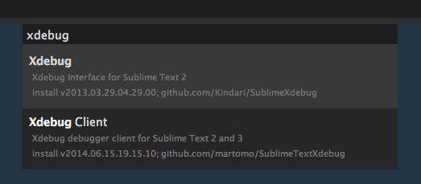
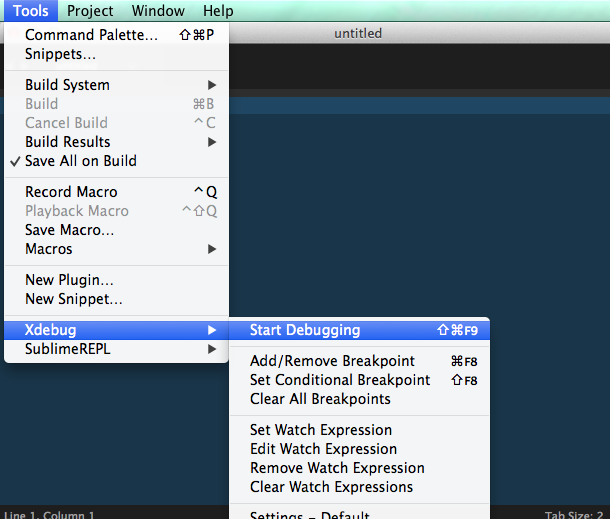
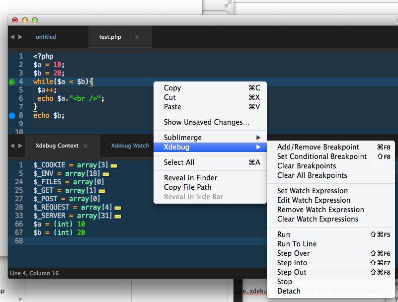

PHP를 디버깅하기 위해서는 Xdebug와 같은 확장을 서버에 설정해야 하고 리모트로 디버깅 하기 위한 클라이언트 프로그램이 요구된다. 이 글에서는 서버로 MAMP를 활용하며 클라이언트로 Sublime text를 활용한다.

## Xdebug 활성화하기

MAMP에는 이미 Xdebug가 포함되어 있기 때문에 `php.ini`를 찾아 수정해주면 바로 활성화 할 수 있다. `php.ini`의 위치는 MAMP 기본 설치 시 `/Applications/MAMP/bin/php/php<버전>/conf/php.ini`에 있다. 해당 파일을 열어 가장 마지막줄로 이동하면 다음과 같이 주석처리 되어 있는 것을 확인할 수 있다.

    [xdebug]
    ;zend_extension="/Applications/MAMP/bin/php/php5.5.10/lib/php/extensions/no-debug-non-zts-20121212/xdebug.so"
    

PHP 버전에 따라 위 내용이 다를 수 있다. 해당 확장을 불러올 수 있도록 맨 앞에 `;`를 지운다. 그리고 리모트 디버깅을 위해 다음과 같이 내용을 추가해 저장한다.

    [xdebug]
    zend_extension="/Applications/MAMP/bin/php/php5.5.10/lib/php/extensions/no-debug-non-zts-20121212/xdebug.so"
    xdebug.remote_autostart=1
    xdebug.remote_connect_back=1
    xdebug.remote_enable=1
    xdebug.remote_port=9000
    

## Sublime text에 Xdebug Client 설치 및 디버깅

`Cmd + Shift + P` 를 눌러 Command Palette를 열고 Install Package를 실행해 `Xdebug Client`를 설치한다.

설치 후 메뉴에서 `Tools > Xdebug > Start Debugging`을 실행해 디버깅 세션을 시작한다.

세션이 정상적으로 시작되었다면 디버깅 하고자 하는 페이지에 다음과 같이 디버깅 쿼리 스트링을 붙여 다시 접속해보면 Sublime Text에서 디버깅이 가능한걸 확인할 수 있다.

    http://localhost/example.php?XDEBUG_SESSION_START=sublime.xdebug
    

하단 4개의 창에서 Context, Watch, Stack, Breakpoint를 확인할 수 있으며 코드에서 오른쪽 클릭으로 Breakpoint나 watch expression을 추가해 확인할 수 있다.

## OSX에서 사용 가능한 클라이언트

근래의 대다수 에디터와 IDE에서 기본적으로 내장되어 있어 현재 사용하고 있는 에디터나 IDE에 있는 기능을 먼저 확인해보도록 하자. 다음은 OSX에서 사용 가능한 standalone 클라이언트다.

  * [MACGDBP][1]
  * [codebug][2]

[1]: https://www.bluestatic.org/software/macgdbp/index.php
[2]: http://codebugapp.com/