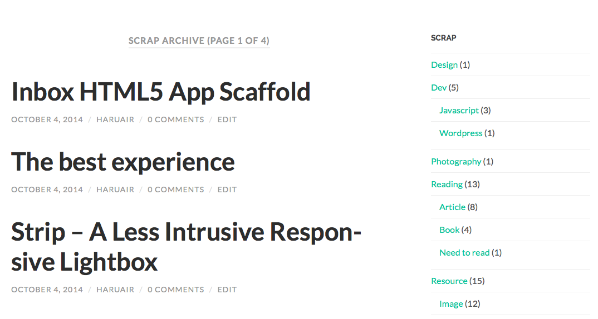

트위터, 페이스북, pocket 전부 관리되지 않는 스크랩 자료로만 가득 차는 기분이 들어서 워드프레스에서 수집할 수 있도록 작은 플러그인을 만들었다.

플러그인은 `scrap`이라는 포스트 타입을 생성해주며 일반 포스트와 동일하게 category와 tag를 지원한다. 추가적으로 워드프레스에서 post에서 사용할 수 있는 함수를 비슷하게 쓸 수 있도록 이름만 바꿔서 같이 넣었다. 기본적인 widget도 포함하고 있다.

<del datetime="2014-10-07T06:27:36+00:00">플러그인은 <a href="https://gist.github.com/haruair/0ef8f46922e845b00f27/download" target="_blank">gist</a> 에서 받을 수 있으며 <a href="https://gist.github.com/haruair/0ef8f46922e845b00f27">소스코드도 확인</a> 할 수 있다.</del>

2014년 10월 7일 업데이트: 플러그인을 GitHub 리포지터리로 옮기고 [bookmarklet][2]을 활용할 수 있도록 `Scrap this`를 추가했다. [다운로드는 여기에서][3], 코드는 [github][4]에서 확인할 수 있다.

* * *

이 블로그와 같이 [scrap archive][5]를 만들기 위해서는 해당 테마에 새로운 포스트 타입과 taxonomy를 위한 페이지를 생성해야 하며 생성할 때 `the_tag()`와 같은 함수들을 `the_scrap_tag()`와 같이 변경해줘야 한다.

  * `archive.php` -> `archive-scrap.php`, `taxonomy-scrap_category.php`, `taxonomy-scrap_tag.php`
  * `single.php`-> `single-scrap.php`
  * `sidebar.php` -> `sidebar-scrap.php`

물론 생성하지 않아도 출력은 되지만 약간 다르게 나오는 부분들이 있다. (원래는 자동으로 뿅 되야 하는데 대충 만들어서&#8230; 추후 버전을 기약하며.)

이 플러그인을 위한 특정 Permalink를 사용하려면 [Custom Post Type Permalinks][6] 플러그인을 활용할 수 있다.

[2]: http://haruair.com/blog/2464
[3]: https://github.com/haruair/scrapbook/archive/master.zip
[4]: https://github.com/haruair/scrapbook
[5]: http://haruair.com/scrap
[6]: https://wordpress.org/plugins/custom-post-type-permalinks/
