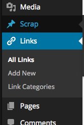

WordPress에는 기본적으로 Links라는 포스트 타입이 존재했었는데 WordPress 3.5 에서 제외되었다고 한다. 대부분의 사용자가 거의 이용하지 않는 기능이 되다보니 이런 결정을 내리지 않았나 싶다.

그 이전 버전 사용자는 업그레이드 하더라도 해당 기능이 계속 유지되지만 신규로 설치한 경우는 다음과 같은 Links 항목을 관리자 화면에서 찾을 수 없다. 이 Links 항목을 보여주는 Link Widget(Blogroll) 또한 존재하지 않는다.

<figure>

<figcaption>3.5 이후 버전을 설치한 경우에는 Links가 존재하지 않는다.</figcaption></figure>

티켓 [#21307][1]에서 논의된 결과로 [Link Manager][2] 플러그인으로 분리되었고 3.5 이후 버전에서는 해당 플러그인을 설치해 사용할 수 있다.

 [1]: https://core.trac.wordpress.org/ticket/21307
 [2]: https://wordpress.org/plugins/link-manager/