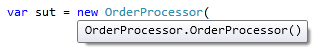
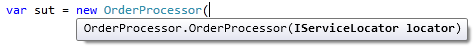

새로 옮긴 회사에서 열심히 레거시를 정리하고 있다. 기존 코드는 관리가 전혀 되지 않는 인하우스 프레임워크를 사용하고 있어서 전반적으로 구조를 개편하기 위해 고심하고 있다. 이 포스트는 [Mark Seemann][1]의 [Service Locator is an Anti-Pattern][2]를 번역한 글로 최근 읽었던 포스트 중 이 글을 레퍼런스로 하는 경우를 자주 봐서 번역하게 되었다.

* * *

## 서비스 로케이터는 안티패턴이다

서비스 로케이터는 [마틴 파울러가 설명한 이후][3]로 잘 알려진 패턴이다. 분명 좋은 패턴일 것이다.

실제로는 아니다. 이 패턴은 안티패턴으로 피해야 하는 방식이다.

왜 안티 패턴인지 더 살펴보자. 서비스 로케이터를 사용했을 때 나타나는 문제는 클래스의 의존성을 숨겨서 컴파일 중 오류가 나타나지 않고 대신 런타임에서 오류를 찾을 수 있다. 이전에 작성한 코드와 호환이 되지 않도록 코드를 변경한 경우에는 어떤 부분에 의존성이 있는지 명확하지 않아 새로운 코드를 작성할 때마다 코드를 유지보수하는 일이 더욱 어려워진다.

### OrderProcessor 예제

예제로 요즘 의존성 주입에서 가장 뜨거운 주제인 `OrderProcessor`를 확인한다. 주문을 진행하기 위해서는 `OrderProcessor`가 주문을 검증하고 검증에 문제가 없으면 배송 처리를 해야한다. 정적 서비스 로케이터의 예제는 다음과 같다.

```csharp
public class OrderProcessor : IOrderProcessor
{
    public void Process(Order order)
    {
        var validator = Locator.Resolve<IOrderValidator>();
        if (validator.Validate(order))
        {
            var shipper = Locator.Resolve<IOrderShipper>();
            shipper.Ship(order);
        }
    }
}
```

위 코드에서 `new` 오퍼레이터를 대체하려고 서비스 로케이터를 사용했다. `Locator`는 아래와 같다.

```csharp
public static class Locator
{
    private readonly static Dictionary<Type, Func<object>>
        services = new Dictionary<Type, Func<object>>();

    public static void Register<T>(Func<T> resolver)
    {
        Locator.services[typeof(T)] = () => resolver();
    }

    public static T Resolve<T>()
    {
        return (T) Locator.services[typeof(T)]();
    }

    public static void Reset()
    {
        Locator.services.Clear();
    }
}
```

이 `Locator`는 `Register` 메소드를 사용해서 설정 가능하다. 물론 &#8216;실제&#8217; 서비스 로케이터는 위 코드보다 훨씬 진보된 방식으로 구현되어 있지만 여기서는 이 코드를 예제로 살펴보려고 한다.

이 구현은 유연하고 확장 가능하다. 또한 서비스를 테스트할 수 있도록 테스트 더블(Test Doubles)의 역할도 수행한다.

이렇게 좋은 점이 많은데 무엇이 문제가 될 수 있을까?

### API 사용 문제

단순하게 `OrderProcessor` 클래스를 사용한다고 가정해보자. 서드파티에서 제공한 어셈블리라면 우리가 코드를 직접 작성하지 않았으니 `Reflector`를 사용해서 구현을 확인해야 할 것이다.

비주얼 스튜디오의 인텔리센스는 다음 그림처럼 동작한다.



자동완성을 보면 클래스가 기본 생성자를 갖고 있다. 즉, 이 클래스로 새 인스턴스를 생성한 후에 `Process` 메소드를 올바르게 실행할 수 있다는 뜻이다.

```csharp
var order = new Order();
var sut = new OrderProcessor();
sut.Process(order);
```

이 코드를 실행하면 놀랍게도 `KeyNotFoundException`이 발생하는데 `IOrderValidator`가 `Locator`에 등록된 적이 없기 때문이다. 왜 이런 고통을! 이런 동작은 놀라는데서 그치지 않는다. 만약 소스 코드에 접근할 수 없는 경우라면 당혹스럽기 그지없다.

소스 코드를 (또는 `Reflector`를 사용해서) 찬찬히 들여다 보거나, 문서를 참고해서(읔) 결국 `IOrderValidator` 인스턴스를 완전 뜬금없이 관련 없어 보이는 정적 클래스 `Locator`에 등록해야 한다는 사실을 아마도 발견할 수 있을 것이다.

유닛 테스트에서는 다음처럼 작성할 수 있다.

```csharp
var validatorStub = new Mock<IOrderValidator>();
validatorStub.Setup(v => v.Validate(order)).Returns(false);
Locator.Register(() => validatorStub.Object);
```

`Locator`의 내부 저장소도 정적이라서 테스트를 작성하는 과정도 짜증난다. 매 유닛 테스트가 끝나는 순간마다 `Reset` 메소드를 실행해야 하기 때문이다. 이 경우는 유닛 테스트의 경우에만 주로 해당되는 문제긴 하지만 말이다.

여기까지 살펴본 내용으로도 이 방식의 API는 긍정적인 개발 경험을 제공한다고 말하기엔 어렵다고 봐야 한다.

### 관리 문제

사용자 관점에서도 서비스 로케이터를 사용하는 일이 문제가 가득하다는 것을 확인했지만 이 관점은 유지보수하는 개발자에게도 쉽게 영향을 끼친다.

OrderProcessor의 동작을 확장해서 [`IOrderCollector.Collect` 메소드][4]를 호출한다고 생각해보자. 쉽게 추가할 수 있을&#8230;까?

```csharp
public void Process(Order order)
{
    var validator = Locator.Resolve<IOrderValidator>();
    if (validator.Validate(order))
    {
        var collector = Locator.Resolve<IOrderCollector>();
        collector.Collect(order);
        var shipper = Locator.Resolve<IOrderShipper>();
        shipper.Ship(order);
    }
}
```

순수하게 기계적으로 본다면 매우 단순하다. 간단하게 `Locator.Resolve`를 한 번 더 호출하고 `IOrderCollector.Colelct`를 실행하는 코드로 끝난다.

이 새로운 내용은 변경 전과 호환이 되는 코드일까?

이 질문에는 놀랍게도 답변하기 쉽지 않다. 일단 컴파일에서는 문제가 생기지 않지만 유닛 테스트를 깨뜨렸다. 실제 프로그램에서도 문제가 발생했을까? `IOrderCollector` 인터페이스를 다른 컴포넌트에서 사용한 적이 있다면 서비스 로케이터에 이미 등록되어 있어서 문제 없이 동작하게 될 것이다. 즉, 테스트는 통과하고 동작하지 않는 경우도 있을 수 있다는 의미다.

결론적으로 서비스 로케이터를 사용하면 지금 변경한 코드가 문제를 만드는 변경인지 아닌지 판단하기 더욱 어렵다. 코드를 수정하거나 작성하기 위해서는 서비스 로케이터를 사용하는 어플리케이션 _전체_를 모두 이해해야 한다. 이 상황에서는 컴파일러도 도움을 줄 수 없다.

### 변형: 구체적인 서비스 로케이터

이 문제를 해결할 방법이 없을까?

이 문제를 해결하기 위한 방법을 생각해보자. 정적 클래스가 아닌 구체적인(concreate) 클래스로 변경하면 가능할 것 같다.

```csharp
public void Process(Order order)
{
    var locator = new Locator();
    var validator = locator.Resolve<IOrderValidator>();
    if (validator.Validate(order))
    {
        var shipper = locator.Resolve<IOrderShipper>();
        shipper.Ship(order);
    }
}
```

하지만 설정을 위해서는 여전히 정적인 메모리 내 공간이 필요하다.

```csharp
public class Locator
{
    private readonly static Dictionary<Type, Func<object>>
        services = new Dictionary<Type, Func<object>>();

    public static void Register<T>(Func<T> resolver)
    {
        Locator.services[typeof(T)] = () => resolver();
    }

    public T Resolve<T>()
    {
        return (T) Locator.services[typeof(T)]();
    }

    public static void Reset()
    {
        Locator.services.Clear();
    }
}
```

다시 말해 구체적인 클래스로 정의한 서비스 로케이터와 앞서 본 정적으로 구현하는 경우와 크게 구조적인 차이가 없다. 동일한 문제가 여전히 있고 해결된 부분도 없다.

### 변형: 추상 서비스 로케이터

다른 변형은 실제 의존성 주입과 비슷하다. 서비스 로케이터는 구체적인 클래스로 인터페이스를 구현하는 방식이다.

```csharp
public interface IServiceLocator
{
    T Resolve<T>();
}

public class Locator : IServiceLocator
{
    private readonly Dictionary<Type, Func<object>> services;

    public Locator()
    {
        this.services = new Dictionary<Type, Func<object>>();
    }

    public void Register<T>(Func<T> resolver)
    {
        this.services[typeof(T)] = () => resolver();
    }

    public T Resolve<T>()
    {
        return (T) this.services[typeof(T)]();
    }
}
```

이 변형은 결과적으로 서비스 로케이터를 사용하려는 곳에 집어 넣어야 하는 구조가 된다. **생성자 주입(Constructor Injection)**은 의존성을 넣는데 좋은 방식이므로 `OrderProcessor`를 다음처럼 변경해서 적용한다.

```csharp
public class OrderProcessor : IOrderProcessor
{
    private readonly IServiceLocator locator;

    public OrderProcessor(IServiceLocator locator)
    {
        if (locator == null)
        {
            throw new ArgumentNullException("locator");
        }

        this.locator = locator;
    }

    public void Process(Order order)
    {
        var valiator =
            this.locator.Resolve<IOrderValidator>();

        if (validator.Validate(order))
        {
            var shipper =
                this.locator.Resolve<IOrderShipper>();
            shipper.Ship(order);
        }
    }
}
```

좋아보인다. 그 다음은 무엇일까?

개발자 관점으로는 이제 인텔리센스에서 알려주는 정보가 조금 더 많아진다.


<figure>



<figcaption>인텔리센스가 OrderProcessor.OrderProcessor(IServiceLocator locator)를 보여줌</figcaption></figure>

여기서 무얼 알 수 있을까? 정말 뭐 없다. `OrderProcessor`가 `ServiceLocator`를 필요로 한다는 정보는 조금 더 알 수 있겠지만 실제 어떤 **서비스**를 사용하고 있는지 알려주지 않는다. 다음 코드는 컴파일 가능하지만 실행하면 앞서 나타났던 `KeyNotFoundException`가 발생한다.

```csharp
var order = new Order();
var locator = new Locator();
var sut = new OrderProcessor(locator);
sut.Process(order);
```

유지보수를 하는 개발자 입장에서도 향상된 부분이 딱히 없다. 다른 서비스에 의존적인 코드를 추가하더라도 문제가 발생하는지 안하는지 확답해서 말하기 어렵다.

### 정리

서비스 로케이터의 문제는 특정 서비스 로케이터 구현을 사용한다고 해서 나타나는 문제가 아니라 이 패턴을 사용하면 언제든 나타나는 순수 **안티-패턴**이다. (물론 특정 구현에 더 문제가 있는 경우도 있다.) 이 패턴은 API를 소비하는 모든 사용자에게 끔찍한 개발 경험을 제공한다. 유지보수를 하는 개발자 입장에서는 변경 하나 하나를 만들 때마다 두뇌를 풀가동해서 변경이 미치는 모든 영향을 파악해야 하므로 더욱 고통스러워질 것이다.

**생성자 주입**을 사용한다면 컴파일러는 코드를 소비하는 사람과 생산하는 사람 모두에게 도움이 된다. 서비스 로케이터에 의존하는 API라면 이런 도움을 전혀 받을 수 없다.

  * 의존성 주입 패턴과 안티 패턴에 대해 더 알고 싶다면 [내 책][5]에서 확인할 수 있다.
  * 또한 서비스 로케이터는 [SOLID 원칙을 위반한다는 점][6]에서 부정적이다.
  * 서비스 로케이터의 근본적인 문제는 [캡슐화를 위반해서][7] 나타난다.

[1]: http://blog.ploeh.dk/about/
[2]: http://blog.ploeh.dk/2010/02/03/ServiceLocatorisanAnti-Pattern/
[3]: https://martinfowler.com/articles/injection.html
[4]: http://blog.ploeh.dk/2010/02/02/RefactoringtoAggregateServices/
[5]: https://www.amazon.com/gp/product/1935182501/ref=as_li_ss_tl?ie=UTF8&camp=1789&creative=390957&creativeASIN=1935182501&linkCode=as2&tag=ploeh-20
[6]: http://blog.ploeh.dk/2014/05/15/service-locator-violates-solid/
[7]: http://blog.ploeh.dk/2015/10/26/service-locator-violates-encapsulation/
