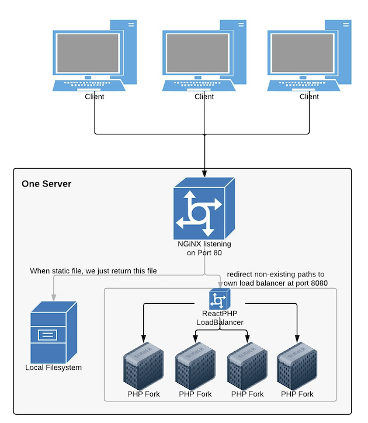
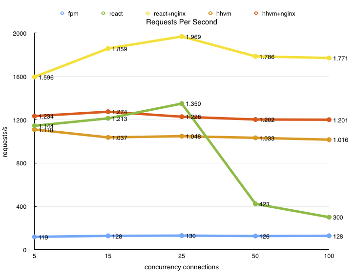
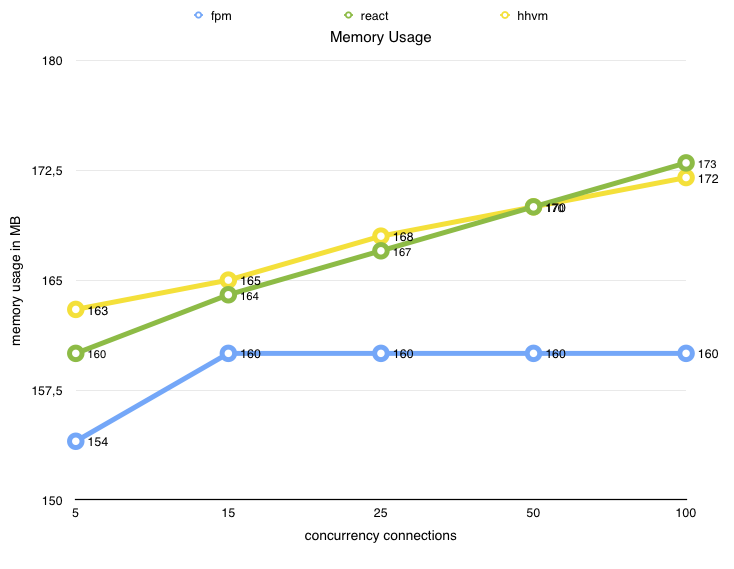

[Marc Johannes Schmidt][1]가 쓴 [Bring High Performance Into Your PHP App (with ReactPHP)][2]을 번역했다. 2014년 초 글이라서 아마 php7을 사용한다면 여기에 언급된 벤치마킹보다 더 나은 수치가 나오지 않을까 생각한다.

* * *

# ReactPHP로 고성능 PHP 앱 만들기

이 글에서는 PHP 어플리케이션의 성능을 어떻게 최대화 하는지 살펴보려고 한다. 대부분 앱은 PHP의 성능을 완전히 사용하지 않는다. 대신 APC를 켜는 정도가 최선이라고 생각한다. 이 글을 읽어보면 아마 놀랄 것이다.

_요약_

대규모 심포니 앱에서 초당 130회 정도 요청을 처리할 수 있었는데 이 접근 방식으로 초당 2,000여 회 요청을 처리할 수 있다.

## 아키텍처

먼저 과거를 살펴보자.

근래 PHP를 사용하는 일반적인 방식은 Apache, Nginx, lighttpd와 같은 웹서버를 통해서 HTTP 프로토콜을 처리하고 동적 요청을 PHP로 전달하는 식으로 사용한다. Apache의 mod_rewrite와 같은 리라이트 엔진을 사용한다면 더 강력하게 사용할 수 있다.

웹서버에서 PHP를 구동하기 위해 설정하려면 다음과 같은 방법이 있다.

  * mod_php (apache 만)
  * f(ast)cgi
  * PHP-FPM

SuExec와 함께 FCGI를 설정하는 방식은 보안상 가장 많이 사용한다. 각 인터프리터 프로세스는 각 사이트 사용자 아래서 구동된다. 이렇게 분리된 환경은 VM 없이도 각각의 사용자에 대응해 대규모 호스팅 형태로 운영 가능하다. 이 접근 방식이 매우 일반적인 탓에 mod_php나 PHP-FPM을 로컬 개발 머신이나 단일 앱을 구동하는 웹서버(한 조직이 만든 앱인데 서버에서 이런 형식으로 웹서버에 올려 구동하는 경우)에서도 동일한 방식을 사용한다.

물론 이 접근 방식은 업계 전반에 걸쳐 상당히 일반적인 방식이다. 이 방식에서 가장 큰 손실은 &#8220;연산코드 캐시(opcode cache)&#8221;가 존재한다고 하더라도 클래스를 선언하고 객체를 초기화하며 캐시를 읽는 등의 작업을 **매 요청마다** 수행해야 한다는 점이다. 이 과정이 시간을 많이 소비하고 고성능의 완전한 환경과는 거리가 멀다는 점을 쉽게 상상할 수 있을 것이다.

## 틀을 깨고 생각하기

그럼 왜 이런 일을 하는 것일까? 왜 매 요청마다 사용하는 메모리를 정리하고 다시 생성하는 일을 반복해야 하는 것일까? 물론 PHP가 서버 자체로 디자인된 것이 아니라 템플릿 엔진, 도구 모음 정도로 만들었기 때문이다. 또한 PHP 자체가 비동기 형태로 디자인되지 않았기 때문에 대부분 함수는 &#8220;블로킹(blocking)&#8221;이 발생한다. 수년 동안 상황이 많이 달라졌다. PHP로 작성된 강력한 템플릿 엔진이 있다. 수 만 가지의 유용한 라이브러리를 [Composer][3]로 설치할 수 있는 커다란 생태계를 갖게 되었다. Java와 다른 언어에서 구현된, 아주 강력한 디자인 패턴도 PHP에서 구현되었다. (안녕, Symfony와 동료들!) 심지어 PHP의 비동기 웹서버를 위한 라이브러리도 존재한다.

## 잠깐, 뭐라고요?

잠깐, PHP를 위한 비동기 도구가 있다고? [그렇다.][4] ReactPHP는 내가 가장 기대하는 라이브러리 중 하나다. 이 라이브러리는 이벤트 주도, 넌-블로킹 입출력 개념을 PHP로 가져왔다. (안녕, NodeJS!) 이 기술을 사용하면 HTTP 스택을 PHP에서 직접 작성할 수 있으며 각 요청마다 파괴할 필요 없이 메모리를 제어할 수 있게 된다.


매번 객체를 초기화 하거나 캐시를 읽는 것처럼 어플리케이션을 시작하기 위해 해야 하는 대부분의 작업이 응답 시간에 있어 많은 분량을 차지하고 있는데 이 시간을 줄여 성능을 올리는 것은 쉽게 이해가 되리라 믿는다. 이런 과정을 Java, NodeJs와 그 친구들처럼 없앨 수 있다면 성능이 향상될 것이란 얘기다. 만세!

## 어떻게 해야 하나

간단하다. ReactPHP는 http://reactphp.org에서 받을 수 있다. Composer를 사용해서도 설치할 수 있다.

```bash
$ composer require 'react/react=*'
```

`server.php` 파일을 다음처럼 생성한다.

```php
<?php
require_once(__DIR__. '/vendor/autoload.php');

$i = 0;
$app = function ($request, $response) use ($i) {
    $response->writeHead(200, array('Content-Type' => 'text/plain'));
    $response->end("Hello World $i\n");
    $i++;
};

$loop = React\EventLoop\Factory::create();

$socket = new React\Socket\Server($loop);
$http = new React\Http\Server($socket, $loop);

$http->on('request', $app);
echo "Server running at http://127.0.0.1:1337\n";

$socket->listen(1337);
$loop->run();
```

이제 PHP 서버를 `php server.php`로 실행한다. 이제 `http://127.0.0.1:1337`로 접속하면 &#8220;Hello World&#8221; 문구를 볼 수 있을 것이다. `$app`은 &#8220;main&#8221; 함수로 서버에 들어오는 각 요청을 받는 엔트리 포인트 역할을 한다.

이게 전부다. 이렇게 쉽다. 끝.

## 벤치마크

아마 이런 생각이 들 것이다. &#8220;음, PHP는 하나의 cpu 코어/스레드를 사용하니깐 다중 코어 서버의 성능을 전부 사용하진 못할 거야.&#8221; 사실이긴 하지만 여러 대의 서버를 실행해서 프록시가 일감을 분배할 수 있다면 어떨까? 이제는 다중 코어를 지원하는 여러 워커를 실행할 수 있는 서버를 만들어야 한다. 이 작업을 위해 [프로세스 매니저를 만들었는데][5] 간단하게 Symfony를 위한 브릿지를 제공해서 핵 원자로 같이 강력하게 사용할 수 있게 되었다.

다음과 같은 형태로 구동된다.



테스트를 한 환경은 이렇다.

  * Intel(R) Xeon(R) CPU L5630, 6 Cores
  * 8GB RAM
  * PHP 5.4.4 with APC
  * Debian 7.1
  * nginx/1.2.1

각 PHP-FPM과 React 서버는 6개의 워커를 사용했다.

테스트는 Apache HTTP 서버 벤치마킹 도구인 ab를 사용했다.

테스트는 Symfony 2.4+로 작성된 웹앱을 사용했다. 이 프로젝트는 꽤 규모가 있는 [CMS 번들][6]을 사용했다. 이 번들에는 많은 서비스, 이벤트 리스너, 캐싱, 템플릿, 데이터베이스 엑세스 등 많은 기능이 들어있다. (이 번들은 [jarves/jarves][7]로 변경되었다.)

캐시는 기본적인 부분에만 적용되어 있으며, 이 벤치마크 결과에서 뷰는 캐싱되지 않았다.

react 서버를 실행할 때 다음 명령을 사용했다.

```bash
$ php ./bin/ppm start /path/to/symfony/ --bridge=symfony -vvv
```

hhvm은 다음처럼 구동했다.

```bash
$ hhvm ./bin/ppm start /path/to/symfony/ --bridge=symfony -vvv
```

결과는 이렇다.

초당 요청 횟수



메모리 사용량



  * `fpm` &#8211; nginx 서버 뒤에 구동한 일반적인 PHP-FPM 서버.
  * `react` &#8211; 내장 로드 벨런서로 실행한 react 서버. (위 구성 이미지에서 확인할 수 있음.)
  * `react+nginx` &#8211; nginx를 로드 밸런서로 사용한 react 서버. react 서버는 워커 프로세스만 사용했고 nginx는 이 워커에 직접 통신함.
  * `hhvm` &#8211; `react`와 동일하지만 `hhvm`으로 실행.
  * `hhvm+nginx` &#8211; `react-nginx`와 동일하지만 `hhvm`으로 실행.

`hhvm`은 `stream_select` 이벤트 루프를 사용하고 `php`는 `libevent`를 사용한다. 그래서 hhvm의 내장 웹서버는 사용하지 않았다.

위 결과에서 확인할 수 있는 것처럼 nginx를 로드벨런서로 사용한 react 서버는 전통적인 PHP-FPM + APC 구성보다 15배나 빨랐다.

react+nginx (libevent PHP 모듈)에서는 거의 초당 2,000 여 회 요청을 처리했다.

            2,000 requests / second
        7,200,000 requests / hour
       86,400,000 requests / half day
      172,800,000 requests / day
    2,678,400,000 requests / half month
    5,356,800,000 requests / month
    

메모리 사용량은 동일하다. 결과 중 메모리가 꾸준히 증가하는 부분은 CmsBundle에 있는 메모리 유출이 문제일 것이다. 이 문제는 아직 코드가 이 환경에 최적화되지 않은 탓이다. 이 접근 방식에 관한 문제는 아래에서 더 언급했다.

이 의미는 Symfony 앱에 엄청난 성능 향상을 끌어낼 수 있다는 이야기다. 시도해볼 만한 가치가 있다. 더 설명할 필요 없이 위 결과가 수천 마디 말을 대신한다고 생각한다.

### Nginx를 로드 벨런서로 사용하기

`react+nginx`와 `hhvm+nginx`를 사용할 때 다음 설정을 사용했다. 단순히 요청을 프록시로 넘겨줬을 뿐 특정 파일을 지정하지 않았다.

    upstream backend  {
        server 127.0.0.1:5501;
        server 127.0.0.1:5502;
        server 127.0.0.1:5503;
        server 127.0.0.1:5504;
        server 127.0.0.1:5505;
        server 127.0.0.1:5506;
    }
    
    server {
        root /path/to/symfony/web/;
        server_name servername.com
        location / {
            if (!-f $request_filename) {
                proxy_pass http://backend;
                break;
            }
        }
    }
    

## 이 접근 방식의 문제점

이 방식에서 나타날 수 있는 몇 가지 문제점이 있다.

첫째로는 메모리 유출을 막기 위해 메모리 처리를 잘 해야한다는 점이다. 최신 버전의 PHP는 상당히 잘 처리하고는 있지만 요청을 처리한 다음에 전체 어플리케이션의 메모리를 제거하는 이전 방식에서는 그다지 지적되지 않았던 부분이다. 그러므로 변수 내에 있는 자료에 대해 주의를 기울일 필요가 있다.

둘째로 파일이 변경되었을 때는 서버를 재시작해야 할 필요가 있다. PHP에서는 클래스나 함수를 재정의하는 것이 불가능하기 때문이다. [php-pm][5]에서는 새로운 워커를 실행하는 방식으로 해결하려고 계획하고 있다.

셋째로 예외 처리가 되지 않은 예외가 발생했을 때 서버를 재시작해야 할 필요가 있다. 이 문제도 [php-pm][5]에서 해결할 예정이다.

넷째로 ReactPHP가 비동기 코드를 작성할 수 있는 기능은 제공하지만 대부분의 라이브러리가 (Symfony 포함) 이런 방식으로 작성되지 않았다. 즉, 정말로 웹 어플리케이션의 성능을 극대화 하고 싶다면 앱을 비동기 형태로 다시 작성해야 할 것이다. 재작성이 불가능한 것은 아니며 일반적으로 빠르게 가능하지만 결국엔 콜백 지옥에 빠지게 될 수도 있다. Node.js 앱에서 이 문제를 어떻게 다루는지 살펴보고 이 접근 방식을 사용하는 것이 가치있는 일인지 고민해봐야 한다. 내 의견으로는 시도해볼 가치가 충분하다.

다섯째로 큰 규모의 프레임워크를 ReactPHP와 함께 작성할 예정이라면 요청에 사용할 수 있던 내부 데이터를 어떻게 분리해서 처리할지 고려해봐야 한다. Symfony는 `Request`/`Response`를 사용하는 프레임워크다. 이런 구조로 요청과 응답이 구분된 코드 환경이 아니라면 PHP 어플리케이션을 개발하는 방식 자체에 대해 다시 생각해볼 필요가 있다. 이 변화는 극적으로 크다. 기본적으로 `$_POST`, `$_GET`, `$_SERVER`와 같은 것을 절대 사용할 수 없게 된다는 뜻이다. 현재 프레임워크가 이런 차이점을 지원하지 않는다면 쉽지 않을 것이다. 만약 지원하지 않는다면 집어 던지고 Symfony를 사용하자. 🙂 대단히 가치있는 일이다.

## 마지막으로

이 접근 방식이 Apache/nginx/lighttpd를 대체하는 것은 아니다. 이 방식은 HTTP 서버를 ReactPHP로 실행하는 것으로 어플리케이션을 실행하도록 준비하는데 가장 비싼 부분들을 제거하는데 그 포인트가 있다. 추가적으로 이 접근 방식을 사용했을 때는 새로운 캐시 레이어를 생각할 수 있다. 바로 PHP 변수다. APC 사용자 캐시를 사용하기 전에 PHP 배열을 캐시처럼 사용했던 것을 생각해보자. 물론 이런 접근 방식은 유효하지 않은 캐시가 발생하지 않도록 어떻게 다룰 것인지 염두해야 한다.

ReactPHP는 100% CPU 문제가 있었는데 [고쳐졌다][8].

Symfony의 Request/Response 객체를 React의 Request/Response로 변환하기 위해서 작성한 Symfony 브릿지는 아직 완벽하진 않다. React의 HTTP 서버를 리팩토링 하는 작업이 필요하다. 물론 Symfony와 동작하는가에 대해서 질문은 &#8220;언제 되느냐&#8221; 하나만 남았다. 기여는 언제나 환영이다. 🙂

[1]: http://marcjschmidt.de/about.html
[2]: http://marcjschmidt.de/blog/2014/02/08/php-high-performance.html
[3]: http://getcomposer.org/
[4]: http://reactphp.org/
[5]: https://github.com/php-pm/php-pm
[6]: https://github.com/marcj/krycms-bundle-old
[7]: https://github.com/jarves/jarves
[8]: https://github.com/reactphp/react/pull/273