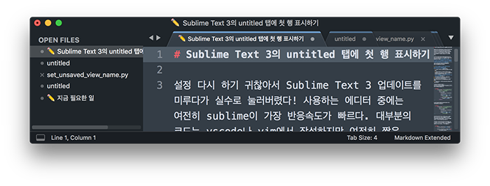

설정 다시 하기 귀찮아서 Sublime Text 3 업데이트를 미루다가 실수로 눌러버렸다! 사용하는 에디터 중에는 여전히 sublime이 가장 반응속도가 빠르다. 대부분의 코드는 vscode나 vim에서 작성하지만 여전히 짧은 메모라든지 코드 스니핏/마사징은 sublime에서 하고 있다.

2에서 3으로 업데이트 한 후에 달라진 동작이 몇 가지 있다. 탭이 깔끔하게 untitled로 표시된다는 점이 가장 불편했다. 이 부분은 [검색해보니][1] `set_unsaved_view_name.py` 라는 내장된 플러그인에서 동작을 수정해야 한다.

  1. [Package Resource Viewer][2]를 설치한다. 
      1. <kbd>cmd + shift + p</kbd>으로 Command Palette를 연다.
      2. package control: install package 클릭한 후 package resource viewer를 입력해서 설치한다. (목록에 나오지 않는다면 [Package control를 설치][3]해야 한다.)
  2. 앞서 열었던 Command Palette를 다시 연다.
  3. `open resource`를 입력해서 `PackageResourceViewer: Open Resource`를 연다.
  4. `Default` -> `set_unsaved_view_name.py` 를 선택한다.

이제 해당 파일을 변경하면 된다. `SetUnsavedViewName` 클래스의 `update_title` 메소드에서 다음 내용을 찾는다.

```python
        if syntax != 'Packages/Text/Plain text.tmLanguage':
            if cur_name:
                # Undo any previous name that was set
                view.settings().erase('auto_name')
                if cur_name == view_name:
                    view.set_name("")
            return
```

빈 행으로 설정하고 반환하는 것을 확인할 수 있다. 다음처럼 변경하고 저장한다.

```python
        if syntax != 'Packages/Text/Plain text.tmLanguage':
            if cur_name:
                # Undo any previous name that was set
                view.settings().erase('auto_name')
```

변경 후에 반영이 되지 않는다면 `Preferences`에 `set_unsaved_view_name` 항목이 `false`로 지정되지 않았는지 확인해야 한다. `Preferences`를 <kbd>cmd + ,</kbd>로 열어서 설정이 있는지 찾는다.

코드를 보니 의외로 수정하기 쉽게 되어 있길래 몇 가지 더 넣었다. `#`으로 시작하면 Markdown으로 변경하고 탭에는 `#`을 제거한 후, ✏️ 이모지를 붙였다.

```python
        first_line = view.substr(line)

        first_line = first_line.strip(self.dropped_chars)

        # 추가한 부분
        if first_line[0:2] == "# ":
            first_line = "✏️ " + first_line[2:]
            # Markdown Extended를 사용하는 경우
            view.settings().set('syntax', 'Packages/Markdown Extended/Syntaxes/Markdown Extended.sublime-syntax')
            # 내장 Markdown을 사용하는 경우
            # view.settings().set('syntax', 'Packages/Markdown/Markdown.sublime-syntax')

        self.setting_name = True
        view.set_name(first_line)
        self.setting_name = False
```

참고로 <kbd>Ctrl + &#96;</kbd>를 누르면 콘솔이 열리는데 코드 내에서 `print()` 한 내용도 확인할 수 있다.



[1]: https://stackoverflow.com/questions/43781845/how-to-enable-sublime-text-to-take-first-line-as-file-name-while-saving/43782072
[2]: https://packagecontrol.io/packages/PackageResourceViewer
[3]: https://packagecontrol.io/installation
