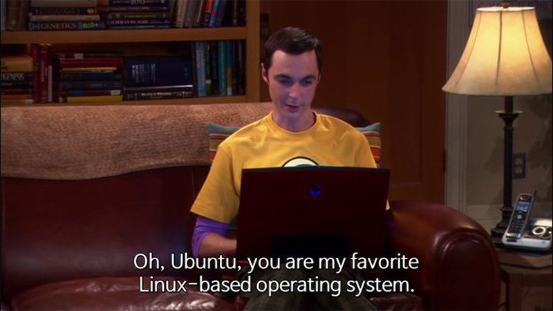

맥북 프로 키보드에 불만족스러워서 그런지 회사에서도 미팅 때마다 사람들이 들고 들어온 노트북을 계속 눈여겨 보게 되었다. 3년 전까지는 델 납품을 받았는데 그 이후로는 레노보를 사용하고 있어서 Dell Latitude랑 XPS, Lenovo Thinkpad 13, Thinkpad T740, 요가 시리즈 정도를 대부분 들고 다녔다. Acer 쓰는 사람도 좀 있었고. 그 중에 sysadmin 하는 분들이 노트북에 리눅스 설치하고 다니는거 보고는 나도 하나 그런 노트북 있으면 좋겠군 싶어서 검트리에서 적당한 가격에 이것저것 설치하고 놀 수 있는 노트북을 찾고 있었다.

그러다가 Dell Latitude E7240를 \$100에 구입했다. 원래 \$150에 구입하기로 했고 판매자가 보기로 한 장소에 나갔는데 판매자가 약속을 잊었다고 미안하다고 할인해주고 다음 날 집 앞으로 가져다줬다. 40도 넘는 더위를 뚫고 갔다가 돌아오는게 좀 짜증나긴 했지만 역시나 막상 받고나니 다 기분이 풀렸다.

구입한 모델은 i3긴 했지만 8GB 램에 128GB SSD였다. 좀 지난 모델이긴 하지만 울트라북이고 가벼워서 만족스러웠다. \$300에 구입했던 인스피론보다 훨씬 안정적이고 빨라서 너무 만족스럽다. TN 패널인게 아쉽지만 찾아보니 IPS로도 모델이 있길래 교체에 문제가 없을 것 같아 IPS 패널도 하나 주문했다.

그런 후에 무슨 배포판을 설치할까 고민했다. 뭘 설치할 일이 있으면 늘 고민 없이 우분투를 설치했었다. Archlinux 좋다는 얘기를 계속 듣기도 했고 arch를 사용하지 않아도 그 위키에서 도움을 받은 적이 많아서 이번엔 arch를 설치하기로 했다. lxde나 그놈을 사용했는데 KDE로 설치해보기로 했다.

Archlinux는 위키에 모든 단계가 잘 정리되어 있어서 따라하기만 하면 된다! 는 생각보다 좀 환상이었다. 설치하기 위해서는 이거 이거 보면 된다 그러고 링크를 누르면 또 엄청난 분량의 설명이 나온다. 그래서 설치하면서 했던 단계를 간단하게 정리했다. 기본적으로는 [설치 가이드][1]와 동일하다.

## 설치 전

archlinux iso를 받아서 usb에 설치한다. [Etcher][2]를 사용하면 손쉽게 이미지를 usb에 넣을 수 있다. 이 usb를 노트북에 꽂고 부팅한다. bios에서 부팅 순서를 확인하고 usb를 가장 먼저 읽도록 설정한다.

부팅이 다 되면 root 계정에 로그인 된다. 먼저 인터넷을 연결한다. wiki 설치 안내에서는 안나오는데 wifi 접속할 수 있는 dialog 스크립트를 제공한다.

```bash
# wifi-menu
```

만약 wifi 드라이버를 인식하지 못하면 스크립트가 동작하지 않는데 그럼 [위키에서 설명하는 방식][3] 따라서 직접 연결해야 한다.

파티션 설정은 `cfdisk` 또는 `fdisk`를 사용한다.

```bash
# cfdisk
```

내 경우에는 sda1 (bootable), sda2 (50GB, home), sda3 (4GB, swap)으로 설정했다.

```bash
# mkfs.ext4 /dev/sda1
# mkfs.ext4 /dev/sda2
# mkswap /dev/sda3
# swapon /dev/sda3
```

드라이버를 마운트한다.

```bash
# mount /dev/sda1 /mnt
# mkdir /mnt/home
# mount /dev/sda2 /mnt/home
```

## 설치

본격적인 설치 전에 가까운 미러 서버를 선택한다. `/etc/pacman.d/mirrorlist` 열어서 가까운 서버를 최상단으로 옮긴다. 내 경우는 swin.edu.au를 가장 위로 올렸다.

이제 호스트 드라이브에 리눅스를 설치한다.

```bash
# pacstrap /mnt base base-devel
```

설정한 디스크 설정을 호스트 드라이브에 저장한다.

```bash
# genfstab -U /mnt >> /mnt/etc/fstab
```

chroot로 호스트에 접속한다.

```bash
# arch-chroot /mnt
```

일단 사용에 필수적인 패키지를 설치한다. vim은 필수고, wifi\_menu는 [dialog에 의존성이 있고][4] WPA를 사용하면 wpa\_supplicant도 설치해야 한다.

```bash
# pacman -S vim wpa_supplicant dialog
```

이제 타임존 설정이 필요하다. `/usr/share/zoneinfo/` 안에 적합한 타임존을 찾아서 링크를 추가한다.

```bash
# ln -sf /usr/share/zoneinfo/Australia/Melbourne /etc/localtime
```

하드웨어 시간을 맞춘다.

```bash
# hwclock --systohc --utc
```

로케일을 설정한다.

```bash
# locale-gen
# echo LANG=en_AU.UTF-8 > /etc/locale.conf
# export LANG=en_AU.UTF-8
```

hostname 설정과 host를 설정한다.

```bash
# echo "ed-dell" > /etc/hostname
# echo "127.0.0.1 ed-dell" >> /etc/hosts
```

Grub 설치한다. bootable로 지정한 첫 파티션에 grub을 설치하면 된다.

```bash
# pacman -S grub
# grub-install /dev/sda
# grub-mkconfig -o /boot/grub/grub.cfg
```

root 비밀번호를 설정한다.

```bash
# passwd
```

설치된 패키지를 최신 버전으로 갱신한다. 미러에서 바로 설치했기 때문에 실제로는 별다른 내용 없이 지나가지만 그래도 한다.

```bash
# pacman -Syu
```

이제 종료하고 USB를 제거하고 켜면 설치된 arch를 사용할 수 있다.

```bash
# exit
# reboot
```

## KDE 설치

[KDE][5] 페이지를 보고 설치하면 된다. 임시로 wifi-menu를 사용해서 인터넷을 연결한다. 그리고 아래 패키지를 설치한다.

`xf86-video-intel`은 그래픽카드 드라이버인데 본인에게 맞는걸 설치해야 한다. 목록은 [Xorg][6]를 참조한다.

```bash
# pacman -S xorg
# pacman -S xf86-video-intel
# pacman -S sddm
# pacman -S plasma-desktop
# pacman -S kde-applications
# pacman -S kdeplasma-addons # 네트워크 매니저가 포함됨
```

root 대신 사용할 계정을 생성한다.

```bash
# useradd -d /home/edward edward
# passwd edward
# echo "edward   ALL=(ALL) ALL" >> /etc/sudoers
```

sddm을 설정한다.

```bash
# sddm --example-config > /etc/sddm.conf
```

`/etc/sddm.conf`을 열어서 autologin을 설정한다.

    [Autologin]
    User=edward
    Session=plasma.desktop
    

KDE를 사용하면 wifi-menu가 더이상 필요 없다. 그 전에 네트워크 매니저 서비스를 켠다.

```bash
# systemctl enable NetworkManager.service
```

bluetooth를 사용한다면 몇가지 패키지를 더 설치한다.

```bash
# pacman -S bluez bluez-utils
# systemctl enable bluetooth.service
# systemctl start bluetooth.service
```

## 한국어 설정

fcitx로 설치하고 싶은데 제대로 동작을 안해서 일단 ibus를 설치했다.

```bash
# pacman -S ibus ibus-hangul
```

`/etc/locale.gen`에 ko\_KR을 추가한다.

    ko_KR.UTF-8 UTF-8
    

`/etc/locale.conf`도 변경한다.

    LANG=ko_KR.UTF-8
    LC_COLLATE=ko_KR.UTF-8
    

`/etc/xprofile`를 열어서 다음 내용을 추가한다.

    export GTK_IM_MODULE=ibus
    export XMODIFIERS=@im=ibus
    export QT_IM_MODULE=ibus
    ibus-daemon -d -x
    

* * *



물론 우분투보다 복잡하게 느껴지긴 하지만 (그게 우분투의 셀링포인트이기도 하고) 직접 설치하지 않으면 전혀 설치가 안되고 설정도 안되는 그런 환경이 OS에 대한 애착을 만드는 기분이다. 만자로를 사용하면 좀 더 쉽게 설치할 수 있다고 한다.

 [1]: https://wiki.archlinux.org/index.php/installation_guide
 [2]: https://etcher.io/
 [3]: https://wiki.archlinux.org/index.php/Wireless_network_configuration#Wireless_management
 [4]: https://wiki.archlinux.org/index.php/netctl
 [5]: https://wiki.archlinux.org/index.php/KDE
 [6]: https://wiki.archlinux.org/index.php/xorg
