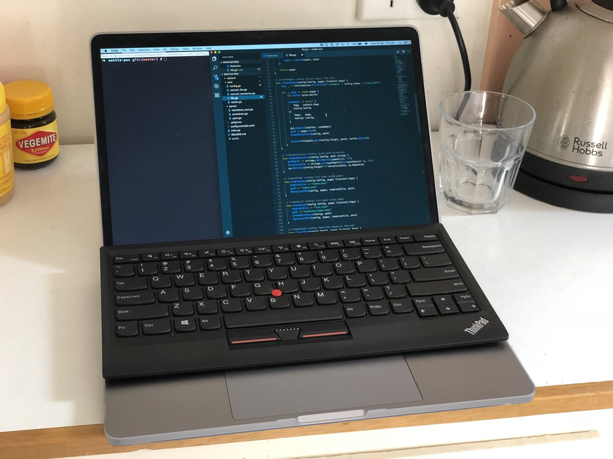

매일매일 맥북프로 키보드에 감사할 줄 모르는 삶을 지내고 있었다. 어느 날 디지털 노마드로 활동하는 [hivickylai][1]님의 포스트를 읽게 되었다. 그 포스트는 [작년 어떻게 짐을 꾸렸나 하는 내용][2]이었는데 그 중 싱크패드 블루투스 키보드가 눈에 꽂혔다. 키보드에 조예가 깊은 [_nodelay님이 싱크패드 사고 키보드 좋다는 트윗][3]을 보고 나서 안그래도 싱크패드를 마련하면 이 슬럼프를 탈출할 수 있을 것 같은 굳은 믿음 같은 것이 생기고 있었다. 하지만 조만간 이사를 준비해야 할지도 모르기 때문에 짐을 늘려서는 안되는데 블루투스 키보드의 존재를 알게 되었으니 지갑이 열렸다. 결제하고 한 주 지나서 홍콩에서 배달이 왔다.

<blockquote class="twitter-tweet" data-lang="en">
  

    핏이 조금 아쉽네. 좌우는 딱 맞음. <a href="https://t.co/HniY5Yp5xe">pic.twitter.com/HniY5Yp5xe</a>
  

  
  

    &mdash; 용균 (@haruair) <a href="https://twitter.com/haruair/status/955349965999562753?ref_src=twsrc%5Etfw">January 22, 2018</a>
  

</blockquote>

엉성한 박스에 배달이 왔다. 레노보 공식 사이트에서 구입했는데도 표지도 없는 카드보드 박스에 담겨져 와서 좀 놀랬다. 개봉하며 처음 몇 번 눌렀을 때는 애플 블루투스 키보드랑 별다르지 않네 생각했었다. 그리고 컴퓨터에 연결했고 5분 정도 사용하고 나니 완전히 생각이 달라졌다. 이건&#8230; 혁명이야! 그렇게 아이맥에서 사용하던 애플 블루투스 키보드를 새 키보드와 교체하게 되었고 맥북프로는 여전히 옆에서 충전기만 꽂혀 있게 되었다.

로지텍 블루투스 키보드도 갖고 있었는데 지금은 아내가 사용하고 있어서 비교할 수 있는 대상은 애플 블루투스 키보드가 전부다. 비교해서 써보면 이렇다.

  * 애플 키보드에 비해서 키 넓이가 넓다. 손이 크다면 싱크패드 쪽이 더 좋을 것 같다. 내 손에는 약간 큰 느낌이다.
  * 키감이 좋다. 뭐라 설명하기 어려운 부분인데 키를 누를 때마다 키가 손가락 끝에 달라붙는 그런 기분이 든다. 그렇다고 반발력이 엄청 느껴진다거나 그런건 아닌데&#8230; 뭔가 매력적이야.
  * 포인팅 스틱(빨간 점)이 의외로 편리하다. 물론 마우스가 있으면 습관적으로 마우스에 손이 가긴 하지만 스크롤이라든지 커서를 조금 이동하는 등의 작업은 마우스를 사용하지 않고도 쓸 수 있다. 지금 소파에 앉아서 키보드만 놓고 글을 쓰는데 전혀 불편함이 없다.
  * 배터리가 오래 간다. usb 케이블로 충전할 수 있고 충전하면서 사용할 수 있다. 애플 키보드도 배터리 교체를 언제 했는지 기억나질 않지만 AA 전지 충전하고 하는 번거로움에 비해서 편리하다.
  * 블루투스 끊김이 있다고 들었는데 아직까지 그런 경험이 없다. 시간이 지나면 절전 모드로 들어가는 것 같은데 그 때 슬립 모드였던 아이맥이 잠시 켜지는 증상이 있는 것 같다. 본체가 자는지 핑(?)을 쏘는데 그거에 반응해서 켜지나 싶기도 하고.
  * 마감이 좋다. 애플 키보드에 긁혀본 적이 있어서 플라스틱이 더 마음 편하다.
  * 키보드에 조그마한 다리가 있어서 각도를 높힐 수 있다. 일반적인 블루투스 키보드에서 못봤던 것 같다.

단점은 별로 없지만 억지로 적어보면

  * 색이 검정이다. 그런데 계속 보면 멋있다(?).
  * 포인팅 스틱의 속도를 세밀하게 조절하려면 내 손가락도 그만큼 섬세하게 움직여야 하는데 마우스에 비해서 좀 더 신경을 많이 써야 한다. 물론 적응하면 엄청 편하게 느낄 것 같다.
  * 방향키 옆에 pgUp, pgDn키를 붙여놨다. This is not cool&#8230; [삼성 노트북 키보드][4]만큼 이상하다. 어짜피 cmd + 방향키로 쓰고 있기 때문에 키맵으로 두 키를 사용하지 않게 설정했다.
  * 맥 기본 기능키와 순서가 다르다. 게다가 달려있는 FnLk 키는 싱크패드 외에 동작하지 않는다. 물론 맵핑 프로그램을 쓰면 다 마음대로 바꿀 수 있으니까 엄청 큰 단점은 아니고 극복할 수 있는 수준. 오히려 사용할 수 있는 키가 넉넉한건 장점이라고 해야할까.

기계식 키보드를 좋아하긴 하지만 이 키보드는 그 자체로도 크게 완성된 느낌이고 사용하면 즐거운 기분이 든다. 회사용으로 사달라고 해서 하나 비치해둘까 생각하고 있다.

[내가 구입한 모델][5]은 장비 하나에만 페어링이 가능한 모델(0B47189)인데 반해 중국에서만 구입할 수 있는 멀티 페어링 버전(4X30K12182)도 존재한다고 한다. 모델명이 완전 다른 걸로 보면 내수용이거나 그런 것 같다. 멀티 페어링 버전이 필요하다면 [알리익스프레스][6]에서 구입할 수 있다.

 [1]: https://twitter.com/hivickylai
 [2]: https://heronebag.com/blog/gear-roundup-2017/
 [3]: https://twitter.com/_nodelay/status/949485077678837761
 [4]: http://www.haruair.com/blog/1569
 [5]: https://www3.lenovo.com/au/en/accessories-and-monitors/keyboards-and-mice/keyboards/KEYBOARD-US-English/p/0B47189
 [6]: http://s.click.aliexpress.com/e/QbqV7im