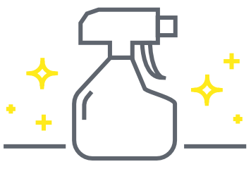

한참 미루던 블로그를 정돈했다. 새로운 도메인을 구입했는데 그쪽으로 옮길까 하다가 신경써야 할 부분이 너무 많아서 정리만 했다.

  * 새로운 테마를 만들까 싶었지만 엄두가 안나서 기본 테마를 손질하는 쪽으로 방향을 바꿨다. [Twenty Fifteen][1]를 사용했다. 깔끔. 서체 크기를 좀 변경하고 헤드라인을 추가했다.
  * [본명조][2]와 [Freight Text Pro][3]를 적용했다. 지금은 Typekit을 사용하고 있는데 동적으로 로딩하는 식이라 뒤죽박죽 보일 때가 종종 있다. 호주 인터넷이 느려서 그렇겠지만. 본명조도 [스포카 한 산스][4]처럼 얼른 작고 빠른 웹폰트 패키지로 나왔으면 좋겠다.
  * dns 서비스를 [cloudflare][5]로 변경했다. 덕분에 https도 손쉽게 적용했다. dns propagation이 느려서 답답했다.
  * 위젯을 바꿨다. 기존에 쓰던건 그냥 많이 조회되는 순서로 나오는 위젯이었는데 이제 직접 선정한 글만 나온다. 한땀한땀 html로 되어 있는 목록이다.
  * 헤더 이미지로 svg를 넣을 수 있게 수정했다. (플러그인 있어서 설치) OpenGraph는 svg를 지원하지 않아서 소셜 카드에서는 좀 밍밍하게 보일 것 같다.
  * 오래된 글은 메시지를 넣었다.
  * 내용이 오래된 페이지는 메뉴에서 뺐다.
  * 코드 하일라이트 색상을 바꿨다. [hightlight.js][6]에서 조금 눅눅하고 밝은 색인 Atelier Estuary Light으로 골랐다.
  * 덧글 기능을 다시 활성화했다.

보기엔 크게 달라지진 않았지만 기분이 좋아졌다. 만드는 일도 즐겁지만 다듬는 일도 재미있다. 언제가 될지 모르겠지만 카테고리 분류가 엉망이라 색인을 다시 만들어서 정리할 생각이다.

정리하면서 이전에 쓴 글도 읽게 되었다. 지금 내 생각과는 다른 부분도 많고 누군가 읽고 상처받을 만한 글도 보였다. 일상의 스트레스와 부정적인 감정을 블로그에 너무 많이 쏟아서 내 스스로도 이 블로그 주인은 일상에 문제가 좀 있나보군, 생각이 들 정도다. 잘 모를 때 썼거나 그냥 어리고 부족한 글도 많다. 이런 부분을 발견할 때마다 삭제 버튼을 누르고 싶어진다. 눈앞에서만 치운다고 내가 달라진다면 참 좋겠지만 과거의 경험으로 봐서는 그렇지 않은 것 같다. 부끄러운 글을 다시 볼 때마다 돌아보고, 반성하고, 개선하는 순환을 만들고 싶다.

앞으로는 좀 더 긍정적으로 생각하고 행동하고, 그런 삶이 글로도 나타났으면 좋겠다.

 [1]: https://en-au.wordpress.org/themes/twentyfifteen/
 [2]: https://typekit.com/fonts/source-han-serif-korean
 [3]: https://typekit.com/fonts/freight-text
 [4]: https://spoqa.github.io/spoqa-han-sans/en-US/
 [5]: https://cloudflare.com
 [6]: https://highlightjs.org/