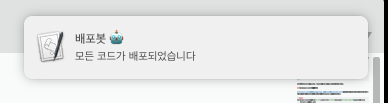

최근 php로 cli 도구를 만드는 프로젝트를 했다. 타겟 서버에 접속하는 권한이 제한적이고 나도 프로젝트 스코프 내에서만 접근 가능한 상황이라 ci를 돌리기 좀 애매해서 bash로만 작성해뒀다. 총 12개의 물리 서버에 도구를 배포하는데 배포가 완료되면 notification을 띄우고 싶어서 찾아봤다.



특별한건 아니지만 그냥 보기 좋으니까. ?

## osascript 사용하기

가장 간단한 방법이다. osascript로 노티를 띄울 수 있다. 장점은 1줄이면 된다는 점이다. 단점은 클릭하면 script editor가 열리는 점, 아이콘 변경이 안되는 점이다. bash에서 스크립트를 다음처럼 실행하면 된다.

```bash
osascript -e 'display notification "노티 내용" with title "타이틀" sound name "Basso"'
```

소리명은 `~/Library/Sounds`, `/System/Library/Sounds`에서 찾을 수 있다.

## terminal-notifier 사용하기

[terminal-notifier][1]를 설치해서 쓰는 방법이다. 아이콘이라든지 마음대로 다 변경할 수 있지만 따로 설치해야 한다. homebrew로 설치 가능하다.

```bash
terminal-notifier -title "Hello" -subtitle "코드 배포" -message "배포가 완료되었습니다" -appIcon https://haruair.com/logo.png
```

## node-notifier 사용하기

node로 작성되어 있다면 [node-notifier][2]를 사용하면 된다. 멀티플랫폼을 지원한다. mac은 terminal-notifier를 포함해서 배포하기 때문에 terminal-notifier의 기능을 전부 사용할 수 있고 js에서 간단하게 불러낼 수 있다.

```js
const notifier = require('node-notifier');

notifier.notify({
    title: "Hello",
    message: "Hello World!",
});
```

[1]: https://github.com/julienXX/terminal-notifier
[2]: https://github.com/mikaelbr/node-notifier