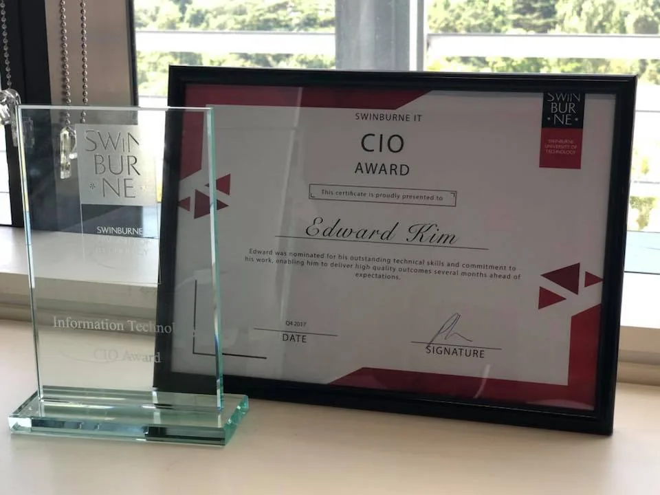
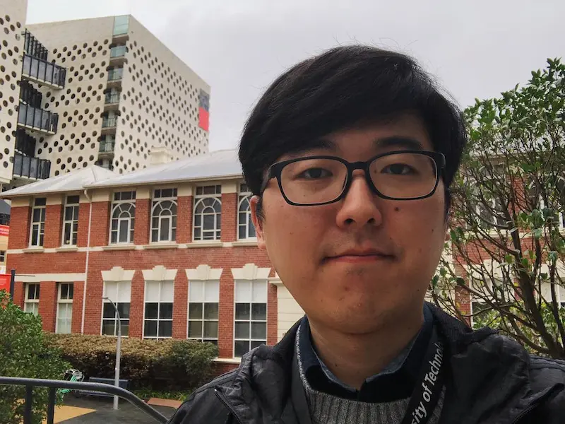

오늘이 마지막 출근이다.

1년 조금 넘는 기간을 다닌 이번 회사에서는 이전 다녔던 곳과는 확연히 다른 경험을 했다. 규모도 달랐고 프로세스도 갖춰져 있었다. 다른 부서와 함께 일하는 경험은 처음이었다. PM과 BA와 함께 일하고, 아키텍트에게 리뷰도 받고, 수많은 단계를 거쳐 배포와 retrospective까지 가는 모든 과정이 배움의 연속이었다. 모두 친절하고 많이 도움 받았다.

회사 다니는 동안 크고 작은 다양한 업무를 했고 프로젝트는 대외적으로 인정도 받아 즐거웠다. 업무 프로세스가 많고 내 영어가 부족해서 지치는 면도 좀 있었지만 좋은 사람들과 함께 재미있는 프로젝트를 할 수 있었다. 프로젝트에서 대학에서만 볼 수 있는 그런 도메인 지식을 배운 것도 즐거운 경험이었다.

또한 성평등과 문화 다양성이 로드맵에 들어있을 정도로 신경을 많이 쓰는 회사라서 그런지 지난 회사에서 겪었던 작은 편견조차 여기서는 볼 수 없었다. 덕분에 회사가 차별에 맞서기 위해서는 어떤 역할을 해야 하는지, 어떤 장치를 둬야 하는지도 업무 외적으로도 많이 배웠다.

다음은 어느 회사로 갈지 정해지지 않았다. 다음 회사에서는 다른 기술을 사용해서 일하고 싶다는 막연한 생각만 있다. 오랜만에 어디에도 소속되지 않은 상태로 시간을 보낼 예정이다. 그동안 만나지 못했던 사람들도 보고, 책도 읽고, 여유도 가질 참이다. 물론 나날이 들어오던 돈이 더 이상 없다는 상상은 좀 걱정이 된다. 이런 면에서 보면 월급 중독이 심한 것 아닌가 싶기도 하고.

매년 무언가 배우면서 미래를 대비하려고 했지만 조급한 마음만 앞서서 그런지 1, 2년이면 닳아버리는 지식만 반복해서 접했던 것 같다. 급함에 너무 좁은 시각으로 살지 않았나 생각이 많이 들었다. 그래서 이번에는 기간을 두고 집중해서 볼 수 있는 지구력도 좀 만들고, 무엇을 오래 보고 배울지 부지런히 찾아야지 싶다. 무엇이 미래에 정말 필요할까, 나는 어떤 역할로 그 기류 속에 서 있을 수 있을까.

무엇을 준비하고 어떻게 대비하는지 고민과 함께 정말 하고 싶은 것은 무엇인지도 생각하게 된다. 하고싶은 일이 기술적 깊이가 있는 엔지니어링인지, 아니면 비즈니스와 더 맞닿아 있는 기술 컨설팅인지, 아니면 좀 더 큰 그림을 그리는 아키텍트가 되고 싶은 건지. 이 전환 기간동안 좋은 결정을 내릴 수 있는 토대를 잘 가꿔서 결정 하고싶다.

벌써 멜번에서 만 6년의 시간을 보냈다. Stop and smell the roses. 고민도 많고 고생도 했던 기간이지만 몸 건강히 잘 지내는게 얼마나 다행인지 생각한다. 지금까지 지내온 시간과 받은 도움에 감사하는 시간을 보내고 싶다.

