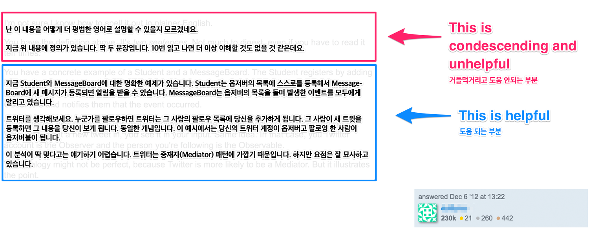
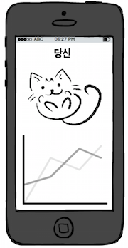

이 글은 [April Wensel](https://twitter.com/aprilwensel)의 [Tech has a Toxic Tone Problem — Let’s Fix It!](https://compassionatecoding.com/blog/2016/8/25/tech-has-a-toxic-tone-problemlets-fix-it/) 번역입니다.

---

# 기술 업계의 독성 말투 문제, 고칩시다!

의사소통에 관해서, 특히 엔지니어가 연관된 경우라면 기술 업계에서 독성 말투 문제가 존재합니다. 저는 이 문제를 지난날 동안 주변에서 겪었기 때문에 알기도 하지만, 저도 이런 순간을 마주했을 때는 그 문제에 기여를 했었기 때문입니다.

먼저 [말투(tone)](https://www.merriam-webster.com/dictionary/tone)는 "누군가 단어를 말하거나 쓸 때 표현되는 태도"라는 의미에서, [독성(toxic)](http://www.hbs.edu/faculty/Publication%20Files/16-057_d45c0b4f-fa19-49de-8f1b-4b12fe054fea.pdf)은 "조직의 자산 또는 구성원을 포함해서 그 조직에 위해를 주는 것"이란 의미에서 사용하고 있습니다.

소프트웨어 엔지니어는 일반적으로 뛰어난 커뮤니케이션 스킬을 갖고 있지 않다고 얘기합니다. 이런 경향은 여러 이유로 설명되기도 합니다. 전문 지식을 갖고 있기 때문에, 인간관계보다 컴퓨터와 더 많은 시간을 썼기 때문에, 전통적으로 성격이 프로그래밍에 가까워서 등으로 말이죠. 하지만 이런 대부분의 잠재적 이유는 문제점이 있으며 특히 마지막 이유는 고정관념이기도 합니다. 게다가 엔지니어가 이런 문제점을 핑계로 주변 사람들에게 멀쩡한 사람처럼 행동하지 않을 구실로 삼을 수 없다는 점입니다.

엔지니어의 부족한 커뮤니케이션은 새로운 현상이 아닙니다. 제럴드 와인버그는 1971년에 [프로그래밍 심리학](http://www.worldcat.org/title/psychology-of-computer-programming/oclc/216809)에서 다음처럼 적었습니다.

> 프로그래밍에서는 엄청나게 똑똑할지 몰라도 자신의 지적 능력을 사용해서 자신의 사회적 행동이나 대화 방식을 고칠 수 있을 정도로 똑똑하지 않을 수 있습니다.

이런 점은 단순히 팀 생산성을 망치는 일에 그치지 않습니다. 커뮤니케이션 문제가 기술을 공부하는 사람들을 낙담하게 하며 사회적 활동에 참여하는 기존 엔지니어의 의지까지도 꺾게 됩니다. 여기서 사회적 활동이란 스택오버플로우에 질문을 올리고 답변을 달거나 오픈 소스에 기여하는 활동을 예로 들 수 있습니다. **그러므로 프로그래밍을 둘러싼 커뮤니케이션을 향상하는 일은 더 포괄적인 개발 커뮤니티를 만드는 일에 필수적이라 할 수 있습니다.**

이 문제를 지적하기 전에 먼저 이해를 제대로 하기 위해 살펴봐야 합니다. 저는 그동안에 이 말투 문제를 지켜보면서 세 가지 공통분모를 찾았습니다. 물론 이 사항은 완벽한 목록이라고 말할 순 없지만, 엔지니어만 이런 커뮤니케이션 문제를 겪는 사람이 아니라는 점을 확인할 수 있을 겁니다.

이런 독성 말투는 일반적으로 거들먹거리는 말투, 기계적 말투, 또는 비관적인 말투로 나타나기도 합니다. 어떤 경우에는 달콤한 독성 말투 비빔밥이라도 되는 것처럼 이 세 가지를 모두 섞어 놓은 때도 있습니다.

## 거들먹거리는 말투

어떤 기술을 습득하게 된다면 아마 주변 사람들에게는 부족한 전문 지식을 갖게 될 겁니다. 나쁘게도 새로운 기술을 습득한다고 해서 그 기술이 없는 사람과 효과적으로 의사소통하는 능력까지 함께 따라오지 않습니다. 다른 사람과 대화하게 될 때 당신이 아는 만큼 알지 못하는 사람에 공감하는 능력이 부족하다면 거들먹거리는 녀석으로 보일 뿐입니다.

지미 펄론이 세러데이 나이트 라이브에서 했던 [닉 번즈: 당신 회사의 컴퓨터 담당자](http://www.nbc.com/saturday-night-live/video/nick-burns-your-companys-computer-guy/n11268)를 본 적이 있나요? 닉은 따지고 보면 허구의 IT 전문가며 실제 세계의 프로그래머가 아니긴 하지만 극에서 묘사된 그의 행동은 놀랍게도 기술 업계에서 만연하게 볼 수 있던 거들먹거리는 말투를 명확하게 보여주고 있습니다.

저는 동료들이 다른 엔지니어나 인터뷰 대상자를 "종이봉투 뚫고 나올 간단한 방법조차도 프로그래밍하지 못하는" 그런 "멍청이"라고 부르는 경우를 수 년간 들어왔습니다. 초급 엔지니어가 질문했다고 눈을 부라리는 경우도 봤습니다. 부트캠프 졸업생이나 스스로 공부해서 프로그래머가 된 사람들을 평가하는 지적도 들은 적이 있습니다.

또한 많은 엔지니어가 말하는 방식이라든지 이들이 마케팅, 영업, 제품과 고객 응대에서 일하는 직원에 대해 언급하는 경우를 봤을 겁니다. 엔지니어가 누군가를 "비개발자 (non-technical)"라고 언급했다면 그 사람들의 업무를 뭉개버리는 것이나 마찬가지입니다. (다른 얘기지만 저는 이 단어를 [더는 사용하지 말아야 한다고](https://medium.com/compassionate-coding/if-you-can-use-a-fork-youre-technical-352e21d92c87) 봅니다)

이런 거들먹거리는 태도는 항상 노골적으로 드러나지 않습니다. 다음 예제는 조금 교묘합니다. 누군가 [스택오버플로우에 남긴 질문](http://stackoverflow.com/q/13744450)인데 온라인에서 한참 검색하기도 했지만, 이해에 어려움이 있어서 _옵저버_ 와 _옵저버블_ 의 차이점이 무엇인지 물어봤습니다. 다음 답변은 100회 이상의 투표를 받은 답변입니다.

읽기 좋게 거들먹거리는 부분을 가져왔습니다.

> 난 이 내용을 어떻게 더 평범한 영어로 설명할 수 있을지 모르겠네요.
>
> 지금 위 내용에 정의가 있습니다. 딱 두 문장입니다. 10번 읽으면 더는 이해할 것도 없을 것 같은데요.

질문에 답변하는 사람은 용어의 차이가 명확해서 어떻게 이걸 이해하기 위해 더 "평범한 영어"로 설명해야 하는지 상상조차 하지 못하고 있습니다. 이 질문을 남긴 사람은 이 답변으로 어떤 기분이 들었을지 궁금하게 합니다. 질문자가 이 답변에서 응원을 받은 기분이거나 답을 읽고 더 자신감을 느끼게 되었을 거라고는 상상되질 않습니다. 이 문답이 충격적이라는 점을 [트위터에서도](https://twitter.com/loooorenanicole/status/745685279940411396) 마주할 수 있었습니다.

운 좋게도 누군가 커뮤니티에서 답변을 수정할 수 있는 사람도 트위터 토론을 봤는지 거들먹거리는 서두를 지워서 유용한 답변으로 바꿔놨습니다. 커뮤니티 구성원 모두가 친절함에도 가치를 둬서 투표를 따라 줬더라면 얼마나 좋았을까요.

근본적으로 어떤 경우든 거들먹거리는 말투 뒤에 숨어 있는 태도는 "내 주변에 있는 사람들은 다 모르지만 나는 알고 있다. 내가 우월하기 때문에 그들을 굳이 존중할 필요가 없다."와 비슷할 겁니다.

이런 태도는 위험합니다. [죄와 벌](http://www.worldcat.org/title/crime-and-punishment/oclc/27188192)에 나오는 라스콜니코프의 "초인" 콤플렉스를 연상하게 합니다. 이 사람은 스스로를 다수인간 위에 있는 법적 존재인 소수인간이라 여기고 다른 사람을 살해하기에 이릅니다.

물론 이처럼 극단적인 경우를 다루지는 않지만, 여전히 이런 사람은 우리 개발팀에 있는 것은 건강하지 않습니다. RailsBridge를 창업한 사라 메이는 [이렇게 말했습니다.](https://twitter.com/sarahmei/status/673599699819958273)

<blockquote class="twitter-tweet" data-conversation="none" data-lang="en">
Anti-social behavior in any employee invisibly &amp; silently costs you money - WAY more money than their extraordinary productivity gains you.
&mdash; Sarah Mei (@sarahmei) <a href="https://twitter.com/sarahmei/status/673599699819958273?ref_src=twsrc%5Etfw">December 6, 2015</a></blockquote>

> 직원의 보이지 않고 조용한 반사회적 행동에서 비용이 발생합니다. 그런 사람들의 비범한 생산성보다 정! 말! 큰 비용을 지출하게 합니다.

이에 대한 해결책은 무엇일까요?

### 평화적인 대안

먼저 대표직에 있다면 거만하거나 거들먹거리거나 공격적인 행동에 대해 보상하는 일을 중단해야 합니다. 개념을 진정으로 숙련했다면 경험이 적은 사람에게 더 간단한 용어를 사용해서 개념을 설명할 수 있어야 합니다. 이런 행동이 보상을 받아야 하는 행동입니다.

개인 수준에서는 무얼 할 수 있을까요?

동료가 도움을 받고 싶어서 하는 질문에서 본인이 잘 아는 분야라고 생각한다면 스스로 무언가 거들먹거리는 내용을 말할 수 있다는 점을 인지하고 있어야 합니다. 또한 내가 이런 답변을 누군가에게 들었을 때 어떤 기분이 들까 하고 스스로에게 물어봐야 합니다. 사용하는 단어가 듣는 상대의 기분을 상하게 하나요 아니면 좋게 하나요? 정말 그 사람보다 더 잘 알고 있는 게 맞나요? 더 알고 있다는 점이 상대에게 예의 없게 행동해야 한다는 의미인가요? 상대방도 당신이 모르는 부분을 더 잘 알 수도 있지 않을까요? 단순히 동일한 문제를 다른 관점에서 보고 있는 것은 아닐까요?

당신이 대화하고 있는 사람이 정말로 해당 주제에 대해 무지하다고 가정해봅시다. 상대방이 문제를 이해하는데 얼마나 어려움을 겪을지 상상해봅니다. 이해하는 동안 겪는 고통에 동정심을 갖고 그 어려움을 최소화할 수 있도록 하려면 어떻게 도울 수 있을지 살펴봅시다. 자신이 이 주제에 대해 처음으로 배우던 당시를 생각해본다면 어떻게 알려줘야 하는지 생각하는데 도움 될 겁니다. 어떤 점이 도움이 되었습니까? 다음을 고려해보세요.

1. 어떤 질문들을 하고 있었고 가장 유용한 답변은 어떤 답변이었습니까?
1. 어떤 자료가 이 문제를 이해하는데 있어 추가적인 관점을 제공할 수 있습니까?

또한 자기 자신에게 인정을 베풀기 바랍니다. 이 사람을 도와주는 일이 에너지를 소비하나요? 만약 그렇다면 좀 쉬는 것이 낫지 않을까요? 도와줄 수 있는 다른 사람은 없나요? 이 문제를 다루는 데 도움이 되는 연관 자료가 있나요? (주의하세요: "[대신 구글링 해줄게](http://lmgtfy.com/?q=how+not+to+be+a+jerk)" 링크를 보내는 일은 일반적으로 거들먹거리는 거나 다름없습니다. 상대방이 농담으로 받아들일 것이라는 확신이 있는 것이 아니라면 말입니다.)

스스로 이런 행동을 한다면 당신의 동기(motivation)를 확인해보세요. 사실, 이 지식에 대해 약간 불안전하게 느껴서 그런 행동을 보일 가능성이 있지 않나요? 자신의 자아를 방어하기 위해서 거들먹거려야겠다는 유혹을 받는 것은 아닌가요? 정말 이런 문제로 그렇다면 스스로를 채찍질하지 않기 바랍니다. 기술 산업에 있는 면접과 직원 보상 시스템은 주로 부풀려진 자아를 선호하기 때문에 아마도 이런 태도가 당신의 잘못만은 아닐 겁니다. 그러므로 조금의 자기 성찰로 무언가 공격적인 말을 하는 것을 방지할 수 있을 것입니다.

거들먹거리는 응답 대신에 연민이 있는 응답을 할 수 있다면 듣는 상대방도 기분 상하지 않아 당신과 함께 일하기 즐겁게 여길 것입니다. 올리비아 폭스 카반의 저서 [The Carisma Myth](http://www.worldcat.org/title/charisma-myth-how-anyone-can-master-the-art-and-science-of-personal-magnetism/oclc/729341503)([카리스마, 상대를 따뜻하게 사로잡는 힘](https://book.naver.com/bookdb/book_detail.nhn?bid=7241510))에서 이런 이야기가 나옵니다.

1886년, 한 여성이 두 명의 영국 총리 후보와 각각 저녁 식사를 했습니다. 이 여성이 저녁 식사에서 언론에 다음과 같이 말했습니다.

> "글래드스턴 씨와 저녁 식사를 한 후에는 그가 영국에서 가장 현명한 사람이라고 생각했습니다. 디즈레일리 씨와 저녁 식사를 한 후에는 **제가** 영국에서 가장 현명한 사람이라는 생각이 들었습니다.

말할 필요도 없이 궁극적으로 디즈레일리가 선거에서 승리했습니다. 어떤 타입의 사람이 되고 싶은가요? 거들먹거리며 당신의 우월함을 자랑하는 사람이 되고 싶은가요? 아니면 다른 사람들의 가능성을 일깨우는 데 도움을 주는 사람이 되고 싶은가요? 단순하게, _당신은_ 어떤 타입의 사람과 일을 하고 싶은가요?

이 주제에 대해 더 알고 싶다면 책 [The No A**hole Rule](http://www.worldcat.org/title/no-asshole-rule-building-a-civilized-workplace-and-surviving-one-that-isnt/oclc/70176901)([또라이 직](https://book.naver.com/bookdb/book_detail.nhn?bid=2916694))을 확인해보세요.

## 기계적 말투

> "안녕 패트, 네 사촌이 죽었다."

이 메시지는 제가 사랑하는 할머니가 제 유년 시절에 자동 응답기에 남긴 메시지입니다. 목소리에 억양도 없었고 요점을 전달하는데 감정적 수사 여구도 없이 단순히 효율적인 사실만 전달하는 말이었습니다. 저는 할머니의 직선적인 태도를 물려받았다고 생각합니다.

아쉽게도 모두가 감정 없는 직선적인 태도를 좋아하지 않습니다. 앞서 이야기한 것과 같이 저 또한 기술 분야의 독성 말투 문제에 기여를 했는데 이 로봇 같이 행동하는 문제가 바로 제 약점이기도 합니다.

엔지니어로서 컴퓨터를 다루면서 일반적으로 주의 깊게 사람의 감정을 고려하는 것처럼 행동하지 않습니다. 컴퓨터에게 매우 직선적으로 무엇을 할지 이야기하면 컴퓨터는 명령을 처리합니다. 아름답게 효율적이고 논리적인 흐름입니다. 아마 이런 특징이 많은 사람으로 하여금 엔지니어링에 첫눈에 반하고 빠지게 하는 그런 부분일 겁니다.

좋든 나쁘든 간에 컴퓨터와 사람은 동일하지 않습니다. 우리는 감정이 있습니다. 상대가 어떻게 받아들일지 고려하지 않고 사실을 직접 공유할 수 없습니다. 제 말은 물론 그렇게 직접 공유할 수 있긴 하겠지만 그러면 당신에게 "거칠다" 혹은 "직설적"이라는 이름표가 붙게 됩니다. (저를 믿으세요.) 인간에게 기계에 말하듯 한다면 사람들 대부분은 당신과 일하는 것을 좋아하지 않을 겁니다.

저는 제 할머니에게 감사하기도 합니다. 저는 이런 직선적인 태도가 엔지니어에게는 자산이 될 수 있다고 항상 생각하기 때문입니다. (사실 엔지니어뿐만 아니라 모두에게 말입니다.) 하지만 말을 듣는 청중을 주의 깊게 생각하는 일, 어떻게 말을 전달해야 하는지 그 모양을 다듬는 일이 중요하다는 점에 저는 동의하게 되었습니다.

중대한 순간에 웹사이트가 닫히게 되었다고 가정해봅시다. 지금 문제를 해결하고 있다는 확신을 보여주지 않고 직설적으로 이 소식만 전달한다면 아마 회사에서 가장 인기 있는 사람이 될 수는 없을 겁니다. 이런 종류의 뉴스도 기계적인 말투로 전달한다면 당신의 고객과 제대로 공감대가 형성될 수 있을지도 의문입니다. 또한 침착함을 유지하는 것도 중요하지만 최소한 고객이 어떤 영향을 미치는지 인지하는 것도 중요합니다.

기계적 말투는 피드백을 전달하는 과정에서도 문제입니다. 직접적인 피드백을 좋아한다고 여러 차례 언급한 디자이너와 함께 협업한다고 상상해봅시다. 이 디자이너는 지금 함께 작업하고 있는 애완동물 관리 앱의 가장 최근 목업(mockup)에 대해 조언을 구했습니다. 사용자의 애완동물 정보를 볼 수 있는 상세 페이지를 만들고 있었습니다. 이 목업에는 디자이너의 고양이, 닐에 대한 통계가 표시되고 있습니다. 페이지 상단에는 "당신" 이라는 제목이 붙어 있습니다. 대략 다음 같은 화면이지만 훨씬 멋지다고 생각해봅시다.

이 디자인을 본 후에 시나리오를 논리적으로 생각해보면 이렇게 말하게 될 겁니다. "이 화면의 제목은 애완동물에 대한 하위 페이지라면 적어도 '당신의 고양이' 또는 '당신의 애완동물' 아니면 '닐'이 되어야 하지 않나요?" 논리적이기도 하고 제목이 페이지 가장 위에 있으니 가장 먼저 보이기도 하니 이런 지적을 가장 먼저 할 수 있을 겁니다.

이제 디자이너와 좋은 관계가 있거나, 디자이너가 스스로 능력에 자신감이 있거나, 기분이 좋은 날이거나, 정말 앞서 말한 것처럼 직접적인 피드백을 좋아하는 사람이라면 디자이너는 오류를 지적한 점에 고마워하고 제목을 갱신하는데 동의할 겁니다. 아니면 왜 여기서는 이런 제목이 맞는지 기쁘게 설명할 수도 있겠습니다.

하지만 모든 상황이 잘 맞아서 돌아가지 않았다고 생각해봅시다. 먼저 디자이너가 그동안 디자인을 하면서 공들인 부분을 알아주지 않고 어떤 부분에서도 이 디자인의 장점을 언급하지 않으며 가장 먼저 문제를 딱 집어내서 그다지 기분이 좋지 않을 수도 있습니다.

스스로는 효율적이라고 생각할 수 있겠습니다. 왜 디자인에서 올바른 부분을 이야기하거나 잘못된 부분에 대해 조심해서 얘기하면서 시간을 낭비해야 하죠? 그냥 바뀌어야 하는 부분을 직접 집어 말해줘서 빠르게 고치는 게 뭐가 잘못인가요? 음, 사람들은 감정이 있고 그 감정은 생산성에 영향을 준다는 점이 문제입니다.

상대방의 강점을 인지하지 않고 상대의 잘못을 냉담하게 지적한다면 상대방은 위협으로 느낄 수도 있으며 생산성에 악영향을 줄 수 있습니다. [데이비드 록](https://web.archive.org/web/20120413051133/http://www.scarf360.com/files/SCARF-NeuroleadershipArticle.pdf)은 다음처럼 설명합니다.

> 위협적인 응답은 분석적 사고, 창의적인 통찰, 문제 해결력을 훼손합니다.

즉, 가장 효과적이라고 생각하는 방식이 고통스러운 감정의 원인이 되고 실제로 팀의 발목을 붙잡는 일이 됩니다.

코드 리뷰에도 동일합니다. 만약 누군가의 오류를 억양 없이 지적하는 일은 역효과를 낳아 상대방의 열정을 죽이고 성장해야겠다는 동기를 짓누르는 일이 될 수 있습니다.

### 평화적인 대안

단순히 충분하지 않다는 이유만 갖고 거만한 녀석이 되는 일을 멈추기 바랍니다. 대신 팀에 긍정적으로 협력하고 진정성을 갖고 지원하기 바랍니다. 긍정적인 감정으로 팀의 다른 사람들에게 어떻게 최고의 영감을 줄 수 있을지 고민하고, 팀원이 고통받지 않도록 하는 일까지 한 단계 앞서 나갈 필요가 있습니다.

기계에 대고 말하는 것이 아니라 사람과 대화한다는 사실을 잊지 마세요. 카렌 암스트롱은 다음처럼 [경고했습니다](http://www.worldcat.org/title/twelve-steps-to-a-compassionate-life/oclc/630500252).

> "만약 자비로움과 공감이 제련되어 있지 않다면, 이성은 인간을 도덕적 공허로 이끌 수 있습니다."

피드백으로 돌아와서, 여기에 사용할 수 있는 하나의 기법은 진정성 있는 질문에 의지하는 방법입니다. 위에서 이야기한 애완동물 앱의 예제 피드백은 "하지 않나요?"로 끝나고 있습니다. 문장은 질문의 형식을 빌리고 있지만 평가하는 문구에 가깝습니다. "이 화면의 제목 선택에 관해 설명해주실 수 있을까요?" 정도가 더 나은 선택지가 되겠습니다.

또한 비판적인 피드백도 긍정적인 피드백과 함께 제련할 수 있습니다. 어떤 사람들은 "샌드위치" 기법으로 피드백을 주는 것을 좋아하기도 합니다. 먼저 칭찬할 점을 언급하고, 건설적인 비판을 제공한 후 또 다른 칭찬을 합니다. 또 어떤 사람들은 (저 자신을 포함해서) 투명하게 보고 요점만 말하길 원하는 경우도 있습니다.

저도 이 조언에 저항하는 데 참여할 수 있습니다. 제 경력 대부분 동안 이 조언에 저항했기 때문입니다. 어린 에이프릴은 "뭐, 사람들이 진실을 대하는 방법에 대해 배워야 할 뿐이라고" 같은 말을 했었습니다. 아마 제 그런 과거에서 저항하려는 이유가 있을 겁니다. 하지만 사람들과 강한 관계를 만들어가는 과정에서 서로 굳은 신뢰 관계(rapport)가 없는 사람과 직설적인 의사소통을 한다면 부적절할 수 있습니다. 저는 또한 진정으로 자아 없는 프로그래밍과 제품 개발도 염두에 두는데 이런 경우에는 피드백은 직접 줄 수 있을 겁니다. 이런 경우에는 (이론적으로) 자아가 없기 때문이죠.

그리고 사람 일은 모르는 법입니다. 직접적인 피드백을 줘도 잘 받는 누군가가 있다 하더라도 그 피드백을 받는 그 날에 그 사람의 개가 죽었다면 평소처럼 받지 못하고 무너질지도 모릅니다. 그래서 어느 때라도 소통하는 사람들의 감정에 당신의 말이 어떤 영향을 주는지 고려하지 않아도 되는 경우는 차라리 없다고 생각해야 맞습니다.

## 비관적 말투

마지막 독성 말투는 비관적 말투입니다. 먼저 저는 회의적인 입장도 어느 정도 팀에 존재하는 것이 건강하다고 생각하는 편이라서 그런 경우는 문제가 아닙니다.

문제는 거의 _모든_ 창의적인 새 아이디어, 도구, 접근 방식에 대해서 비관적으로 대하는 경우인데 "다 본 적이 있다"고 말해서 씁쓸하게 만드는 시니어 엔지니어 같은 경우가 일반적입니다. 이런 건 정말 다 최악입니다.

"그거 동작 안 할 거야."

"그거 확장 안될 거야."

"그 새 도구는 그냥 예전 것만큼 별로야."

어떤 이유에서인지 어떤 엔지니어는 종종 전 USC 총장인 스티븐 샘플이 [말한](http://www.worldcat.org/title/contrarians-guide-to-leadership/oclc/47140745) "습관적 반대론자"에 속하기도 합니다. 그는 다음처럼 설명합니다.

> "새로운 아이디어가 어떻게 동작 가능할지 상상하는 일보다 이들은 본능적으로 왜 안 되는가에 대한 온갖 이유를 생각합니다. 이 사람들은 이런 태도가, 나쁘거나 멍청한 아이디어에 쓰는 모든 사람의 시간을 아낀다고 굳게 믿고 있습니다. 하지만 이 사람들이 실제로 하는 일은 자유로운 생각에서 수확할 수 있는 창의력을 침식하는 일입니다."

엔지니어가 비관주의의 매력을 느끼는 이유가 두 번째 문장에서 정확하게 묘사되고 있습니다. 시간을 절약하는 것 말입니다. 당신의 비관주의적 예측이 옳다면 그들의 아이디어를 거부함으로 모든 사람들의 시간을 잘 절약하고 있을 것입니다.

하지만 이 일이 너무 자주 일어나면 엔지니어는 그 아이디어가 정말 실패할지 잘 모르는 상황에서도 작은 확신이라도 있으면 아이디어를 거절하게 됩니다. 모든 사실을 검증하기도 전에 판단을 내립니다. 아마 과거에 _비슷한_ 접근 방식이 실패한 것을 봤을 수도 있습니다. 또는 수많은 불필요한 프로젝트 관리 도구를 지난 기간 동안 봐서 어떤 새로운 도구든 제대로 동작할 거란 상상을 하지 못할 수도 있습니다. 아니면 매번 위키를 도입하려고 시도했지만, 팀이 계속 관리하지 못했기 때문에 이번에도 별다르지 않을 것으로 생각할 수도 있습니다.

이 모든 경험은 엔지니어가 팀에게 제공할 수 있는 유용한 정보이긴 하지만, 그렇다고 해서 제안이 실패할 것이라는 결론에 즉각적으로 닿지는 않습니다. 과거의 데이터를 알려주면서 거기에 한숨과 부정적인 말투를 더할 필요는 분명 없습니다.

아마 과거 프로젝트에서 레일즈를 사용하면서 한 번의 나쁜 경험이 있을 수 있습니다. 그 한 번의 경험으로 나쁜 도구라고 말할 순 없습니다. 아마도 당시 상황에 맞지 않았거나 팀이 전체적으로 이해하고 있지 못했을 수도 있습니다.

오랜 기간에 걸쳐 많은 프로젝트의 실패를 봐 온 엔지니어라면 실패를 예측할 수 있습니다. 이런 엔지니어는 그들이 말하는 모든 것에 일반적인 부정론을 투영하기도 합니다. 팀을 막다른 골목에 들어가서 시간을 낭비하는 일을 구하기 위해 매번 반대하는 말을 하게 되면, 아마 팀의 의욕을 꺾고 달콤한 실험을 방해했을 가능성이 10배는 될 겁니다.

또한, 위험할 수도 있는 부분은 새로운 엔지니어가 이런 독한 기운을 뿜는 엔지니어를 경외하기도 한다는 점입니다. 이런 이유의 배경을 짐작해보면 모든 것에 불평하고 반대하는 것 보면 분명 모든 걸 다 알기 때문이라 생각하는 것으로 보입니다. 이 모든 부분이 악순환입니다.

_Sidenote: 흥미롭게도 이런 엔지니어는 의외로 낙천적인 경향이 딱 한 주제에서 나타나는데 바로 작업을 완료하는데 걸리는 시간입니다. 이런 낙관주의적 경향의 주된 결과는 한심할 정도로 현실적이지 못한 시간 예측입니다._

### 평화적인 대안

엔지니어가 실패에 대한 가능성을 볼 수 있다면 유용할 겁니다. 이런 관점이 버그와 다운타임, 보안 문제를 방지하기 때문입니다. 하지만 성공의 가능성과 잠재적인 부정적 결과를 발견하는 능력에 균형을 찾는 일은 진정 주의해야 합니다.

그 이유는 숀 머피의 [The Optimistic Workplace](http://www.worldcat.org/title/optimistic-workplace-creating-an-environment-that-energizes-everyone/oclc/913164327) 설명에서 확인할 수 있습니다.

> "두뇌는 기쁨과 같은 긍정적 감정에 열리게 될 때, 전체적인 연결성을 명확히 볼 수 있고 문제를 해결할 수 있는 선택지를 찾을 수 있습니다."

그리고 통계도 인용합니다.

> "긍정적인 업무 환경에 있는 사람들은 부정적인 분위기에서 일하는 사람보다 10~30% 더 나은 결과를 냈습니다."

아이디어를 내리깎고 새 프로젝트의 실패를 예측하기 전에 스스로 물어보세요. 정말로 이 아이디어가 실패한다고 확신하나요? 볼테르가 확신에 대해 한 말을 기억하기 바랍니다.

> "사기꾼만 확신에 차 있습니다. ... 의심이란 그다지 바람직한 상태가 아닙니다. 하지만 확신이란 얼토당토않은 상태인 것입니다."

확신하지 않으면서 왜 확신한 것처럼 말할까요? "그거 동작 안 할 거야"는 정말 당신의 응답으로 필요한 말일까요? 이런 대답 대신에 공손하게 어떤 걱정이 있는지, 과거에 팀에서 어떤 경험을 했는지 공유하는 것은 어떨까요?

만약 정말 그 비운의 아이디어가 실패한다고 _확신_ 한다면 먼저 볼테르의 말을 다시 읽어보고, 자신의 의심을 나머지 팀원에게 의욕을 꺾지 않는 방법으로 어떻게 소통할지 고려하기 바랍니다. "[맞아요, 그리고...?](https://99u.adobe.com/articles/7183/the-yes-and-approach-less-ego-more-openness-more-possibility)"로 그 응답을 시작할 수 있습니다. 예를 들면, "맞아요, 그 아이디어가 뛰어난 이유를 알겠어요. 그리고 이 아이디어는 이런 다른 맥락에서 더 좋은 이유가 있어요." 또는, "맞아요, 흥미로운 아이디어네요. 그리고 아마도 몇 달 후에 Y를 달성하고 나면 그 아이디어가 더 실현할 수 있겠네요." 식으로 답할 수 있을 겁니다.

여기에 자신에게 자비로움을 베풀어 도움을 구할 수 있는 시간이 또 있습니다. 다른 무언가로 인해 괴로워하고 있고 그 고통이 제안된 아이디어에 대해 반대하는 진짜 원인인가요? 그냥 피곤한가요? 먼저 본인에게 있는 개인적인 필요를 돌봐야 합니다. 그리고 그 아이디어를 여전히 반대하는지 살펴보기 바랍니다.

그리고 회사의 사명과 자기 자신의 사명을 다시 상기하는 일도 도움 됩니다. 왜 이 프로젝트에 지금 일하고 있죠? 무엇이 희망을 주나요? 그 희망을 새로운 아이디어에 대한 열린 마음으로 이어갈 수 있나요?

항상 모든 일이 완벽하게 잘 될 것이라고 가장할 필요는 없습니다. 하지만 새 아이디어에 대한 열린 태도는 진정으로 혁신적인 작업을 하기 위한 전제조건입니다. 또한 당신을 더 즐겁고 타인을 지지해줄 수 있는 동료로 만들 것입니다.

## 미래

> "컴퓨터 프로그래밍은 인간 활동입니다. ... 하지만 아직도 ... 많은 사람들(많은 프로그래머들)은 프로그래밍을 인간 활동으로 전혀 고려하고 있지 않습니다."

제럴드 와인버그는 1971년에 [이 글을 썼지만,](http://www.worldcat.org/title/psychology-of-computer-programming/oclc/216809) 여전히 이런 인식이 존재합니다. 제 생각에는 엔지니어링에서의 커뮤니케이션이 주목받을 가치가 있습니다.

우리가 아름다운 소프트웨어 걸작을 만드는 일을 사랑하는, 뛰어난 엔지니어라면 그와 동시에 친절하고 자비로운 사람들로 서로를 돕고 말과 글로 의사소통을 할 때는 서로의 단어로 영감을 불어넣는 사람이 될 수 있지 않을까요?

저는 기술 업계의 더 밝은 미래를 그립니다. 모든 종류의 독성 말투를 버리고 대신에 긍정적이고, 겸손하며, 희망차고, 명확하며, 초대하는 것과 같은 말투를 받아들인 미래를 말입니다. 왜 초대하는 것과 같아야 하는가 하면 알다시피 우리가 만들고자 하는 것을 모두 만들려면 우리에게 더 많은 엔지니어와 기여자를 필요로 하기 때문입니다.

프란 앨런의 [Coders at Work](http://www.worldcat.org/title/coders-at-work-reflections-on-the-craft-of-programming/oclc/535024762) 인터뷰에서 말하는 엔지니어링처럼 말입니다.

> "엔지니어링은 사회 전체를 위한, 변혁적인 분야입니다. 또한 우리가 하는 일에서 다양한 사람들의 참여 없이는, 우리 사회의 모든 측면에서 매력적이거나 유용하지 않은 결과를 얻게 됩니다."

그러므로 진보적인 관점에서, 불필요하고 자아 중심적인 부정성 때문에 다른 누군가가 겁먹지 않도록 조심합시다.

---

- 2018-12-12: *직진적*을 *직선적*으로 변경했습니다. 버블쓰님 피드백 감사드립니다.
- 2018-12-12: *현명이라고 생각했습니다*를 *가장 현명한 사람이라는 생각이 들었습니다*으로 변경했습니다. [minieetea](https://twitter.com/minieetea)님 피드백 감사드립니다.
- 2018-12-13: 잘못 걸린 링크를 수정했습니다. [정겨울](https://twitter.com/res_tin)님 피드백 감사드립니다.
- 2018-12-13: 제럴드 와인버그의 인용을 수정했습니다. [chiyodad](https://twitter.com/chiyodad)님, [lazygyu](https://lazygyu.net)님, [jinhoyim](https://github.com/jinhoyim)님 피드백 감사드립니다.
- 2019-07-16: *지정*을 *지적*으로 고쳤습니다. 아델라님 피드백 감사드립니다.
