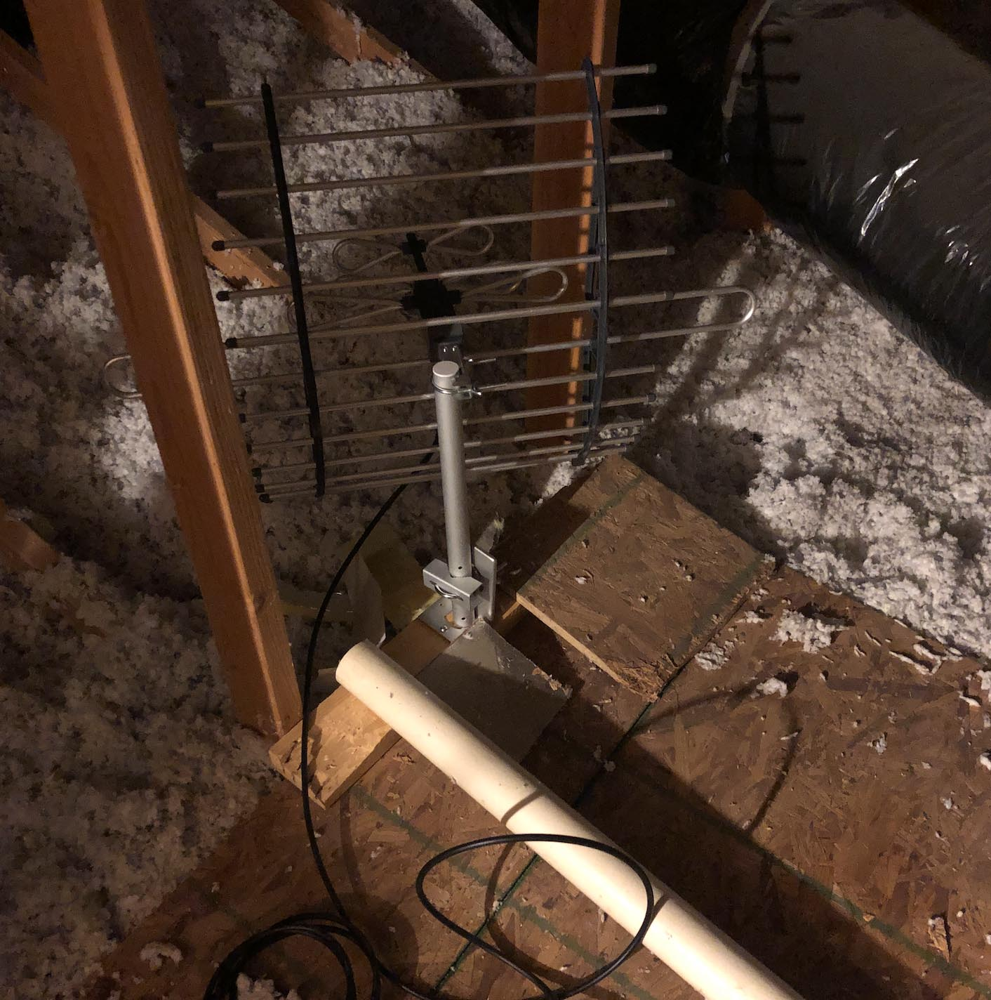

그동안 AT&T의 DirectTV를 인터넷과 함께 번들로 사용하고 있었다. 한국 채널도 나오고 집에서도 한국 방송을 꽤 보고 있기 때문에 이 케이블 TV를 계속 유지했었는데 번들 할인도 끝나더니 최근에 기본 요금도 올랐다. 작년에 크롬캐스트를 사용하면서 대부분 방송은 온디맨드코리아(사랑해요)랑 넷플릭스, 유튜브로 보고 있고 케이블 TV는 정말 가끔 야구나 보는 정도였다.

남 캘리포니아 지역에는 한국 방송을 송출하는 공중파 방송국도 있고 공중파는 처음에 설치하는 장비 값만 들면 계속 무료로 시청할 수 있어서 DirectTV를 해지하고 공중파(OTA; Over-the-air)로 전환하기로 했다.

## 수신 가능 채널 확인

먼저 집에서 DTV 신호를 받을 수 있는지 확인해야 한다. 아래 웹사이트에서 채널을 얼마나 수신할 수 있는지 확인할 수 있다.

- [DTV Reception Maps](https://www.fcc.gov/media/engineering/dtvmaps) 미연방통신위원회에서 제공하는 페이지, 수신 채널 수 확인 가능
- [DTV Gov Maps](http://dtvgovmaps.com/) 수신 감도, 방향, 채널 수 확인 가능

이 지도에서 몇 마일이나 떨어진 거리인가 확인하는 것이 가장 중요하다. 거리가 멀수록 좋은 안테나가 필요하고 가격도 올라간다. 내 경우는 35마일에서 40마일 내외에 모든 채널이 있었다.

## 안테나 선택

안테나는 수신 거리와 송출 방향에 따라 어떤 종류를 사야하는지 달라진다.

안테나는 크게 설치 위치에 따라 실내용과 실외용으로 나뉜다. 실외는 수신이 잘 되긴 하지만 전문 장비가 없으면 설치하기가 어렵고 새가 집을 만든다거나 날씨의 영향을 받는다거나 여러 문제가 생길 가능성이 있다. 실내는 그런 문제가 덜한 대신 수신은 잘 안될 가능성도 있다는데 신호가 약할 만큼 먼 거리가 아니라서 실내로 설치하기로 했다.

그리고 안테나는 수신 방향에 따라 지향성과 무지향성으로 구분된다. 지향성은 특정 각도에만 수신이 가능한 대신 약한 신호도 더 잘 잡고, 무지향성은 넓은 각도에서 수신할 수 있는 대신 신호가 약하면 잘 수신하지 못한다고 한다. 우리집은 위 지도에서 봤을 때 거의 대부분 송출국이 몰려 있어서 지향성 안테나로 골랐다.

만약 모든 송출국과 거리가 멀고 신호가 약하다면 지향성 안테나를 여러 방향으로 설치해서 신호를 합치는 방법도 있다. 이럴 때는 여러 안테나와 함께 컴바이너(Combiner)를 구입하면 된다. 이 장비는 분배기(Divider)랑 똑같이 생겼고 통합, 분배 둘 다 역할을 할 수 있는 경우도 있다.

## 구입 장비

집에는 이미 케이블 TV가 설치되어 있었고 이 케이블 TV의 셋톱박스도 안테나 케이블(Coaxial cable)이고 모든 선이 단자함에 연결되어 있었다. 총 3개 방에 연결되어 있었는데 손님 방에도 케이블 연결을 추가하기로 해서 안테나 선을 방 4개로 분배해야 했다. 손님 방 케이블은 아예 케이블 끝에 연결부도 작업되어 있지 않았다.

전에 IP 카메라를 설치하면서 다락에서 단자함으로 내린 Cat5e 케이블이 있었다. 그래서 안테나를 다락 내에 설치한 후에 안테나 케이블을 Cat5e 케이블을 따라서 단자함으로 끌어오기로 했다.

그래서 구입한 장비는 이렇다.

- [GE Pro Attic Mount TV Antenna](https://www.amazon.com/gp/product/B00DNJZ58M) 60 마일까지 수신 가능한 지향성 안테나.
- [GE 4-Way TV Antenna Amplifier Splitter](https://www.amazon.com/GE-4-Way-Distribution-Amplifier-34479/dp/B005AUH1SE) 4채널 분배기 + 신호 증폭기. 신호가 강해도 나눠지는 방이 많으면 필요하다고 해서 구입.
- [AmazonBasics CL2-Rated Coaxial TV Antenna Cable](https://www.amazon.com/gp/product/B01DN7NT8Q) 안테나 케이블인데 다락에서 내리는 케이블은 100ft, 방에서 쓸 짧은 것 해서 구입.
- [RG6 Tool-Less Compression F-Connector (4-Pack)](https://www.homedepot.com/p/Ideal-RG6-Tool-Less-Compression-F-Connector-4-Pack-85-069/206810398) 연결부 작업이 안된 케이블 끝에 도구 없이 손쉽게 꽂아서 사용할 수 있는 컨넥터. 아마존에서 구입하는 걸 잊어서 동네 홈디포에서 구입. 패키지 뒤에 설명도 잘 되어 있음.

## 설치

모든 장비에 설명서가 있어서 막히면 찾아보고 따라하면 된다.

1. 기존에 연결되어 있지 않았던 단자함 내 안테나 케이블에서 손님 방과 연결된 선을 찾아 컨넥터를 부착했다.
1. 안테나는 미리 조립해 다락에 올려 설치했다.
1. 안테나 케이블을 연결한 후에 단자함으로 내렸고 새로 구입한 분배기에 연결했다.
1. 케이블TV 분배기에 연결되어 있던 케이블을 모두 빼서 새 분배기에 연결했다.
1. 새로 만든 손님방 케이블도 분배기에 연결했다.
1. 각 티비에 연결된 DirectTV 중계기에서 안테나 케이블을 빼서 티비에 직접 연결했다.
1. 각 티비마다 안테나 신호를 사용하도록 채널 검색을 수행했다.
1. 티비에서 가장 자주 보는 채널과 가장 안나오는 채널을 틀어놓고 안테나의 방향을 조금씩 조절해서 가장 잘 나오는 방향으로 맞췄다.

<figure class="wide">

<figcaption>다락에 설치한 안테나. 지주에 못질하고 싶지 않아서 나무판에 고정했다.</figcaption>
</figure>

## 문제 해결

단자함 내에 연결되지 않은 안테나 케이블이 많았다. 어느 케이블이 손님 방과 연결되어 있는지 확인해야 했었는데 별 장비도 없고 그래서 일단 손님 방에 티비를 벽에 있는 케이블 단자와 연결했다. 안테나도 미리 조립했기 때문에 안테나에 케이블을 연결한 후, 케이블 끝을 단자함에 있는 모든 케이블에 하나씩 가져다 대보고 티비 화면에 간섭이 나타나는지 확인했다. 티비는 신호를 잡지 못하고 있기 때문에 지직거리는 화면이 출력되고 있었다. 다행히 10개 케이블 중 하나에서 깜빡이는 간섭을 확인할 수 있었다. 최종적으로 연결해서 확인해보니 손님 방에 연결된 케이블이 맞았다.

----

이전에 IP 카메라를 설치하면서 익숙해졌던 것도 있어서 그런지 생각보다 손쉽게 설치할 수 있었다. 지출이 줄어든 만큼 다른 구독 서비스도 덜한 죄책감으로 사용할 수 있을 것 같다.
