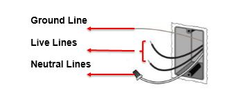
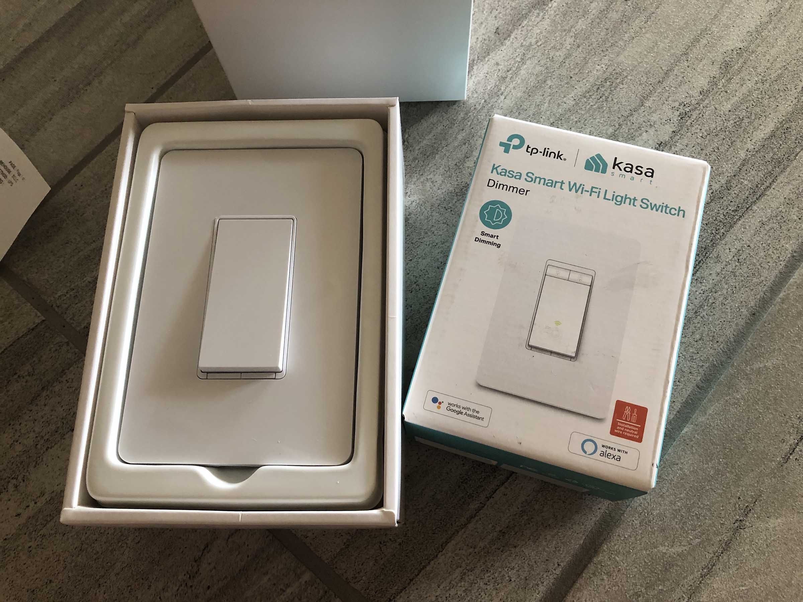
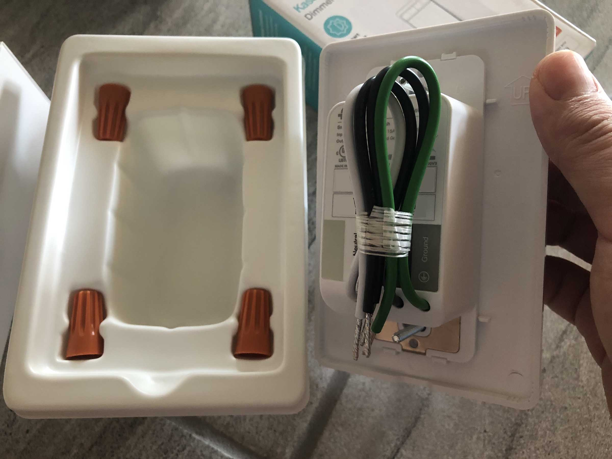
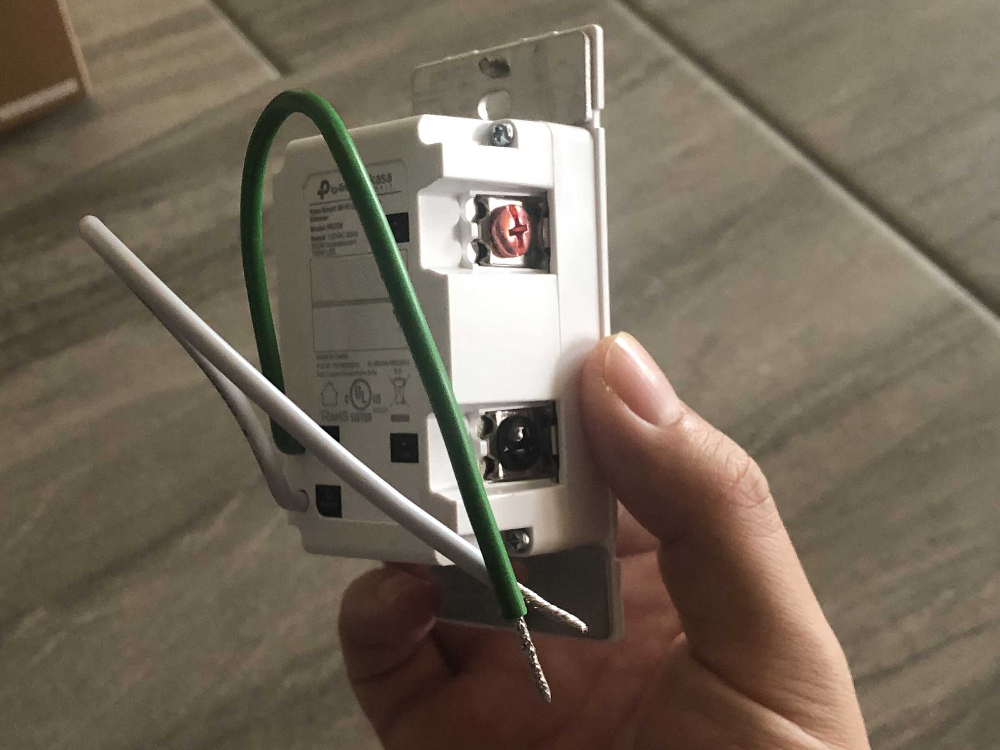
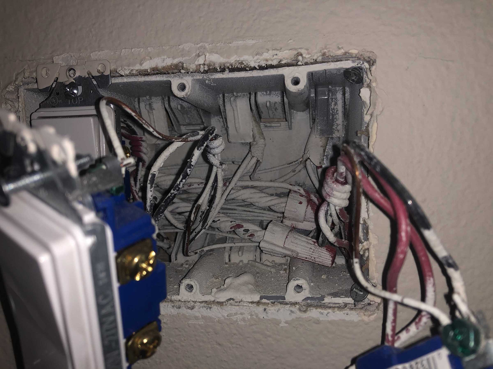
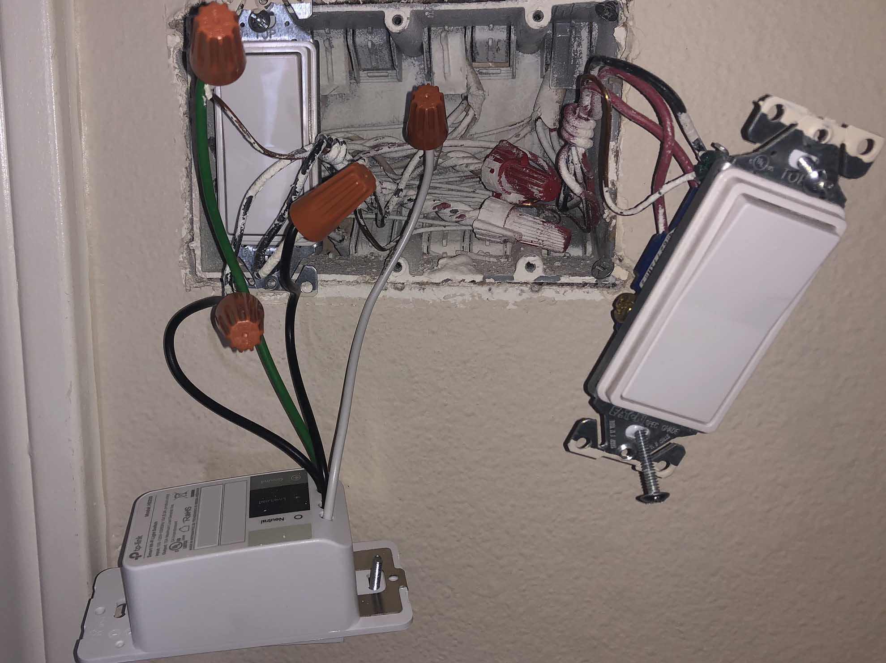
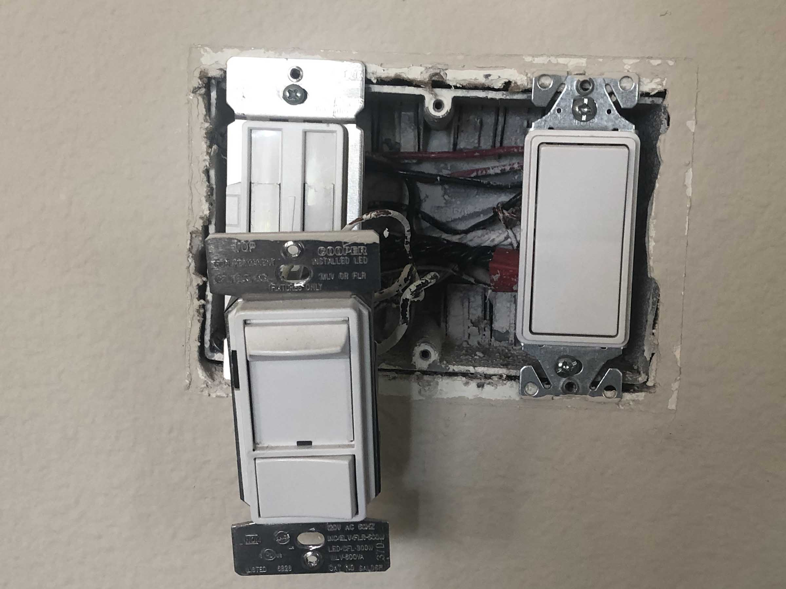
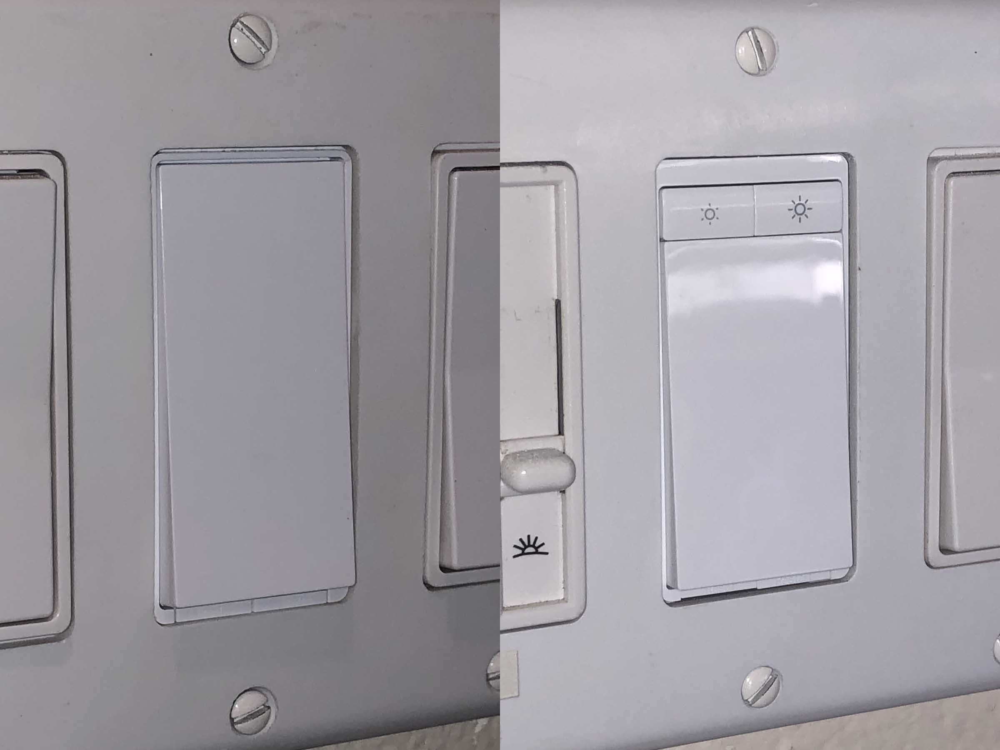
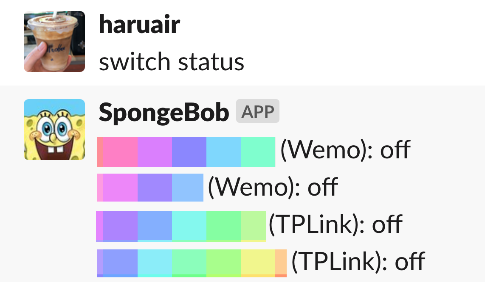

동네가 그렇게 치안이 나쁜 것은 아니지만 가끔 동네 페이스북 그룹이나 넥스트도어 같은 곳에서 접하게 되는 크고 작은 사건 탓에 집을 비울 때 조금 걱정이 있었다. 그나마 보안 카메라를 설치하고 나서는 불안감은 줄어들긴 했지만 누가 봐도 집에 있는지 없는지 밖에서 판단할 수 없었으면 싶었다. 이전에 코스트코에서 구입한 WeMo 플러그로 조명을 켜고 끌 수 있었지만 아무래도 연결하는 조명이 스탠드 정도라서 만족스럽지 않았다. 그래서 기존 벽 스위치를 교체하는 방법을 알아보다가 wifi 스위치를 구입해서 설치하게 되었다.

물론 고민하고 찾아볼 필요 없이 기술자를 부르면 금방 끝날 일이다! **전기 공사는 정말 위험할 수 있는 일이기 때문에 무슨 작업이 어떻게 필요한지 정확히 모른다면 전문가를 찾는 것이 맞습니다.**

## 자격과 규정 확인하기

캘리포니아도 전기 공사를 하려면 자격이 필요하다. 다만 프로젝트의 크기가 자재와 인건비 포함 $500 미만인 경우에는 CA B&P Section 7048 (Small Operations)에 따라서 자격 없이도 가능하다. 스위치 4개 교체하는 수준이고 유튜브 영상 보고 크게 시간 걸리는 작업도 아닌 것 같아서 직접 해야겠다고 판단했다.

미국은 National Electrical Code(NEC)를 주기적으로 발행하고 그 NEC를 기준으로 각 주마다 전기 공사 규정(electrical code)이 존재한다. 각 주, 지역마다 적용되는 전기 공사 규정이 다르고 규모에 따라 허가(permit)가 필요한 경우도 있다. 전기 기술자를 통해 설치한다면 이 부분도 확인해달라고 하면 된다. 나는 내가 설치하려고 했기 때문에 시청에 문의했고 단순 스위치 교환에는 별도의 허가 없이 가능하다는 답변을 받았다.

## 중성선 확인하기

한국과 미국은 전력 공급 방식이 다르다. 한국은 주로 단상 2선식으로 220V만 공급되는 것에 비해 미국은 단상 3선식으로 110V와 240V가 공급된다. 일반적으로 벽 플러그는 110V만 쓸 수 있지만 전기 오븐과 같이 전력을 많이 쓰는 가전은 240V로 연결되어 있다.

스위치도 어떤 스위치냐에 따라 조금씩 다르지만 Wifi 단일 스위치라면 일반적으로 다음 4개의 선을 연결해야 한다.

- Line/Hot wire (주로 빨강 또는 검정): 전력 공급 선
- Load wire (주로 검정): 설치된 기기(전등)에 연결된 선
- Ground wire (주로 노출된 구리선 또는 녹색): 접지선
- Neutral wire (주로 흰색): 중성선, 회로를 완료할 수 있도록 배전반에 연결된 선

스위치의 역할은 공급되는 전력을 전등에 연결하거나 차단하는 역할을 한다. 스위치가 전기를 연결하게 되면 전기가 전등을 거쳐 다시 전력이 공급되는 곳으로 돌아간다. 회로가 연결되는 것으로 전력은 공급되고 전등은 불이 켜진다.

기계식 스위치는 끄면 물리적으로 전등에 전달되는 전기를 끊게 된다. Wifi 스위치는 끈 상태에서도 전력이 계속 있어야 하기 때문에 스위치를 켜지 않은 상태에서도 회로가 연결되어 있어야 한다. 그 회로를 완료하는 역할을 중성선이 수행하게 된다. 그래서 중성선 여부가 중요하다.

중성선은 2009년 NEC 이후에 필수가 되었기 때문에 최근에 지어진 건물이라면 중성선이 존재할 가능성이 높다. 만약 중성선이 없다면 중성선을 설치해야 하는데 이 경우는 기술자가 필요하고 이런 추가 작업은 대부분 허가가 요구된다. 대안이라면 중성선을 필요로 하지 않는 wifi 스위치를 찾아야 하는데 그런 제품은 자체 베터리를 사용하며 UL 인증 제품이 아닐 수 있으니 유의해야 한다.

## 스위치 결정하기

시중에 나와있는 스위치가 상당히 많고 리뷰도 다양하다. 저렴한 제품도 많지만 대부분 저렴한 이유가 있다. UL 인증을 받은 제품인지 확인하는 것이 가장 중요하다. 이 인증이 없다면 집 보험에 문제가 생길 수 있다. UL listed인지 구입 전에 꼼꼼하게 확인해야 한다. 저렴한 제품 중에는 UL listed라면서 실제로는 그렇지 않은 경우도 있다고 하니 주의해야 한다.

<figure class="wide">

<figcaption>UL listed</figcaption>
</figure>

어떤 네트워크를 사용하는지도 염두해야 한다. Wifi 외에도 Z-Wave, Zigbee 등 다양한 규격이 존재한다. 만약 Ring 등 보안 시스템이 있고 거기에 연결해서 쓴다면 호환 여부도 확인해봐야 한다. 스위치 설치할 곳의 wifi 신호도 염두해야 한다. 신호가 약하면 당연히 잘 동작하지 않는다.

구글 홈이나 아마존 에코 연동 여부도 확인해야 한다. 사용하는 제품이 있다면 연동을 지원하는지 확인한다.

어떤 스위치를 교체할지도 미리 고민해야 한다. 스위치 종류는 단일 스위치, 여러 위치에서 끄고 켤 수 있는 3 way 혹은 4 way 스위치, 밝기를 조절할 수 있는 디머 스위치(dimmer) 정도로 구분된다.

Lutron, GE, TP-Link를 후보로 두고 리뷰를 보다가 TP-Link를 골랐다. Lutron도 유명하다는데 처음 들어봤고 GE 제품은 Z-wave에 더 중점을 두고 있었다. TP-Link는 wifi 기반이고 리뷰도 크게 나쁘지 않은 데다 앱도 괜찮았다. [tplink-smarthome-api](https://www.npmjs.com/package/tplink-smarthome-api) 같은 라이브러리도 있어서 나중에 필요에 따라 제어하는데 더 편리할 것으로 보고 결정했다.

필요에 맞게 TP-Link Kasa HS200, HS220 v2 제품을 구입했다.

## 설치하기

설치에는 다음 도구가 필요했다.

- 스크류 드라이버
- 와이어 넛 (wire nuts): 결선에 필요한데 TP-Link 제품에 포함되어 있었음
- 전기 테스터(electrical tester): 비접촉식 제품이나 멀티미터를 사용
- 다용도 칼: 스위치 패널과 페인트가 붙어 페인트가 흉하게 뜯어질 수 있어서 분리 전에 패널과 벽 사이를 칼로 그어준다.
- 스위치

<figure class="wide">

<figcaption>구입한 스위치. 별도 설명서는 없고 TP Link 웹사이트에서 제공한다.</figcaption>
</figure>

먼저 전력 차단기를 내려야 한다. 차단기에 어느 구역 차단기인지 표시가 되어 있다면 확인하고 내린다. 없다면 전등 스위치를 켜놓고 차단기를 내려 전등이 꺼지는지 확인한다.

드라이버로 나사를 풀고 스위치 패널을 연다. 전기 테스터로 아직도 전력이 흐르는지 확인한다. 스위치를 분리하고 wifi 스위치를 연결한다.

<figure class="wide">

<figcaption>페인트 때문에 잘 안보이지만 중성선이 안쪽에 있다. 오른쪽 스위치도 할 수 없이 분리했다.</figcaption>
</figure>

선은 끝을 맞춰 나란히 잡고 와이어 넛을 끼워 돌린다. line/load은 구분 없이 꽂으면 된다. 와이어 넛이 더이상 돌아가지 않을 때까지 돌리면 된다. 연결한 후에 선의 노출 부분이 밖에서 보이지 않아야 한다.

<figure class="wide">

<figcaption>연결된 모습</figcaption>
</figure>

선을 잘 정리해서 스위치를 제자리에 부착한다. 선이 접히지는 않았는지, 닿으면 안되는 선에 닿지는 않았는지 확인하고 잘 넣는다. 차단기를 올리고 제대로 동작하는지 확인한다.

디머 스위치는 line/load 구분이 필요하다. 기존 연결된 스위치를 참고하면 도움이 된다. 일반 스위치와 동일하게 차단기를 내리고 테스터로 확인하고 작업을 시작한다.

<figure class="wide">

<figcaption>기존 디머 스위치에 어떤 선인지 표시되어 있어서 쉽게 교체했다.</figcaption>
</figure>

<figure class="wide">

<figcaption>설치 완료</figcaption>
</figure>

TP Link 앱을 설치하고 wifi에 등록하면 끝난다.

## 활용

TP Link 앱도 생각보다 깔끔하고 큰 문제 없이 잘 동작했다. 기존 사용하던 WeMo는 앱이 정말 불안정하고 wifi가 오락가락할 때가 자주 있었는데 TP Link는 훨씬 깔끔하고 잘 동작한다. 게다가 집에서 구글 홈을 사용하고 있고 WeMo를 가끔 못찾을 때가 있어서 답답했는데 스위치는 잘 동작해서 좋다.

집에 연결된 모든 장비는 slack에도 hubot으로 제어할 수 있는데 새 스위치도 쉽게 연결할 수 있었다.

<figure class="wide">

<figcaption>매우 잘 동작 ✨</figcaption>
</figure>
