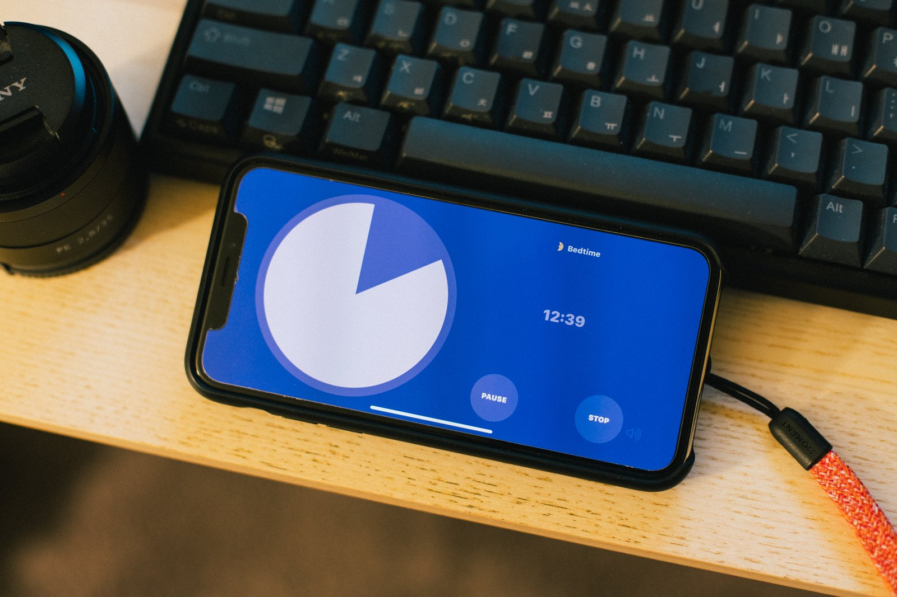
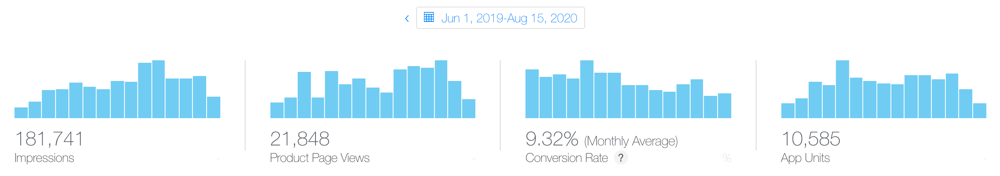
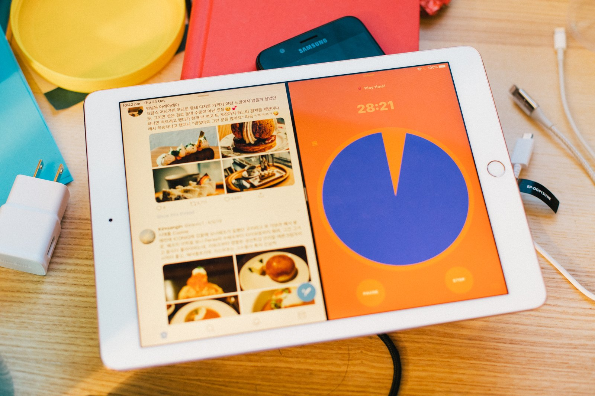
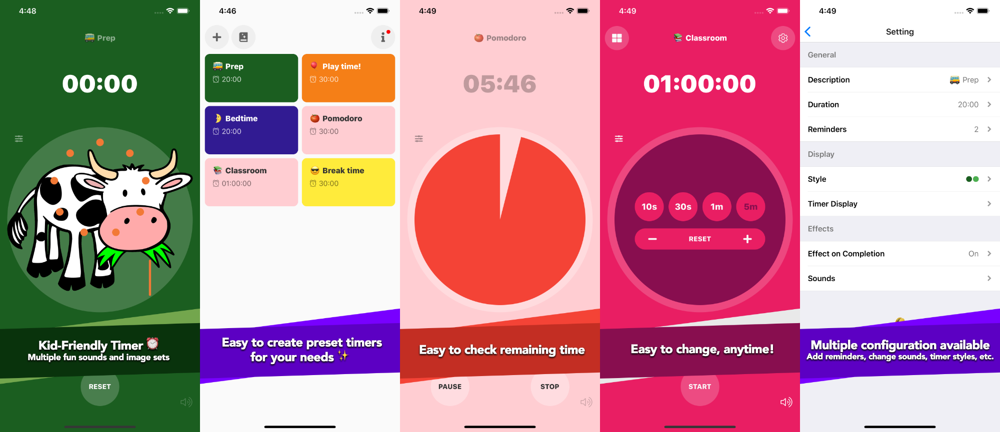
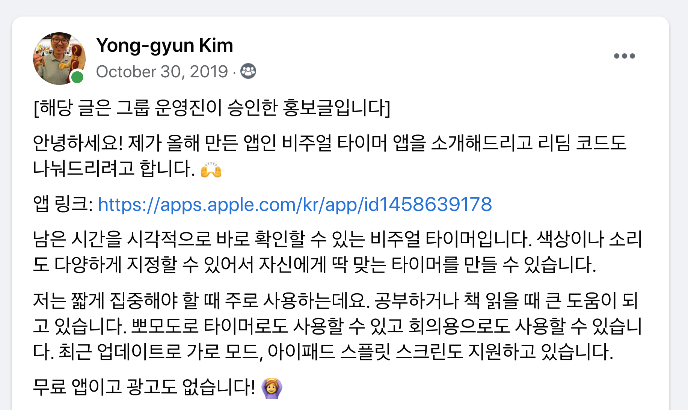
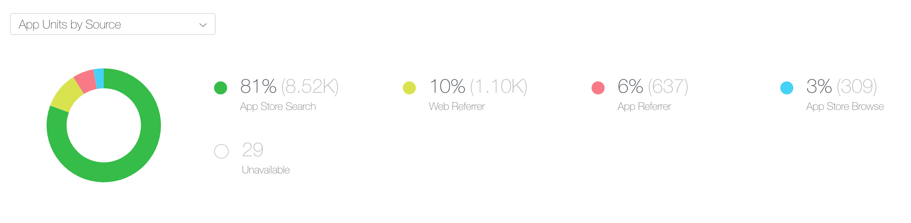
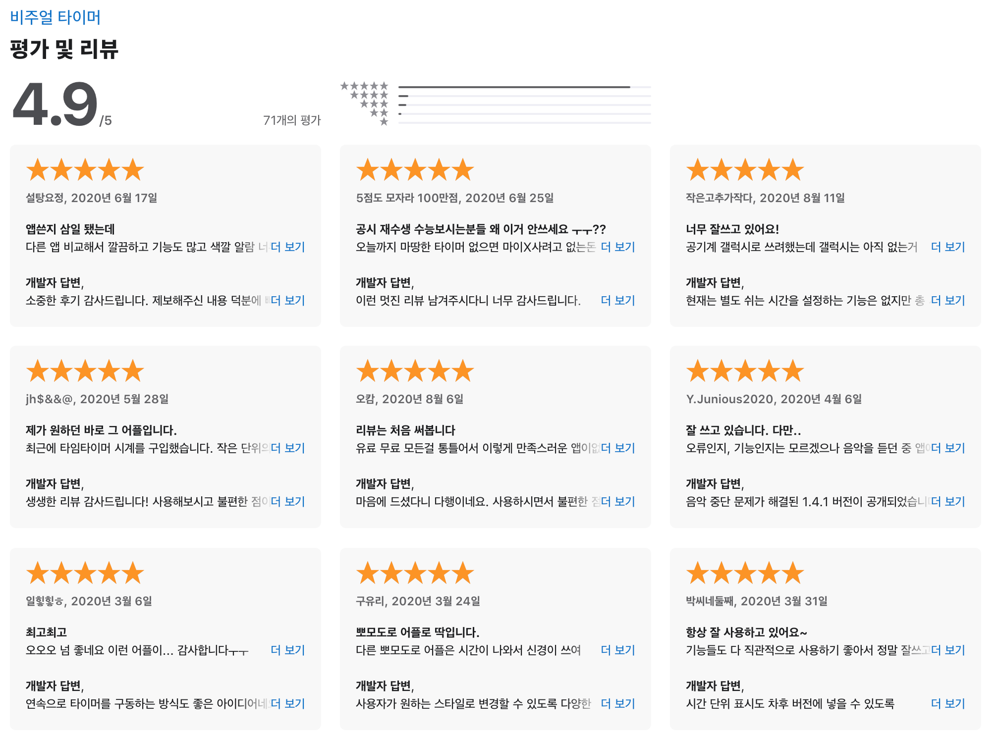
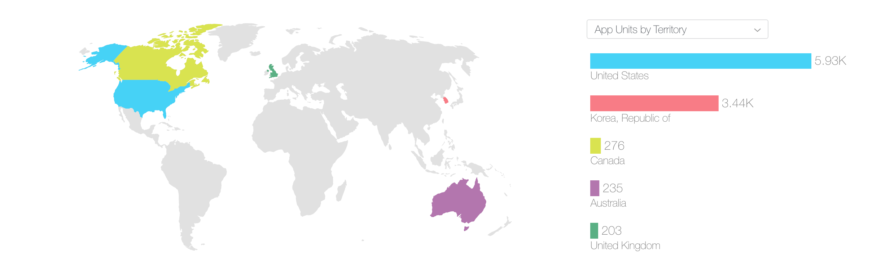
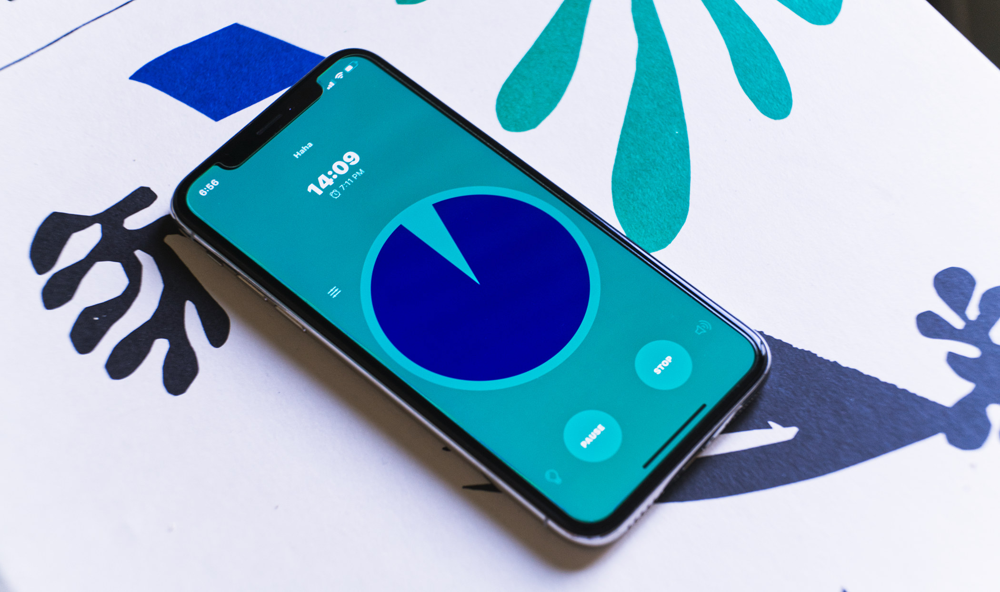

<figure class="wide">

</figure>

비주얼 타이머를 개발해서 2019년 6월에 출시했고 1년여 시간이 지나 1만 건 다운로드를 넘겼다. 현재는 목표로 했던 기능은 대부분 구현했고 성능 문제 개선, 사용자 피드백 적용을 고민하고 있다. 개발을 시작하면서 어렴풋이 정한 마일스톤인데 달성해서 기분 좋다.

비주얼 타이머는 남은 시간을 직관적으로 확인할 수 있도록 진행 상황을 표시해주는 시각화 타이머로, 소리, 색상, 문구 등 다양한 개인화 기능을 제공한다. 앱은 React native를 사용했고 공지 등 서버 자원은 Azure Function App, 이슈와 리퍼지터리는 Github에서 관리했다.

<figure class="wide">

<figcaption>1만 달성 🙌</figcaption>
</figure>

# 개발 동기

- 생산성 도구를 만들어보고 싶다
- 프로젝트로 실무 감각을 유지하고 싶다
- 사이드 프로젝트로 작은 앱은 만들어 봤으니 조금 큰 앱을 만들고 싶다
- 애플 개발자 등록 비용이라도 벌고 싶다

# 개발 전

이전부터 생산성 도구에 관심이 많아 만들어보고 싶었다. 타이머는 나도 자주 사용하는 앱 중 하나였고 앱스토어에서 새로운 앱은 없나 종종 검색하기도 했었다. 생산성 앱을 만들겠다는 결정을 하고 나서 다음 과정을 거쳤다.

이전에 시험 삼아 만들어본 팁 계산기 앱에서 얻은 경험을 바탕으로 무슨 앱을 만들지 결정했다.

- **앱 이름에서 제공하는 기능을 명확하게 알 수 있도록**: 별도로 마케팅할 가능성이 작으니까 나는 앱스토어 검색에 최적화하는 쪽으로 기울었다. 앱스토어에서 다양한 키워드로 검색해보니 검색 키워드가 앱 이름이면 유명한 앱보다 먼저 검색 결과에 노출되는 경우가 많았다.
- **앱스토어에서 검색했을 때 경쟁 앱이 적당히 있어야**: 큰 카테고리에서는 검색 순위에 밀릴 수 있어도 조금이라도 카테고리가 좁아지면 상위 순위에 나와야 한다. 검색했을 때 경쟁 앱이 전혀 없다면 사람들이 검색하지 않는 키워드일 가능성도 크다.
- **기존 앱에서 개선할 만한 부분 확인하기**: 다른 앱도 사용해보고 그 앱 리뷰도 보고 업데이트 로그를 보니 이런 앱을 만들며 겪을 피드백과 개선 과정을 이해하는 데 도움이 되었다. (물론 로그를 대충 적는 앱, 이해하기 힘든 리뷰도 많지만)

타이머 자체 기능도 당연히 중요하지만 사소한 개인화 기능을 요청하는 리뷰가 많았다. 그래서 다양한 설정을 할 수 있는 타이머를 만들어보기로 했고 가능한 한 대부분의 설정을 변경할 수 있도록 계획했다. 그 중에도 아동을 대상으로 한 개인화 기능은 유료로 제공해서 수익을 만들기로 했다.

# 개발 과정

프로젝트는 React native를 사용하기로 했다. 웹앱은 생각보다 느린 반응이 눈에 보여서 Flutter와 RN 사이에서 고민했는데 지금은 많이 개선되었지만 당시에 Flutter로 만들었다는 앱을 써보니 웹앱보다는 빠르지만 약간 느린 인상을 받아서 RN으로 결정하게 되었다.

Expo도 편의 라이브러리가 많아서 좋지만, 결정 당시에는 한국어 입력 문제가 있어서 바로 react native를 사용하기로 했다.

<figure class="wide">

<figcaption>초기에 고려하지 않은 탓에 큰 작업이 되었던 분할 화면</figcaption>
</figure>

처음에는 공통으로 사용하는 컴포넌트를 만들어서 다른 프로젝트를 하게 되더라도 활용할 수 있도록 계획을 세웠다. 설정 저장/불러오기나 국제화 지원과 같이 전역에서 사용되는 라이브러리는 큰 문제 없이 계획한 방식대로 만들 수 있었다. 다만 생각처럼 되지 않은 부분은 표현 컴포넌트였다. RN에서 기본적인 컴포넌트를 많이 지원하긴 하지만 iOS 스타일의 크고 작은 표현 컴포넌트는 다른 라이브러리를 사용하거나 직접 만들어야 했다. 공개된 라이브러리가 많이 있지만 필요한 기능은 극히 일부인 데다 스타일 일관성을 맞추는 노력이 생각보다 많이 필요로 해서 직접 만들게 되었다. 이렇게 부분적으로 기능하는 컴포넌트는 당장에는 잘 동작하지만, 특정 상황만 고려해서 만든 탓에 다른 프로젝트에서 쓰기엔 조금 부족했다.

디자인은 iOS 기본 컴포넌트를 거의 따라가서 큰 막힘은 없었다. 아직도 약간씩 어색한 부분이 있지만 대부분 컴포넌트가 나름 비슷하게 동작한다. 그 외는... 좀 대충 만든 부분도 있지만 그래도 동작은 하니까 일단 뒀다. (타이머 순서 바꾸는 부분이라든지 매우 안 이쁘다.)

기능 중 완료 이미지 모음 리소스를 만드는 데 가장 많은 시간이 걸렸다. 완료 이미지 모음은 동물 등 이미지와 함께 이미지에 맞는 효과음이 타이머 완료 시에 표시되는 기능이다. 적합한 저작권을 가진 리소스를 찾고 정리해서 넣는 과정에 많은 시간을 썼다. 직접 일러스트라든지 그릴 수 있었다면 시간을 좀 더 줄일 수 있었을까.

서버는 Azure Function App을 사용하고 있는데 공지를 그냥 JSON 형식으로 내려주는 수준이라 별도의 데이터베이스 없이 작성했다. 그런 덕분에 응답도 빠르고 비용도 안 들어서 지금까지 그대로 유지되고 있다.

개발은 출시까지 4개월 정도 걸렸는데 개발은 1달 반에서 2달 정도 걸렸고 나머지는 앱 리소스(소리 효과, 이미지)와 앱스토어 메타 정보(앱 소개, 정책 등)을 준비하는 데 시간을 썼다.

<figure class="wide">

<figcaption>사소하지만 품이 많이 드는 작업. 아이폰, 아이패드, 언어별로.</figcaption>
</figure>

개발이 완료된 후에는 이상한모임 분들에게 테스트를 부탁해서 진행했다. 이 과정에서 앱이 어떤 맥락과 흐름에서 동작해야 하는지 피드백을 많이 주셔서 큰 도움이 되었다.

# 마케팅

홍보는 페이스북 그룹, 이상한모임 채널, 클리앙, 내 소셜 계정에서 진행했다. 소개 글과 함께 프로모션 코드도 나눴다. 다운로드 수는 확실히 이런 홍보를 할 때마다 오르긴 했지만 액티브 유저 수 추세는 큰 변동이 없이 항상 일정하게 증가했다. 돈을 쓰지 않아서 그랬을까, 프로모션 코드도 돈이라고 생각한다면 업데이트마다 꽤 지출했다고 볼 수 있겠다.

<figure class="wide">

<figcaption>가장 큰 도움이 되었던 Back to the Mac 그룹</figcaption>
</figure>

페이스북 타깃 광고는 제공하는 도구로 확인해보니 적어도 광고 본 사람 중 30% 이상은 받고 결제해야 손익 분기인 비용이라 집행하지 않았다...

그래도 적은 수지만 앱스토어에서 검색해 받는 사람도 꾸준히 있다. 메타 정보를 작성하는 일도 생각보다 쉽지 않았다. 업데이트마다 조금씩 변경하고 있지만, 검색 지표가 명확하게 공개돼 있지 않아서 솔직히 잘 모르겠다. (어떤 키워드로 검색했는지 등)

<figure class="wide">

<figcaption>검색 비중이 높다</figcaption>
</figure>

# 개선과 피드백

앱 출시 이후 성능 문제를 계속 개선하고 있고 사용자 피드백도 그 과정에서 반영하고 있다. 초기에는 불안정하게 동작하는 부분이 있어서 못쓰겠다는 리뷰 받고 참담했는데 부지런히 안정화했다. 이 과정에서 Xcode의 프로파일링 도구가 큰 도움이 되었다.

피드백은 앱 내 이메일 보내기로도 오지만 대부분은 앱스토어 리뷰로 남긴다. 만족도를 물어보고 이메일로 보낼지 앱스토어 리뷰로 보낼지 구분하겠다고 백로그에 적어두고는 그동안 잊고 지냈... 그동안 작은 피드백도 많이 받았는데 이미 개인화에 중점을 두고 만든 덕분에 대부분 피드백은 간단하게 추가할 수 있었다.

<figure class="wide">

<figcaption>좋은 리뷰와 탄탄한 피드백은 늘 힘이 된다</figcaption>
</figure>

다만 구조적인 변화가 필요한 피드백은 백로그로 쌓고 있다. 가령 여러 타이머를 동시에 사용하거나 순서대로 동작하도록 하는 방식은 현재 구조에서는 처음에 염두에 두지 않았던 부분이라 구현이 어렵다. 좀 더 정리해서 차기 버전에서는 구현할 수 있는 구조로 가고 싶다.

# 아쉬운 점

## 사용자 추적

앱스토어커넥트에서 제공하는 분석 도구는 피상적인 수준이라 실제 데이터를 볼 수 없다는 점이 늘 불편하다. 실제 사용은 앱을 실행했을 때 버전 확인과 공지 데이터를 받기 때문에 애저 펑션앱 사용량으로 확인할 수 있지만, 여전히 부족하다. GA 등 추적 도구를 사용해서 어떤 기능을 주로 사용하는지 등 데이터를 모으면 개발 방향을 잡는 데 더 도움이 될 텐데 그러지 않았다. 처음부터 이 부분이 중요하다는 이야기를 들었는데도 지금까지 적용하지 않은 것은 정말 반성해야 한다.

## 약한 수익 모델

현재는 인앱 결제로 수익이 발생하고 있다.

- 완료 시 나오는 이미지 모음
- 개발 지원하기

처음 앱을 기획할 때는 아동용 타이머로 방향을 잡고 있어서 완료 이미지 모음을 인앱으로 제공했다. 앱을 공개한 이후에는 아동용 타이머 외에 일반 용도로 많이 사용하길래 커피 지원하기 같은 개발 지원 항목을 추가했다. 한국에서는 개발 지원이, 미국 스토어에서는 이미지 모음 결제가 많다. 내가 쓰는 시간을 생각하면 아직도 많이 부족하지만 그래도 앱개발자 등록 비용은 해결할 수 있게 되었다.

다음 버전에서는 인앱을 정리하고 유료로 전환하는 것을 고민하고 있는데 이런 결정은 어떻게 해야 하는 걸까, 사용자에게 무슨 가치를 주고 있는지, 그 비용은 어떻게 결정해야 할지 배우고 싶다.

## 안드로이드 지원

처음에는 RN이면 안드로이드 지원은 저절로 되겠지 생각했는데 실제로 돌려본 결과는 처참했다. iOS는 그래도 작게나마 해본 경험이 있어서 트러블슈팅도 큰 문제가 없었는데 안드로이드는 구동 자체도 쉽지 않았다. 차기 버전에서는 안드로이드도 같이 지원하고 싶다.

## 자동화와 테스트 부족

지금 앱은 일부 로직에 유닛테스트가 있지만, 아직 많이 부족하고 자동화도 없다. 앞으로 개선해야 하는 부분이다.

# 잘한 점

## React Native

React로 많은 프로젝트를 해보지 않았는데 이 앱을 만들고 관리하면서 많이 배웠다. 정말 매달 새로운 기능과 라이브러리에 눈과 머리가 바쁘다. 출시 이후에도 react에 hook도 들어오고 많은 새 기능이 들어오고 있는데 업데이트 과정에서 조금씩 적용하고 개선하며 많이 배우고 있다.

확실히 js나 react에 경험이 있다면 큰 문제 없이 RN 프로젝트도 꾸릴 수 있다. 물론 타깃 플랫폼도 잘 알면 더 편하다. 특히 기능이나 용어는 각 타깃 플랫폼에서 제공하는 용어로 많이 설명되고 있어서 안드로이드와 iOS의 용어 차이를 알아두는 것도 도움이 됐다.

## 다국어 지원

처음부터 고려하지 않았다면 꽤 번거로운 작업이 되었을 텐데 지금 와서는 잘 한 결정 중 하나다. 현재 영어랑 한국어만 지원하지만 지금까지 지역 통계를 보면 확실히 도움이 되었다. 마케팅도, 프로모션도 대부분 한국에 했는데 다운로드 비율이나 수익 비중은 미국이 더 크다.

<figure class="wide">

<figcaption>프로모션 코드는 한국에서 많이 뿌렸는데 조금 억울</figcaption>
</figure>

## 우선순위와 시간 관리

혼자 하는 프로젝트는 내 마음대로 할 수 있다는 장점이 있지만, 한편으로는 정말로 제한적인 시간 자원을 어떻게 관리하는가 하는 점이 정말 큰 어려움이었다. 특히 내가 안 하면 아무것도 진행이 되지 않는다는 점이 당연하지만 피곤했다.

다행히 처음에 계획한 최소 기능은 대부분 만들어냈고 학업 하면서도 크고 작은 개선 작업을 진행했다. 출시 이후에는 적은 분량이라도 한 달에 한 번은 업데이트 할 수 있도록 노력했다. 지금까지 받은 피드백 중 적용된 것은 일부지만 개선 과정에서 좋은 리뷰도 많이 받을 수 있었다.

---

이 이전에도 앱을 만들어본 경험은 있지만, 하루 정도면 만들었던 수준의 앱과는 경험의 깊이가 달랐다. 특히 앱은 웹과는 확실히 다른 맥락과 인터페이스를 갖고 있었다. 앱을 출시하는 경험은 평소라면 별 생각 없이 쓰던 수많은 앱을 교과서처럼 보이게 했다. 아름답고 멋지고 편리한 기능을 모두 앱에 적용하고 싶었지만 작아도 정교한 기능은 보는 것과 다르게 훨씬 많은 시간을 필요로 했다. 쉽진 않겠지만 다음엔 그런 부분도 꼼꼼하게 구현해보고픈 욕심도 생겼다.

<figure class="wide">

</figure>

지금 이렇게 되돌아보면 잘한 점보다 부족한 점도 많고 배워야 할 부분도 산더미다. 그래도 부족한 부분이 많지만 유용하게 사용하고 있다는 리뷰 하나하나가 큰 힘이 됐다. 앞으로 개선될 타이머와 만들어갈 많은 프로젝트에서도 이런 경험이 거름이 되었으면 좋겠다.

[애플 앱스토어에서 보기](https://apps.apple.com/kr/app/%EB%B9%84%EC%A3%BC%EC%96%BC-%ED%83%80%EC%9D%B4%EB%A8%B8/id1458639178)
