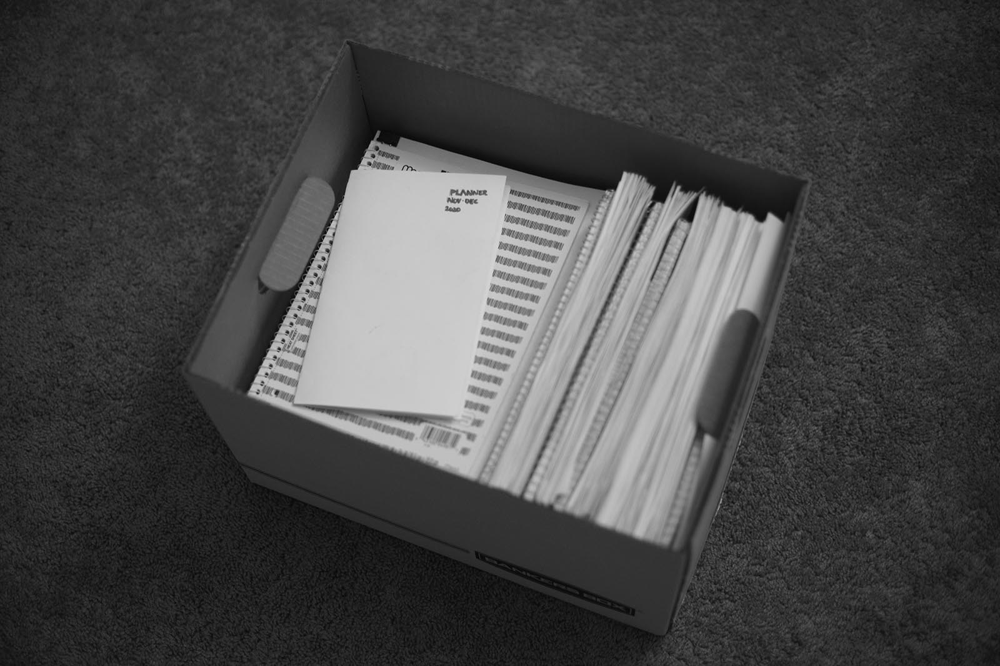

<figure>

</figure>

학기말 시험이 끝나고 그간 공부한 자료를 스토리지 박스에 넣는 과정이 반복되고 있다. 이런 작은 일이 그사이 받았던 스트레스를 조금은 평탄하게 해주지 않을까 하고, 배우면 배울수록 부족함을 더 확인했던 시간, 거기에 따라오던 수많은 상념도 담아서 보내버린다, 보내버리겠다는 생각으로 작은 의식을 치른다. 박스가 엄청 무거운 건 아니지만 그렇다고 가볍게 들리진 않는다. 그래도 뭘 하긴 했구나.

아무리 좋은 점수를 받아도 1년을 긴 학기 둘, 짧은 학기 하나로 보내면 내가 여기에서 시간을 이렇게 보내고 있는 것이 맞나 생각이 자연스럽게 든다. 남 생각 안 하고 내 삶만 보자, 내 성장만 보자, 어제의 나보다 오늘의 나를 생각하자면서도 어느 사이에 주변을 보고서는 나 자신을 평가하기 바빠진다. 잠깐 기분 전환한다고 소셜 미디어에 가까워질 때마다 결국 이런 비교와 평가가 나를 갉아먹는다. 내게 도움이 되는 부분과 빼앗아가는 것을 늘 저울질하면서, 로그아웃, 로그인, 로그아웃. 이런 지난한 싸움이 매일 로그인 화면 앞에서 반복된다. 체류 시간을 높이기 위해 디자인된 수많은 도구와의 싸움은 지루하게 끝이 나질 않는다. 어찌 됐든 자신을 깎는 고민을 안 하려면 결국 지금 앞에 있는 것만 보고 집중하는 것 말고는 큰 대안이 없다. 그런데도 왜 문제의 답이 가까이 있으면서도 나는 왜 그 답에 쉽게 설득되지 않을까. 꼭 멀리에서 들리는 큰 목소리만 답처럼 들리는 것일까. 아는 답을 듣기 위해서 또 로그인, 로그아웃.

이번에도 얇은 플래너 하나로 학기를 보냈다. 마음에 드는 적당한 규격과 양식의 플래너를 찾지 못했다. 연초에 한국서 큰마음 먹고 사 온 플래너도 결국 흐지부지됐다. 작년에 간단하게 만들었던 서식을 또 출력해서 작은 플래너를 만들었다. 내가 과목마다 얼마나 시간을 써야 하는지 명확하지 않은 학기 초에는 플래너에 많이 의존하게 된다. 학기가 절반쯤 지나면 플래너는 체크리스트 역할만 정도지 무슨 요일엔 수학이랑 물리, 무슨 요일에는 무엇, 대략적인 감각이 생기는데 그렇게 루틴에 익숙해지는 순간이 몰입을 돕는 것 같다. 주제에 흥미가 더 붙고 더 알고 싶어졌다. 가끔 달라지는 일정을 플래너에 적고 시간을 조정하다 보면 모든 걸 다 끝낸 것도 아닌데 만족감이 든다. 충분히 할 수 있다는 생각에 부담도 적고 적당히 유연한 서식도 한몫한다. 플래너에 적으면 어떻게든 결과를 볼 수 있다는 자신감도 생긴다. 단순한 시스템을 갖추고 유지하는 일은 코드 밖에서도 적용된다. 끝난 일은 색칠하고, 못 한 일은 긋고 옮긴다. 그렇게 날마다 펼쳐두던 플래너를 접어서 박스에 같이 넣으면 보람찬 기분과 함께 약간은 헛헛한 기분도 든다.

일상과는 거리가 먼 2020년이고 매일 현실감 없는 뉴스에 절망감을 느낀다. 주변은 건강해서 다행이라고 말하는 것도 너무 이기적이다 싶을 정도로 매일 올라가는 숫자들에 마음이 아리다. 복잡한 세상에 비춰보면 일상은 믿기 어려울 정도로 납작하고 단편적으로 변했다. 불안한 마음에 장 보러 가는 일을 최소로 줄였고 외식하는 일은 전혀 생각하지도 않는다. 그렇게 단단히 마음먹고 살다가도 운전하다가 창밖으로 마스크를 안 쓸 자유를 주장하는 사람들이 피켓을 들고 흔드는 모습을 보고는 망연해진다. 각자의 자리에서 각자 전쟁을 치르는 이 땅의 모습은 도무지 익숙해질 것 같지 않다. 나는 이런 사회에서 무엇을, 어떻게 기여할 수 있을까.

그런 욕심 내지는 바람을 갖고 있어서 그런지 누군가에게 도움이 되는 도구와 서비스를 만드는 일에서 효능감이 높다. 그래서 회사 생활에 만족도가 높았었고 공부를 계속 미루던 이유에도 한몫했었다. (다달이 들어오는 월급의 유혹도.) 학교에 다니게 되면서 수업 잘 듣고 과제 잘해서 지적 성장을 도모하고 그 와중에 학점도 잘 챙기면 그것으로도 충분하다고 생각하지만 내가 효능감을 느끼는 영역과는 조금 거리가 멀다. 되려 괜찮은 점수를 받아도 조금 부족하거나 실수한 부분에서 스트레스를 더 받는 편이다. 내가 이런 부분에서 스트레스받는다는 점을 몰랐던 것은 아니지만 그동안은 거의 잊다시피 하고 지내고 있었다. 학교 다니면서 다시 코피가 나기 시작했다. 어릴 때도 늘 하루걸러 코피가 나고 그랬는데 인제야 이게 스트레스 지표나 마찬가지였구나, 깨달았다. 이해가 안되는 내용을 이해하려고 시간을 쓰고, 코피가 나서 그걸 막고 있다 보면 자괴감 비슷한 것이 밀려와서 심란해진다. 내가 하고 싶은 일을 하려면 이 길을 어떻게든 걸어야 해, 행동으로 옮기는 일은 정말 쉽지 않다.

어떻게 만든 기회인데 최선을 다해야 한다는 사실을 알지만 그렇다고 그게 쉽게 되는 일은 아니다. 어떤 이유를 만들어서든 매몰되지 않도록 눈을 가리고 가볍게 지나야 한다는 점은 알지만 어렵다. 3학기가 지나고 나니 나름 시스템이 생겼는지 대략 어떻게 준비하고 공부하면 되는지 감각이 생겼다. 그리고 큰 덩어리를 잘게 쪼개서 조금씩 해결하고 성취에 기뻐하고 작은 보상을 계속 준비하는 것만 어려움을 덜어내는 방법인 것 같다. 어쩌면 당연한 말이고 듣기도 많이 들었지만 겪고 체득하기 전까지는 내 것이 아니란 걸 또 배우게 되었다. 아는 것을 실천으로 옮길 수 있는 것도 능력이고 연습을 통해 근육을 쌓아야만 써먹을 수 있다는 것. 부지런히 근육을 만들어야겠다.

비주얼 타이머는 방학이 될 때마다 작더라도 업데이트를 하고 있다. 처음 만들고 나서는 에너지를 너무 많이 쏟아서 기대보다 낮은 성장에 실망했는데 시간이 지나 약간 거리를 두고 보니 그럴 필요가 전혀 없었다. 학업에 집중하다 보니 이 프로젝트도 조금 더 관망할 수 있어서 마음이 아주 홀가분해졌다. 여전히 엄청나게 많은 사용자가 있는 것은 아니지만 꾸준하게 사용하는 분도 꽤 있고 앱이 좋다며 장문의 리뷰와 피드백을 보내주는 분도 있다. 내게는 직장 생활 당시의 감각을 깨워주는 느낌도 있는 데다 내가 원하는 것처럼 누군가에게 도움이 되고 있다는 점에서 자신감을 줍는다. 후원으로 받은 소중한 돈으로 내년 애플 개발자 프로그램 비용도 지출했다. 처음 계획했던 범위에서는 앱을 다 만들었기 때문에 무얼 어떻게 개선할지 방향이 고민이다. 안드로이드로도 출시해보고 싶어서 코틀린 강의도 틈틈이 봤는데 다음 업데이트에 안드로이드도 포함되면 좋겠다.

연초에 목표로 했던 것을 적어보면,

- 책 읽기: 거의 꽝 (< 5권), 대신에 읽기 과제가 많은 수업을 여럿 들었으니까...
- 운동량 늘리기: 꽝. 애플워치가 생긴 이후로 조금 하긴 했지만.
- 회고 주기적으로 하기: 꽝. 과제에 치여서 글을 거의 못 씀.
- 시간 관리하기: 조금 성공. 조금은 더 철저할 필요가 있지 않았나.

내년 내 모습을 생각해보면 여전히 학교에서 씨름하고 있을 예정이다. 수업도 좀 더 어려워질 예정이고 시간도 많이 쓸 일이 생겨서 긴장되지만 지금 해온 것만큼 해낼 수 있었으면 좋겠다. 일상도 빨리 되찾을 수 있으면 좋겠다. 운동이나 글 쓰기, 책 읽기는 매년 목표지만 이번에도 또 다이어리 앞 장에 적어본다. 가족과 함께 집에 있는 시간은 판데믹 탓에 많아졌지만 온라인으로 전환된 수업이 대중없이 시간을 쓰게 만들어서 몸만 같이 있고 정신은 저 멀리 떠나있던 적도 많았다. 밖에서는 추억을 만들기 어렵더라도 집에서 무엇이든 재미있는 일을 더 꾸며봐야겠다. 제주에 있는 가족들도 많이 보고 싶지만 한국에는 언제 가게 될지 몰라서 좀 아쉽다.

올해도 수고가 많았다. Stop and smell the roses 🌹🌹🌹.
