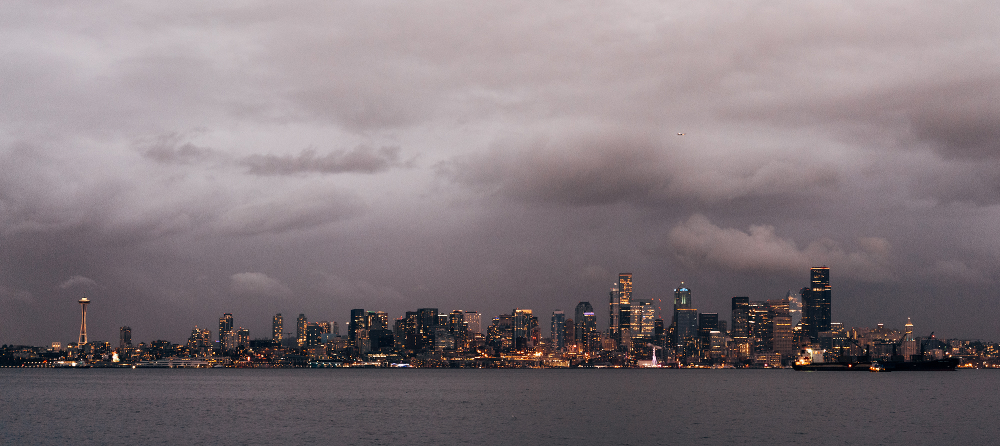

<figure>

<figcaption>우리가 갔을 때도 비가 왔다. 차가운 공기. 상상했던 그런 날씨.</figcaption>
</figure>

이제 앞으로 더 바빠질 예정이라서 9월, 10월도 얼른 적는다.

- 이번 학기에 생각보다 어려워서 괴로워하고 있다. 예전 학기는 어려워도 시간을 많이 쓰면 뭔가 해결이 되는 기분이었는데 이번 학기에는 유독 어렵게 느껴진다. 이 상황에서 좋은 점수 내는 애들 보고 있으면 내가 어디를 어떻게 놓치고 있는 것인지 싶기도 하고. 결국은 또 시간을 많이 써서 점수 만드는 방법 밖에는 없구나 생각도 들고. 그 사이에 아픈 날도 있었어서 흐름을 제대로 타지 못한 것도 있는 것 같다. 건강하자.
- 시애틀에 다녀왔다. 민경 씨가 2년 전에 만들어둔 스케줄이 있었는데 판데믹 탓에 지금까지 미뤄져서 이번 틈에 잠시 다녀왔다. 탄탄한 계획 덕분에 고민 없이 모든 일정이 즐거웠다. 반가운 사람들도 만나고 커피도 많이 마셨다. 자연 속에 있는 도시라 녹음을 어디서나 볼 수 있어서 좋았다. Pacific Northwest 라고 부르는 것도 귀여웠다. 여행에서는 비가 번거롭기만 한 날씨지만 나나 민경 씨나 비를 워낙 좋아하고 또 비가 전혀 오지 않는 도시에 살아서 일정 내에 온 비가 얼마나 반갑던지, 좋은 장소에 즐거운 기억 만들고 왔다. (한동안 그레이 아나토미를 본 탓에, 아 이 도시 어디엔가 그런 병원이 있을 것만 같네, 생각도 들었다.)
- 임플란트를 하게 되었는데 탓에 한동안 트럼펫 연습도 못할 것 같다.
- 어쩌다가 식물 유튜브를 보게 되어서 또 집에 있는 식물들 물꽂이하고 난리를 시작했다. 습도가 워낙 낮은 지역인데다 집안은 더 건조한 편이라 그냥 유튜브에서 알려주는 것만 따라해서는 부족한걸 배웠다. 어떻게 관찰하고 부족한 부분을 채우는지 조금 알게 되었다. 이번에는 좀 제대로 화분에도 옮겨 심고 제대로 키우고 싶다.

이제 올해도 2달 밖에 남지 않았는데 남은 2달이 더 바쁠 예정이라서 조금 걱정이다. 연말에는 제대로 한 해 되돌아보고 즐거웠다고 성장했다고 얘기할 수 있었으면 좋겠다.
