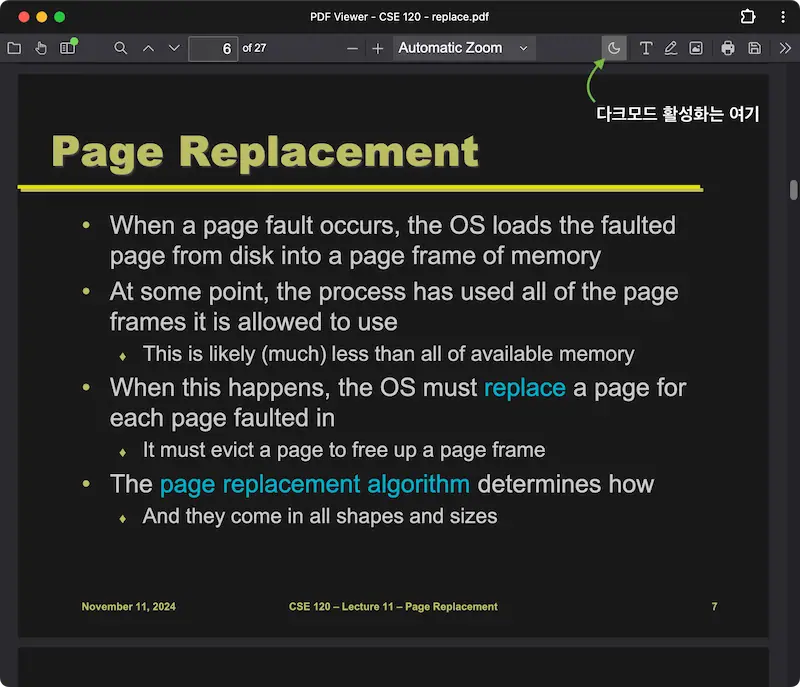

요즘 맥북으로 PDF를 읽는 일이 많아졌다. 새하얀 PDF를 한 쪽에 열어두고 어두컴컴한
터미널을 나머지 공간에 띄워 정리하려니 금방 눈이 피곤해지는 기분이다. 그나마
대안이라고 크롬 브라우저에 내장된 PDF 뷰어와 [Dark Reader][1] 크롬 확장으로
버텼다. 다만 뷰어 전체를 흑백 반전해주는 정도라서 PDF 이외 부분은 애매한
회색으로 표시되는데 그게 정말 마음에 안드는 색이었다. 오늘 해야 할 일은 뒤로
미뤄두고 PDF 뷰어를 찾아 돌아다녔는데 지난 번에 크롬북 용도로 만들어둔 PDF
뷰어를 그냥 쓰면 되는 것이었다!

<figure>

<figcaption>웹은 역시 최고의 발명임을 상기하며...</figcaption>

</figure>

- 뷰어 열기: [pdf-viewer.edykim.com][2]

크롬북에선 PWA로 설치하는 것이 유일한 앱 설치 방법인데 당연히 맥에서도 전혀 문제
없이 설치 가능했다. [pdf.js][5] 기반이고 서비스워커로 오프라인 접속도 지원한다. [File
System Access API][3]를 사용하면 파일을 열 때마다 권한 확인을 하는 번거로움이 있어서
대신 [Origin private file system (OPFS)][4] 공간에 파일을 저장하는 식으로 구성했다.
덕분에 pdf.js의 어노테이션 같은 것도 문제 없이 사용할 수 있고 변경된 PDF를 다시
받는 것도 가능하다.

크롬북에서 부족한 부분이 많아 잔잔하게 만들어 쓰던 것들은 사실 웹브라우저 있는
어느 환경에서나 다 사용 가능하다는 것은 정말 큰 장점이다. 빠르게 새로운 웹
기능을 사용해볼 수 있는 환경이라서 정말 좋아하는 OS인데 요 근래 크롬에 관한 좋지
않은 뉴스가 자꾸 나와서 아쉬울 따름이다.

[1]: https://darkreader.org/
[2]: https://pdf-viewer.edykim.com/
[3]: https://developer.chrome.com/docs/capabilities/web-apis/file-system-access
[4]: https://web.dev/articles/origin-private-file-system
[5]: https://github.com/mozilla/pdf.js

